<p align="center">
  
</p>

# Dockge Enhanced

Un fork con funcionalidades adicionales de [Dockge](https://github.com/louislam/dockge) — agrega monitoreo de imágenes, escaneo de seguridad, copias de seguridad automáticas, detección de bucles de fallo y gestión de recursos de Docker, todo desde la interfaz web.

> 🇪🇸 Español · 🇬🇧 [English](README.md) · 🇫🇷 [Français](README.fr.md) · [Artículo de presentación (en francés)](https://upandclear.org/2026/03/28/gerer-ses-conteneurs-docker-autrement-le-fork-dockge-enhanced-surveillance-dimages-scan-cve-backup-automatique-gestion-des-ressources/)

<p align="center">
  
  
  
  
  
  
</p>

> **¿Lo usas? ¿Te gusta? [⭐ ¡Dale una estrella!] (https://github.com/Aerya/Dockge-Enhanced)** — solo toma dos segundos.

---

## Funcionalidades

### Lo que distingue a Dockge Enhanced

| Área | Lo que agrega Dockge Enhanced |
| --- | --- |
| **Multiinstancia** | Federación automática en malla completa al agregar o quitar un agente, gestión desde cada instancia vinculada, selección y agrupación multiservidor, copia/migración transaccional, trabajos reanudables y replicación en frío automática |
| **Gestión de stacks** | Stacks fijados, columna de stacks más densa y redimensionable, espacio Registros/Compose redimensionable, copia fiable del YAML sin formato, acciones y programación por stack y por contenedor, Construir + Recrear, notas y herramientas Git opcionales, y protecciones para servicios que comparten una red VPN |
| **Copias de seguridad y recuperación** | Restic con múltiples destinos, volúmenes, consistencia por stack, restauración selectiva, pruebas de instantáneas y diferencias (diffs) |
| **Automatización y auditoría** | API REST acotada por permisos y stacks, webhooks por stack, ejemplos para Home Assistant e historial centralizado con origen y duración |
| **Recursos de Docker** | Imágenes, volúmenes, contenedores no gestionados y redes, acciones masivas, limpieza automática y protecciones para eliminaciones de riesgo |
| **Imágenes y seguridad** | Monitoreo de actualizaciones, actualización automática con reversión, escaneos Trivy y excepciones CVE |
| **Monitoreo** | Estadísticas del sistema, stack y contenedor, bucles de fallo, auto-reparación de healthchecks, registros responsivos y a pantalla completa e integraciones opcionales con Kula y Dozzle gestionado |
| **Integraciones** | PlugNPiN opcional y asistente de etiquetas por servicio para Nginx Proxy Manager, Pi-hole y AdGuard Home |
| **Notificaciones y acceso** | Discord, Apprise, 2FA, proxy de confianza, Turnstile y clientes móviles |


<details>
<summary><strong>Mostrar el catálogo completo de funcionalidades</strong></summary>

**2026-08-17 — Registros de stack fiables después de las acciones Docker** — El panel Registros vuelve a conectar automáticamente su flujo en tiempo real después de iniciar, detener, reiniciar, actualizar o recrear una stack. Se conservan el servicio, el periodo de historial y el modo de timestamps seleccionados, y las operaciones de salida/reconexión del terminal se secuencian para impedir que un callback asíncrono antiguo vuelva a enlazar el flujo equivocado.

**2026-08-13 — Protección opcional contra copias Restic simultáneas** — Los ajustes de copia de seguridad incluyen ahora una protección activada por defecto que impide iniciar una copia manual, programada o al guardar un Compose mientras ya se ejecuta otra copia Restic. Los intentos manuales muestran inmediatamente una ventana en la WebUI; los intentos automáticos se registran y se notifican en la pestaña Copias de seguridad si está abierta. Desactivar la opción restablece los inicios paralelos para las instalaciones que los necesiten expresamente.

**2026-08-11 — Columna de stacks más densa y redimensionable** — El panel de escritorio muestra más stacks en la misma altura y sustituye sus columnas Bootstrap fijas por un separador accesible con ratón y teclado. La anchura de la columna está limitada para conservar ambos paneles y se recuerda por navegador. Su altura llena el espacio visible restante en páginas cortas y sigue el contenido real de Compose, los contenedores y el terminal en páginas largas. En móviles, la navegación apilada existente no cambia.

**2026-08-09 — Espacio Registros y Compose más denso y redimensionable** — Las páginas de stack reducen sus espacios y sustituyen la división fija por mitades en escritorio por un separador arrastrable y accesible mediante teclado, cuya posición se recuerda en el navegador. Los registros pueden ocupar toda la pantalla, mientras que el panel Compose puede contraerse y restaurarse cuando solo importa la salida de ejecución. Una acción dedicada copia directamente el YAML Compose sin formato, sin números de línea ni artefactos de selección visual. En móviles, los paneles permanecen apilados y adaptados al uso táctil.

**2026-08-09 — Stacks fijados y resaltado de archivos ampliado** — Cualquier stack puede fijarse en la parte superior del panel lateral conservando la ordenación elegida por nombre, estado o instancia. Las preferencias se guardan por navegador y distinguen stacks con el mismo nombre en instancias diferentes. El editor de archivos de volúmenes montados ahora resalta contenidos YAML, JSON, Python, JavaScript, TypeScript, shell, Dockerfile y `.env`.

**2026-08-06 — Migración automática de federaciones y accesos directos** — En la primera sesión autenticada después de actualizar, una migración única repara automáticamente los catálogos asimétricos creados por versiones anteriores, sin botón ni reconfiguración. Cada pestaña de `/watcher` enlaza directamente con la misma pestaña de las otras instancias. Tanto en las listas de stacks como en la página Compose, el nombre de la instancia de un stack remoto es directamente clicable y abre ese stack en la WebUI que lo aloja.

**2026-08-02 — Federación automática de instancias en malla completa** — Agregar un agente a cualquier instancia Enhanced ahora lo comparte automáticamente con todos los servidores ya vinculados y le proporciona al nuevo servidor el catálogo completo de instancias. La eliminación de un agente se propaga de la misma manera. Las conexiones de retorno utilizan la sesión autenticada actual como credencial dedicada de federación en lugar de solicitar a los usuarios que vuelvan a ingresar los detalles de la instancia local. Cada destino se autentica antes de que los catálogos cambien, cada objetivo recibe su propia lista específica para ese objetivo, las entradas obsoletas se eliminan y los stacks y contenedores pueden gestionarse desde cualquier WebUI vinculada sin un controlador central permanente. El flujo de trabajo y sus comentarios están disponibles en francés e inglés.

**2026-08-02 — Dozzle, registros responsivos, programación de contenedores y novedades** — La pestaña de Monitoreo puede implementar y gestionar opcionalmente [Dozzle](https://dozzle.dev/) con datos persistentes, un montaje de socket de solo lectura, un acceso directo en la barra de navegación y enlaces directos por contenedor. La salida del stack ahora está etiquetada como **Registros** y utiliza una barra de herramientas responsiva con filtrado por servicio, búsqueda, marcas de tiempo y alturas de panel x1/x1.5/x2. Las acciones de stack y contenedor comparten modos de botón compacto o con etiqueta; los paneles de Notas, Git y Programación se muestran solo bajo demanda, mientras que el motor de programación en sí siempre está disponible. Cada contenedor puede definir horarios de inicio y detención independientes. Después de una actualización, un popup de **Novedades** localizado en FR/EN presenta los últimos cambios una vez por navegador y revisión de noticias.

**2026-07-26 — Kit de herramientas de operaciones opcional** — Los stacks compilados localmente obtienen una acción dirigida de **Construir + Recrear**; cada stack puede tener una nota local guardada con sus metadatos; y un panel Git manual colapsado admite inicializar, diff, commit, `pull --ff-only`, push y restauración de revisiones con validación Compose. Los Recursos de Docker ahora pueden gestionar redes `bridge`, `macvlan` e `ipvlan`, con confirmaciones y protecciones para redes del sistema. **Configuración → Automatización** crea tokens API acotados por permisos y stacks, además de webhooks por stack revocables/rotativos. Los secretos se muestran una vez y solo se almacenan sus hashes. Cada operación se une al registro de auditoría central con su origen y duración. Consulta la [guía de API, webhooks y Home Assistant](docs/AUTOMATION.md). Las redes Docker Swarm y `overlay` no son compatibles.

**2026-07-26 — Integración opcional PlugNPiN** — **Configuración → Integraciones** puede habilitar explícitamente un controlador [PlugNPiN](https://github.com/DeepSpace2/PlugNPiN) fijado que publica contenedores etiquetados a Nginx Proxy Manager y, opcionalmente, Pi-hole o AdGuard Home. Está desactivado por defecto y no crea ningún stack o contenedor hasta que se guarda como habilitado. Dockge genera un stack Compose dedicado con un Proxy de Socket Docker de solo lectura, mantiene las contraseñas fuera de la configuración y Compose en un volumen Docker con permisos restringidos montado en `/run/secrets`, expone estado, controles de inicio/detención/reinicio y registros acotados, y registra los cambios en el registro de auditoría. El editor Compose también incluye un asistente de etiquetas por servicio opcional con vista previa YAML; preserva las etiquetas en formato de mapeo y se niega a reescribir automáticamente las etiquetas en formato de lista.

**2026-07-24 — Lista de stacks multiservidor** — La lista de stacks puede mostrar cualquier combinación de servidores Dockge locales y remotos a través de un selector de casillas. Un interruptor independiente agrupa los stacks bajo encabezados por servidor con conteos en vivo, mientras que un color estable identifica cada servidor a través de su encabezado, filas de stack y nombres de stack. La clasificación alfabética global por nombre de stack sigue siendo la predeterminada junto con la clasificación por estado e instancia. Paletas dedicadas para temas claros y oscuros preservan el contraste, y el navegador recuerda tanto los servidores seleccionados como el modo de agrupación mientras migra automáticamente la preferencia anterior de instancia única.

**2026-07-24 — Tamaños de volúmenes eficientes y estado preciso de Kula** — Los tamaños de los volúmenes permanecen disponibles sin permitir que un asistente de escaneo monopolice el anfitrión: las mediciones permanecen en el sistema de archivos de origen, se ejecutan una a la vez dentro de un contenedor BusyBox limitado por CPU, memoria y procesos, se almacenan en caché durante cinco minutos y siempre fuerzan la eliminación del asistente después del éxito, fallo o tiempo de espera. La barra de navegación también actualiza Kula con estadísticas del sistema y elimina inmediatamente su acceso directo obsoleto cuando Kula está deshabilitado o no disponible.

**2026-07-22 — Replicación autónoma sin configuración de Restic** — La replicación ahora aprovisiona su transporte entre ambas instancias automáticamente. Los usuarios ya no seleccionan un repositorio ni preparan nada en la configuración de Copias de seguridad: Dockge-Enhanced transfiere la instantánea directamente, la verifica con SHA-256, la conserva encriptada en el almacenamiento interno del destino y aplica la retención seleccionada automáticamente. La copia en el lado del destino habilita pruebas de recuperación y conmutación por errores incluso después de que la fuente se vuelva no disponible. Los destinos Restic en Copias de seguridad permanecen independientes y opcionales para la replicación.

**2026-07-22 — Flujo completo de transferencia y replicación transaccional** — Los asistentes de transferencia resuelven montajes vinculados declarados y volúmenes nombrados contra el estado real de Docker, incluidos tamaños conocidos. Una copia independiente de los archivos Compose puede adaptarse y validarse para el destino sin modificar nunca el stack de origen; las replicaciones programadas conservan estas adaptaciones. Un transporte HTTP directo opcional no disponible nunca oculta el mapeo ni bloquea copias de solo configuración, y la interfaz indica exactamente qué impide la acción final. Un destino existente detenido solo puede sobrescribirse después de una confirmación explícita y una verificación de espacio libre bloqueante; Dockge conserva su configuración y datos seleccionados en instantáneas de reversión y restaura el destino original automáticamente si la importación, restauración, implementación o verificación de estado falla. Los trabajos de transferencia persisten su solicitud, fase, porcentaje y registro acotado, se marcan como reanudables después de un reinicio de proceso, y la WebUI reintentará automáticamente un comando interrumpido con el mismo ID de transferencia idempotente. La replicación en frío admite tanto un standby completamente restaurado como almacenamiento de solo repositorio restaurado al activarse, retención configurable de 1 a 30 instantáneas, reporte de bytes transferidos y último healthcheck, más huellas Compose y de almacenamiento que suspenden automáticamente la replicación después de una escritura o desviación en el lado del destino. SQLite se rechaza explícitamente en modo en vivo: ganchos coherentes con un punto de control WAL y el comando `.backup` son obligatorios tanto en la interfaz como en el backend.

**2026-07-22 — Pruebas aisladas de recuperación ante desastres y perfiles de aplicación** — Las réplicas en frío pueden restaurar periódicamente la instantánea conservada automáticamente en el destino en un proyecto Compose temporal y montajes vinculados o volúmenes nombrados temporales. La prueba verifica recuentos y tamaños de archivos restaurados, puede opcionalmente iniciar y verificar el estado del stack aislado, deshabilita puertos publicados y configuraciones o secretos externos no disponibles, luego elimina sus contenedores, archivos y volúmenes. Su informe se persiste y la página del stack advierte cuando la última prueba falta o es demasiado antigua. El asistente de transferencia también propone perfiles de PostgreSQL, MariaDB/MySQL, Redis y SQLite: los comandos de preparación y limpieza permanecen visibles y editables antes de la activación y solo se ejecutan dentro del servicio Compose seleccionado.

**2026-07-22 — Finalización segura de movimientos** — Después de una migración validada, Dockge-Enhanced ahora conserva un estado persistente de "esperando finalización" en la fuente. **Retornar a la fuente** detiene los contenedores del destino, conserva sus archivos y datos, luego reinicia solo los servicios que se ejecutaban previamente en la fuente. **Finalizar movimiento** elimina explícitamente los archivos del stack de origen sin eliminar nunca datos persistentes fuera de su carpeta de stack automáticamente.

**2026-08-13 — Mantenimiento de seguridad automático** — Dockge Enhanced ahora sigue la rama activa `master` de Dockge y escanea las fuentes upstream recuperadas antes de proponer su fusión. Las dependencias, la imagen base y Restic se comprueban cada día; las correcciones seguras abren automáticamente una PR y solo se fusionan después de superar npm audit, TypeScript, pruebas de autenticación, build frontend, CodeQL, Trivy y builds Docker amd64/arm64 escaneados. Un conflicto upstream detiene la sincronización sin elegir arbitrariamente una versión y crea una issue. Las imágenes publicadas no contienen hallazgos HIGH/CRITICAL corregibles, salvo excepciones temporales documentadas cuando no existe una release upstream compatible.

**2026-07-22 — Transportes de migración directos y reanudables** — El motor de transferencia ahora utiliza una única interfaz `prepare/upload/resume/verify/restore/cleanup`. Además de repositorios Restic compartidos, el asistente ofrece transferencias HTTP directas de agente a agente protegidas por un token de corta duración de 256 bits, verificación SHA-256, reanudación HTTP Range, caducidad automática y un límite de ancho de banda opcional. Los perfiles SSH/rsync locales explícitos agregan prueba en seco, reanudación nativa de archivos parciales, verificación de suma de comprobación y control de ancho de banda sin exponer una shell o ruta de clave privada en la WebUI. Los datos masivos nunca pasan por Socket.IO.

**2026-07-17 — Filtrado de stacks por instancia** — La lista de stacks puede mostrar cada servidor o cualquier combinación de instancias Dockge a través de un menú de casillas. El agrupamiento por servidor puede alternarse de forma independiente, y cada instancia recibe un color estable a través de su encabezado, filas de stack y nombres de stack, con paletas separadas para temas claros y oscuros. Los contadores totales, activos, detenidos e inactivos se actualizan para la selección; el navegador recuerda tanto el filtrado como el agrupamiento de forma independiente de la ordenación.

**2026-07-17 — Etiquetas de acciones opcionales** — Un interruptor en la página Compose selecciona iconos compactos o iconos con su función mostrada debajo en texto pequeño. El navegador recuerda la elección, y las herramientas emergentes permanecen disponibles en ambos modos.

**2026-07-17 — Acciones de Compose por contenedor con protecciones para VPN** — Cada contenedor en un stack expone **Iniciar**, **Detener**, **Reiniciar**, **Actualizar**, **Recrear** y **Extraer + recrear** sin aplicar la operación a todo el stack. Las últimas cuatro acciones tienen un comportamiento e iconos distintos: reiniciar conserva el contenedor, actualizar extrae y luego realiza un `up` normal, recrear fuerza el reemplazo y extraer + recrear combina ambas operaciones. Cuando un servicio proporciona su espacio de nombres de red a otros contenedores a través de `network_mode: service:<servicio>` — la configuración típica de VPN/Gluetun — Dockge Enhanced incluye automáticamente los servicios afectados en las operaciones que lo requieren. Durante una actualización normal, solo se recrean cuando el contenedor VPN fue realmente reemplazado.

**2026-07-17 — Estadísticas de recursos por contenedor** — Cuando las estadísticas del stack están habilitadas bajo **Monitoreo**, cada tarjeta de contenedor también muestra su propio consumo de CPU y memoria. Estas cifras usan el mismo recopilador Docker compartido que las estadísticas del stack y respetan el modo de bajo consumo.

**2026-07-17 — Activación e indicadores de programación** — La programación permanece oculta y deshabilitada por defecto para cada stack. Una acción de **Programación** junto a **Editar**, **Reiniciar**, **Actualizar** y las demás acciones del stack muestra u oculta su panel. Los stacks con una regla activa están marcados en la lista, y un contador de **Programado** se une a los contadores de Stacks, Activos, Detenidos e Inactivos para un filtrado rápido.

**2026-07-15 — Réplicas en frío programadas y conmutación por errores manual** — Cualquier stack gestionado puede mantener una réplica standby de un solo sentido en otra instancia Dockge cada 15 minutos, 1 hora, 6 horas o 24 horas. Dockge-Enhanced actualiza automáticamente los archivos Compose, montajes vinculados seleccionados y volúmenes nombrados a través de su transporte interno mientras mantiene los contenedores del destino detenidos. La página del stack informa el destino, estado actual, última sincronización exitosa, duración, instantánea conservada, próxima ejecución y cualquier error. Una acción manual de **Conmutar por errores** implementa el standby y valida sus servicios y healthchecks antes de marcarlo como activo. La última instantánea exitosa permanece en el destino hasta que su reemplazo se restaure completamente; una actualización fallida restaura la configuración y datos anteriores. La replicación tiene su propio programador, almacenamiento y metadatos y no altera el sistema de copia de seguridad Restic existente.

**2026-07-15 — Copia y migración completa de stacks entre instancias** — Un asistente de stack copia o mueve configuración y, opcionalmente, datos de montajes vinculados y volúmenes nombrados a otra instancia. Los mapeos origen → destino se descubren automáticamente y permanecen editables. Los datos evitan Socket.IO y fluyen a través de un repositorio Restic compartido local, SFTP, S3 o REST configurado idénticamente en ambas instancias. Las copias respetan el modo de consistencia seleccionado: en vivo, detener/reiniciar o ganchos de aplicación. Las migraciones primero crean una instantánea incremental mientras la fuente permanece en línea, preparan el destino, luego detienen solo los servicios activos de la fuente para un delta final, restauran e implementan el destino, y verifican los estados de los contenedores y healthchecks. En caso de fallo, el destino se elimina y la fuente retorna a su estado exacto de servicio anterior; después del éxito, la fuente permanece detenida mientras sus archivos se conservan. El motor de copia de seguridad Restic programado existente permanece independiente: las instantáneas temporales de transferencia se identifican y olvidan por separado sin `prune`. La página Compose también expone cada acción como un icono visible con una herramienta emergente, más un modo opcional que agrega una etiqueta debajo de cada icono.

**2026-07-15 — Nombres de instancia, filtrado y ordenación por agente** — Tanto la instancia local como los agentes Dockge remotos pueden tener un nombre de visualización de formato libre, editable en cualquier momento desde la página de inicio (por ejemplo `NAS Principal` o `Servidor de respaldo`). Una insignia **Local** identifica claramente la instancia que aloja la interfaz actual; los agentes remotos conservan su punto final técnico visible debajo para enrutamiento sin cambios. El nombre personalizado también se usa en páginas de stack y en la lista de stacks. La lista admite selección multiservidor, agrupamiento opcional por código de color y ordenación por estado o instancia, con cada elección guardada en el navegador.

**2026-07-15 — Consistencia de copias de seguridad por stack** — Cada stack incluido en copias de seguridad Restic obtiene su propio modo: **En vivo** (sin interrupción), **Detener y luego reiniciar** (Dockge recuerda solo los servicios en ejecución, los detiene antes de la instantánea y reinicia los mismos servicios incluso después de un fallo), o **Ganchos de aplicación**. Los ganchos previos/posteriores se ejecutan a través de `docker compose exec` dentro del servicio seleccionado, permitiendo volcados de base de datos, vaciado de caché o bloqueos de aplicación sin acceso a shell del anfitrión. Los stacks se restauran antes de la retención Restic y pruebas de restauración para minimizar el tiempo de inactividad. Esta funcionalidad se inspira en el enfoque de consistencia de copias de seguridad de [Repliqate](https://github.com/lminlone/repliqate) mientras permanece integrada con el motor Restic, destinos y flujo de restauración de Dockge Enhanced.

**2026-07-09 — Resumen de estado de stacks clickeable** — El encabezado de la lista de stacks ahora muestra recuentos totales, activos, detenidos e inactivos de stacks. Cada contador filtra la lista directamente, mientras que los contadores detenidos e inactivos incluyen herramientas emergentes cortas que explican la diferencia.

**2026-07-08 — Tamaños de volúmenes montados dentro de las tarjetas de contenedores** — Cada página de stack ahora muestra volúmenes montados directamente dentro de cada tarjeta de contenedor, con punto de montaje, cálculo de tamaño bajo demanda y acceso directo al explorador de **Archivos** existente para cada montaje.

**2026-07-08 — Registros de stack con rango y búsqueda** — La terminal de registros de la página compose puede cargar las líneas más recientes o una ventana de `24 h`, `3 días`, `7 días` o `14 días` a través de `docker compose logs --since`, mientras conserva el filtro de servicio y la alternancia de marcas de tiempo. La búsqueda integrada te permite saltar entre coincidencias en el scrollback mostrado.

**2026-07-08 — Detalles del sistema anfitrión en Monitoreo** — La pestaña **Monitoreo** ahora muestra modelo de CPU, conteo de núcleos, uso por núcleo, promedios de carga de 1/5/15 min, conteo de procesos, tiempo de actividad del sistema y temperaturas amigables de CPU/disco cuando el entorno expone las herramientas necesarias (`/proc`, `/sys`, `sensors`, `smartctl` o asistentes de disco Synology).

**2026-07-06 — Autenticación local, inicialización y modo proxy de confianza** — El comportamiento histórico permanece sin cambios por defecto, sin necesidad de una nueva variable o actualización de Compose. Las implementaciones automatizadas pueden crear el primer administrador desde un secreto, mientras que el modo `trusted-proxy` opcional acepta una identidad suministrada por OAuth2 Proxy, Traefik ForwardAuth o otro proxy solo cuando la conexión proviene de una red explícitamente de confianza. Las APIs REST y Socket.IO comparten la misma política, `/setup` está permanentemente bloqueado después de la inicialización, y ninguna ruta técnica necesita exponerse públicamente.

**2026-07-06 — Descubrimiento completo de imágenes en el observador** — La pestaña **Imágenes** en `/watcher` ahora lista imágenes declaradas por cada stack local, incluso cuando un stack está detenido y sus contenedores o imágenes locales han sido eliminadas. El descubrimiento sigue los cuatro nombres de archivos Compose aceptados por Dockge (`compose.yaml`, `compose.yml`, `docker-compose.yaml` y `docker-compose.yml`) y usa el modelo resuelto de Docker Compose para soportar variables, anclas, `extends` e `include`, sin necesidad de extracción previa.

**2026-07-06 — Búsqueda de recursos de Docker** — La página **Recursos de Docker**, incluso cuando se abre desde `/watcher`, ahora proporciona un campo de búsqueda único a través de las pestañas Imágenes, Volúmenes y No gestionados. Los recursos pueden filtrarse por nombre, imagen, etiqueta, ID, stack, servicio o contenedor vinculado.

**2026-06-30 — Programación automática de stacks** — Cada stack local ahora puede iniciarse y detenerse usando dos reglas independientes, directamente desde su página de stack o desde la nueva pestaña **Programación** bajo `/watcher`. Los valores predeterminados cubren horarios **diarios**, **semanales**, **cada 2 semanas** con una fecha de anclaje de primera ejecución, y **mensuales**; un modo **Personalizado** también acepta una expresión cron Unix estándar de 5 campos (`minuto hora día-del-mes mes día-de-la-semana`). La próxima ejecución, zona horaria del servidor y último resultado de ejecución se persisten. Iniciar ejecuta `docker compose up -d --remove-orphans`, mientras que detener ejecuta `docker compose stop`. Las reglas están deshabilitadas por defecto y se aplican a stacks locales, no a agentes remotos.

**2026-06-27 — Explorador y editor de archivos de volúmenes** — En cada página de stack, cada contenedor obtiene un botón **Archivos** que abre un explorador de sus volúmenes montados (vinculados y nombrados) directamente en la WebUI. Navega por el árbol, abre un archivo de texto (JSON, conf, yaml, html, php, scripts, registros…) en un editor integrado y guárdalo — sin necesidad de iniciar una consola separada. También puedes **crear archivos y carpetas, renombrar, eliminar y subir**. El acceso pasa a través de un contenedor asistente busybox efímero que monta el volumen a través del socket Docker: funciona **incluso cuando el stack está detenido**, e incluso con imágenes sin shell (distroless/scratch), sin que la ruta del anfitrión se monte en el contenedor Dockge. Las escrituras ocurren en su lugar (`cat >`) para preservar el propietario y permisos. Restringido a los puntos de montaje del contenedor, archivos de texto hasta 5 MiB, archivos binarios rechazados para edición, y cada operación se registra en el registro de auditoría.

**2026-06-27 — Enlace a la fuente de la imagen** — En una página de stack, cada imagen muestra un pequeño icono clickeable junto a su nombre que abre la página de origen: repo GitHub para `ghcr.io/owner/repo`, página de Docker Hub para imágenes oficiales/comunitarias, repos Quay/GitLab, etc.

**2026-06-27 — Búsqueda de imágenes en el observador** — La pestaña **Imágenes** de `/watcher` ahora tiene un campo de búsqueda que filtra instantáneamente la tabla por nombre de imagen o stack — útil para encontrar rápidamente una imagen y cambiar su horario de actualización cuando tienes muchas.

**2026-06-27 — Terminal de progreso más grande** — El panel de progreso de operaciones del stack (implementar/reiniciar/actualizar) es más alto y desplazable, mostrando más contenedores antes de que Docker Compose truncará la salida en `... N more`.

**2026-06-19 — Editor de anulación (override) de Compose** — Cada página de stack en modo edición ahora tiene un editor dedicado de `compose.override.yaml`, junto al archivo compose principal y el `.env`. Docker Compose fusiona automáticamente esta anulación sobre el archivo principal en el momento de la implementación (descubrimiento automático, sin `-f` explícito): útil para mantener una base compartida separada de anulaciones específicas de máquina o entorno. La anulación se valida como YAML al guardar, se escribe en la carpeta del stack y se elimina automáticamente si se deja vacía.

**2026-06-19 — Protección de inicio de sesión con Cloudflare Turnstile** — Un captcha opcional de [Cloudflare Turnstile](https://www.cloudflare.com/products/turnstile/) puede agregarse a la página de inicio de sesión (útil cuando la instancia está expuesta, incluso detrás de un proxy inverso). Habilítalo bajo **Configuración → Seguridad** con una clave de sitio y una clave secreta: el widget entonces aparece debajo del formulario de inicio de sesión y el token se verifica en el servidor a través de la API `siteverify` antes de cualquier intento de autenticación. La clave secreta permanece en el servidor; solo la clave de sitio pública se envía al navegador. El 2FA y el reinicio de sesión con token JWT no se ven afectados.

**2026-06-19 — Resaltado de variables en el editor YAML** — Las referencias de variables (`${VAR}`, `${VAR:-default}`, `$VAR`) ahora se resaltan en los editores compose, override y `.env`. Las variables **definidas** (presentes en `.env`) aparecen en azul, mientras que las variables **no definidas** están subrayadas en rojo — así un error tipográfico o una variable olvidada destaca inmediatamente.

**2026-06-19 — Editor YAML en pantalla completa + comodidad CodeMirror** — Un botón de pantalla completa en cada editor (compose, override, `.env`) expande la edición a toda la pantalla, ideal para stacks grandes. El editor también gana **plegado de código**, **búsqueda** (Ctrl+F), **cierre automático de corchetes** y resaltado de coincidencias de selección.

**2026-06-19 — Eliminación condicional / forzada de stacks** — El diálogo de eliminación ofrece dos opciones. *Eliminar archivos del stack del disco* (marcado por defecto): cuando no está marcado, los contenedores se detienen y eliminan pero los archivos compose/`.env` se conservan y el stack permanece editable. *Forzar eliminación incluso si el apagado falla*: mantiene eliminando la carpeta incluso si `docker compose down` devuelve un error, para limpiar un stack terco.

**2026-06-19 — Auto-reparación de healthchecks** — La pestaña **Monitoreo** ahora puede escuchar eventos `health_status` de Docker para contenedores que ya definen un healthcheck Docker/Compose. Hay cuatro modos disponibles: solo notificar, reiniciar el contenedor no saludable, reiniciar el servicio Compose, o reparación inteligente consciente del stack. El modo inteligente reinicia el servicio por defecto pero recrea el stack completo cuando el servicio no saludable se usa como espacio de nombres de red de otro servicio con `network_mode: service:<servicio>` (patrón típico VPN/Gluetun). Los eventos se registran en la interfaz, las notificaciones reutilizan los canales Discord/Apprise de Monitoreo, y un tiempo de enfriamiento previene tormentas de reinicio. Dockge Enhanced no inyecta healthchecks genéricos automáticamente porque las verificaciones válidas son específicas de la imagen.

**2026-06-19 — Insignias de actualización por contenedor** — Cuando el Observador de Imágenes detecta una actualización de imagen disponible para un stack, la página compose ahora también marca la imagen del contenedor exacta que necesita atención. La insignia a nivel de stack permanece para navegación rápida, mientras que la lista de contenedores muestra una insignia compacta de **Actualizar** junto al nombre de la imagen afectada.

**2026-06-19 — Acciones de recreación de stack** — Las páginas de stack Compose ahora incluyen dos acciones avanzadas confirmadas en la barra de herramientas del stack: **Recrear** ejecuta `docker compose up -d --force-recreate --remove-orphans` con la configuración compose actual, mientras que **Extraer + recrear** primero ejecuta `docker compose pull` y luego fuerza la recreación de los contenedores. Ambos fluyen a través de la terminal de progreso existente, actualizan metadatos/estado del stack y mantienen la acción normal de **Actualizar** disponible para el flujo de trabajo menos disruptivo de extraer + subir.

**2026-06-19 — Registro de auditoría de administrador** — Una nueva pestaña **Auditoría** en `/watcher` registra acciones sensibles de administrador con el usuario, fecha, acción, destino, estado y detalles: implementar/guardar/eliminar/iniciar/detener/reiniciar/recrear/actualizar/bajar stack, eliminaciones de imagen/volumen/contenedor Docker, ejecuciones de limpieza de imagen/volumen, cambios de limpieza automática, controles de reversión/actualización de imagen, restauración de copia de seguridad/eliminación/verificación de instantáneas e inicio/detención de Kula. La retención es configurable desde 30 días hasta **Ilimitada**, y la tabla admite búsqueda amplia (por ejemplo `gluetun`), filtros de acción/categoría/estado, y filtrado por una sola fecha o rango de fechas.

**2026-06-02 — Modo Synology / bajo consumo** — Un interruptor en **Monitoreo → Configuración de visualización** corta drásticamente la actividad de fondo para NAS y configuraciones pequeñas. Cuando está habilitado, las estadísticas del sistema se actualizan cada **30 s** (en lugar de 5 s) y las estadísticas por contenedor/stack cada **60 s** (en lugar de 10 s). Lo más importante, toda la recopilación ahora es **bajo demanda**: los comandos pesados `docker stats` / `docker inspect` se ejecutan *solo* cuando un cliente realmente está observando — la sondeo **pausa automáticamente** cuando ninguna pestaña del navegador está abierta y cuando la pestaña actual está oculta (`document.hidden`). Un único recopilador backend global almacena en caché cada resultado Docker para que todos los clientes conectados lean de una caché compartida en lugar de cada uno de activar sus propias consultas. El modo se aplica en vivo (sin reinicio) y se recuerda entre sesiones.

**2026-05-30 — Metadatos de stack en páginas de compose** — Cada página de stack compose ahora muestra dos marcas de tiempo debajo del nombre del stack: **Actualizado** (tiempo desde que el `docker-compose.yml` se guardó o implementó por última vez, mostrado como una duración relativa con una fecha completa al pasar el mouse) y **Reiniciado** (tiempo desde el contenedor más recientemente iniciado en el stack, derivado de `docker inspect`). Ambos se actualizan cada 5 segundos junto con el estado del servicio.

**2026-05-30 — Alternancia de marcas de tiempo en registros** — Un botón **Marcas de tiempo** en la barra de herramientas de la terminal de registros alterna marcas de tiempo ISO 8601 en cada línea de registro (`docker compose logs --timestamps`). El botón se resalta en azul cuando está activo. Alterna sin problemas a una nueva sesión de terminal sin perder la selección actual del filtro de servicio.

**2026-05-19 — Limpieza automática programada de imágenes** — Un nuevo panel de **Limpieza automática** en la pestaña Imágenes de Recursos de Docker ofrece dos modos de limpieza programada independientes. Las imágenes **Huérfanas** (sin etiqueta) se purgan a través de `docker image prune -f` en un horario de 24h, 48h o 7 días — no se necesita exclusión ya que las imágenes huérfanas no tienen un nombre significativo. Las imágenes **No usadas** (etiquetadas pero sin contenedor) se limpian en su propio horario con una lista de exclusión por imagen: cada imagen no usada en la tabla tiene un botón **Excluir** que agrega su `repo:tag` a una lista de bloqueo persistente, impidiendo que nunca se elimine automáticamente. Un botón **Ejecutar** por modo activa una limpieza inmediata. El último resultado de ejecución y la próxima ejecución programada se muestran para cada modo. Todas las configuraciones persisten entre reinicios.

**2026-05-17 — Exclusiones de alertas de fallo** — Cada contenedor en la tabla de eventos de fallo ahora tiene un botón **Ignorar** con un selector de duración (1h, 6h, 24h, 72h o permanente). Los contenedores excluidos se silencian tanto de alertas como de la lista de eventos. Las exclusiones activas aparecen debajo de la tabla con su fecha de expiración y pueden eliminarse individualmente o todas a la vez. Un botón **Limpiar lista** vacía todos los eventos de fallo de la memoria. Las exclusiones persisten entre reinicios (almacenadas en SQLite).

**2026-05-21 — Notificaciones Apprise por canal** — Las notificaciones Apprise ahora están divididas en tres canales independientes: **Monitoreo de imágenes**, **Seguridad (Trivy)** y **Copias de seguridad**. Cada canal tiene su propia lista de URLs Apprise (por ejemplo, dos chats diferentes de Telegram y una dirección de correo electrónico), mientras que la URL del servidor Apprise permanece compartida. Configúralos por separado en la pestaña Notificaciones de `/watcher`.

**2026-05-17 — Corrección de estado activo en menú de navegación** — La página Enhanced (`/watcher`) ya no resalta incorrectamente **Inicio** en el menú de navegación cuando se navega por la sección de observador de bucles de fallo / recursos.

**2026-05-13 — Registros de stack por servicio** — En cada página compose, el encabezado de la terminal ahora tiene un selector `Servicio`. `Todos` conserva los registros de stack agrupados, mientras que seleccionar un servicio inicia un flujo filtrado dedicado para ese servicio, para que puedas iniciar, inspeccionar, detener, editar y relanzar un compose sin salir de la página.

**2026-05-13 — La reversión mantiene estables los nombres de proyecto de Docker Compose** — La reversión de imagen y la actualización automática ahora ejecutan `docker compose` desde el directorio del stack en lugar de usar solo una ruta de archivo compose absoluta. Esto previene que Compose derive un nombre de proyecto incorrecto y recrear contenedores con prefijos inesperados antes de sus nombres.

**2026-05-13 — Corrección de comparación de dígitos ARM64 / Podman** — Las verificaciones de imagen ahora comparan dígitos remotos contra todos los `RepoDigests` locales, incluidos el dígito de manifiesto específico de plataforma y el dígito de índice multi-arch, evitando falsos positivos cuando Docker o Podman solo exponen un ID de imagen local/dígito no de registro. El banner de auto-actualización usa la misma lógica más segura, y `DOCKGE_DOCKER_SOCKET` puede apuntarlo a un socket personalizado sin raíz/Podman.

**2026-05-07 — Historial de actualizaciones automáticas** — Un registro con marca de tiempo de cada actualización automática de imagen ahora se registra y puede verse directamente en la pestaña Observador de Imágenes. Cada entrada muestra la fecha, stack, nombre de imagen, dígito antiguo → nuevo (truncado), modo de actualización (Inmediato / Programado) y estado de éxito o fallo. El historial persiste entre reinicios (almacenado en `update-history.json`) y puede limpiarse con un clic. Las actualizaciones fallidas también se registran con su mensaje de error.

**2026-05-08 — Integración del monitor de sistema Kula** — Una nueva sección **Kula** en la pestaña Monitoreo te permite habilitar [kula](https://github.com/c0m4r/kula), un monitor de servidor ligero basado en Go (CPU, RAM, red, E/S de disco, contenedores). Cuando está habilitado, Dockge Enhanced extrae y comienza automáticamente el contenedor `c0m4r/kula:latest` al iniciar. Configura el puerto (predeterminado 27960), modo de red (`bridge` con `-p port:27960`, o `host` con `--network host`), y una URL personalizada opcional para configuraciones de proxy inverso. Cuando se ejecuta, un enlace **Kula** aparece en la barra de navegación superior junto a las estadísticas de CPU/RAM/disco, y un enlace directo se muestra en la pestaña Monitoreo. El contenedor se reinicia automáticamente con Docker (`--restart unless-stopped`). Kula es opcional y completamente independiente de Dockge — puede detenerse o deshabilitarse en cualquier momento.

> ℹ️ **¿Por qué aparece un stack `kula-dockge-enhanced` en la lista de stacks como inactivo?** Cuando Kula está habilitado, Dockge Enhanced escribe un `compose.yaml` mínimo en el directorio de stacks únicamente para que el **Observador de Imágenes** pueda rastrear actualizaciones de `c0m4r/kula:latest` junto con tus otras imágenes. El contenedor en sí se gestiona a través de `docker run` (no `docker compose up`) — esto es intencional: Docker Compose v2 inyecta un perfil AppArmor en la especificación OCI que ciertos kernels endurecidos (notablemente Synology DSM) no pueden aplicar, causando que el contenedor falle al iniciar. La entrada de stack inactivo es inofensiva y desaparece cuando Kula se deshabilita.

**2026-05-07 — Progreso en vivo de la copia de seguridad** — Cuando haces clic en **Ejecutar copia de seguridad ahora**, aparece un banner azul pulsante debajo de los botones mostrando cada destino actualmente en ejecución y el tiempo transcurrido (por ejemplo `Local (2m 34s)`). Se actualiza cada segundo y desaparece automáticamente cuando la copia de seguridad termina. Los registros del contenedor ahora también muestran líneas con marca de tiempo: `▶ "Local" started…` al inicio y `✓ "Local" done in 23m 41s` al final — útil para confirmar que una copia de seguridad larga aún se está ejecutando.

**2026-05-07 — Desbloqueo automático de bloqueo de Restic** — Un bloqueo restic obsoleto (código de salida 11) bloqueaba previamente tanto la copia de seguridad como el paso `forget --prune` por completo. Dockge Enhanced ahora ejecuta `restic unlock --remove-all` automáticamente antes de cada operación (inicio de copia de seguridad y forget/prune). Usar `--remove-all` es necesario cuando el bloqueo fue creado por un contenedor diferente (por ejemplo, después de que una reconstrucción de imagen Docker cambia el ID del contenedor) — `unlock` simple solo elimina bloqueos del mismo anfitrión.

**2026-05-08 — Corrección de copia de seguridad SFTP** — Las copias de seguridad SFTP que usan autenticación por contraseña fallaban con `parse error on line 1: bare " in non-quoted-field`. Restic usa el analizador CSV de Go para leer el valor de la opción `-o sftp.command=`, y los argumentos citados por shell (por ejemplo `"/tmp/file"`) causaban errores de análisis. Corregido pasando valores crudos sin citas de shell dentro de `sftp.command` y `sftp.args` — restic divide el valor por espacio él mismo para construir su argv.

**2026-05-08 — Corrección de prueba de restauración en instantáneas grandes** — En repositorios con 1M+ archivos (incluyendo datos de volumen), `restic ls` excedería el búfer de salida y marcaría la prueba de restauración como fallida. Corregido limitando el comando `ls` solo al directorio de stacks (`restic ls <id> /opt/stacks`), reduciendo la salida de ~200 MB a unos pocos KB.

**2026-05-06 — Patrones de exclusión personalizados de Restic** — Una nueva sección de **Patrones de exclusión** en la pestaña Copias de seguridad te permite agregar patrones glob pasados directamente a `restic --exclude` (por ejemplo `*.wal`, `*.tmp`). Los patrones integrados (`*.log`, `__pycache__`, `node_modules`) siempre se aplican. Además, el código de salida 3 de restic ("al menos un archivo de fuente no se pudo leer") ahora se trata como un **éxito con advertencias** en lugar de un error — la instantánea aún se crea y los archivos que desaparecieron durante la copia de seguridad (por ejemplo, archivos WAL de base de datos) se listan en la columna Advertencias en lugar de marcar toda la copia de seguridad como fallida. El tiempo de espera de la copia de seguridad se establece en **2 horas** para manejar de forma segura repositorios grandes.

**2026-05-06 — Detalles de error de copia de seguridad en la interfaz** — Cuando una entrada de copia de seguridad muestra ✗ Error en la tabla de historial, hacer clic en la insignia ahora expande un panel de detalles en línea directamente debajo de la fila — sin necesidad de verificar registros o notificaciones. El mensaje de error completo se muestra en un bloque formateado. Si participaron múltiples destinos, cada destino fallido se lista por separado con su etiqueta y error.

**2026-05-06 — Pestaña de Monitoreo** — Una nueva pestaña **Monitoreo** en el menú Enhanced (`/watcher`) proporciona un panorama unificado de salud: 4 tarjetas de resumen (edad/estado de la última copia de seguridad, actualizaciones de imagen pendientes, CVE críticos, próximo escaneo Trivy), **detección de bucle de fallo** (alertas cuando un contenedor se reinicia N veces en X minutos a través de eventos Docker, con tiempo de enfriamiento y notificaciones Discord/Apprise), **auto-reparación de healthchecks** (acciones opcionales para eventos `unhealthy` de Docker), y **configuración de visualización** (alternancia de estadísticas de stack y partición de disco monitoreada, movida desde Configuración → General).

**2026-05-06 — Nombre de instancia en notificaciones** — Todas las notificaciones Discord y Apprise (actualizaciones de imagen, alertas de seguridad Trivy, copias de seguridad) ahora incluyen el nombre de instancia configurado en **Configuración → General → Nombre de host principal**. Cuando está configurado, el nombre aparece como prefijo `[mi-servidor]` en el título de la notificación (Apprise) y en el pie de Discord junto a la marca de tiempo. Útil cuando se ejecutan múltiples instancias Dockge-Enhanced y se reciben notificaciones en el mismo canal.

**2026-05-06 — Diferencia (diff) instantánea a instantánea** — El modal de vista previa de archivos ahora tiene una tercera pestaña **Diff vs instantánea anterior** junto a Vista previa y Diff vs disco. Muestra un diff LCS línea por línea entre el archivo tal como estaba en la **instantánea anterior** y su contenido en la **instantánea actual** — las líneas exactas agregadas o eliminadas entre dos copias de seguridad. La pestaña se selecciona automáticamente cuando abres un archivo con una insignia *Modificado*. Deshabilitado para archivos nuevos (sin versión anterior). Usa el mismo motor de diff codificado por color que el diff de disco existente.

**2026-05-06 — Prueba de restauración después de cada copia de seguridad** — Después de cada copia de seguridad programada, Dockge Enhanced lee automáticamente un archivo de la instantánea recién creada para verificar que el repositorio es realmente legible — no solo que restic reportó éxito. Encuentra el primer `compose.yaml` en la instantánea, lo descifra y lo lee en memoria (sin archivos temporales en disco), y registra el resultado como ✅ Legible o ❌ Fallido directamente en la tabla de historial de copias de seguridad. Un icono 🔍 también aparece junto a cada destino en notificaciones Discord/Apprise. Las copias de seguridad al guardar se omiten (velocidad). La funcionalidad puede deshabilitarse en la pestaña Copias de seguridad.

**2026-05-06 — Excluir un stack de la copia de seguridad** — Una nueva sección de **Stacks para copiar de seguridad** aparece en la pestaña Copias de seguridad, listando cada stack detectado en tu directorio compose. Cada stack tiene un interruptor encendido/apagado — apágalo para excluir ese stack de todas las copias de seguridad (compose.yaml y .env). Los stacks excluidos se muestran con una insignia gris. El encabezado de la sección muestra cuántos stacks están excluidos cuando está colapsado. Se aplica tanto a copias de seguridad programadas como a disparadores al guardar.

**2026-05-06 — Ignorar un CVE específico** — En el panel de detalles CVE, cada fila de vulnerabilidad tiene un botón **⊘**. Hacer clic en él marca ese ID CVE como ignorado globalmente: desaparece del panel de detalles y se excluye de todas las notificaciones Discord/Apprise. Una sección dedicada de **CVE Ignorados** aparece en la pestaña de configuración Trivy, listando cada ID CVE ignorado con un botón **✕** para reanudar el seguimiento individualmente. Los CVE ignorados persisten entre reinicios y re-escaneos.

**2026-05-06 — Copia de seguridad al guardar compose** — Cada vez que guardas o implementas un stack desde Dockge, una instantánea Restic se crea automáticamente — sin esperar la próxima ejecución programada. Esto cubre el `compose.yaml` **y** el `.env` de todos tus stacks (Restic es incremental, por lo que solo el archivo cambiado agrega nuevos datos). Un tiempo de enfriamiento de 60 s previene instantáneas consecutivas cuando guardas varias veces seguidas. Importante: las instantáneas al guardar se etiquetan `on-save` y **omite intencionalmente el paso de limpieza** (`restic forget`). Esto significa que tus reglas de retención (`keepLast`, `keepDaily`, `keepWeekly`, …) solo se aplican por la copia de seguridad cron programada — por lo que un ráfaga de guardados durante el día nunca eliminará silenciosamente tus copias de seguridad diarias o semanales más antiguas. Un interruptor en la pestaña Copias de seguridad te permite deshabilitar la funcionalidad si no la necesitas.

**2026-05-06 — Omitir una versión específica** — En la tabla de estado de imagen, cuando hay una actualización disponible, aparece un nuevo botón **Omitir esta versión**. Hacer clic en él marca ese dígito exacto como ignorado: sin más notificaciones, sin actualización automática, la imagen muestra "Versión omitida". Un botón **Reanudar** borra la omisión para que la próxima verificación la recupere. Esto te permite omitir un lanzamiento roto sin deshabilitar el observador para la imagen por completo.

**2026-05-06 — Comprobación de integridad de Restic** — Un nuevo botón **Comprobar integridad** en la pestaña Copias de seguridad ejecuta `restic check` en cada destino habilitado de forma independiente. Los resultados (✅ OK / ❌ Fallido) se muestran en línea con la salida completa de restic, sin interferir con copias de seguridad programadas.

**2026-05-05 — Explorador de volúmenes de instantáneas** — El visor de instantáneas ahora lista **archivos de datos de volumen** respaldados junto a archivos compose/env. Cada archivo muestra su nombre de proyecto (primer segmento de ruta dentro del volumen), su ruta relativa dentro del volumen, y los mismos dos indicadores de estado que los archivos compose: **vs instantánea anterior** (Nuevo / Modificado / Sin cambios) y **vs disco actual** (OK / Modificado / Falta). Selecciona cualquier combinación de archivos compose, env y volumen y restaura todos de un clic.

**2026-05-05 — Protección de imagen de reversión** — La imagen de reversión ahora se etiqueta `dockge-rollback-<key>:keep` inmediatamente después de cada actualización automática, previniendo que `docker image prune` (o cualquier otra herramienta) la elimine antes de que expire la ventana de 24 h. La etiqueta de protección se limpia automáticamente al revertir o expirar.

**2026-05-05 — Insignia de copia de seguridad desactualizada** — Una insignia visible `⚠️ Copia de seguridad atrasada` aparece en el encabezado de la sección de copias de seguridad cuando la última copia de seguridad exitosa es más del doble de la edad del intervalo configurado. También se envía una notificación Discord/Apprise una vez por intervalo (FR/EN).

**2026-05-05 — Fecha del próximo escaneo Trivy** — El encabezado de estado Trivy ahora muestra tanto la fecha del último escaneo como la **fecha del próximo escaneo programado** junto a él.

**2026-05-05 — Restauración por stack** — Cada acordeón de stack en el visor de instantáneas tiene un botón de **Restaurar stack** de un clic que restaura todos los archivos de ese stack (compose, env y volúmenes) sin tener que seleccionarlos individualmente.

**2026-05-05 — Vista previa y diff de archivos de instantánea** — Para archivos de texto (compose.yaml, .env), un botón de ojo abre un modal con dos pestañas: **Vista previa** (contenido crudo de instantánea) y **Diff vs disco** (diff LCS línea por línea mostrando exactamente qué cambiaría una restauración — líneas en rojo desaparecerán, líneas en verde se agregarán).

**2026-03-27 — Observador de imágenes** — Verifica automáticamente actualizaciones de imagen comparando dígitos locales y remotos (sin extracción requerida). Soporta Docker Hub, ghcr.io, registros privados e imágenes que usan `network_mode: host`, redes externas o anclas YAML. Frecuencia configurable (1h → 24h). **Actualización automática por imagen**: elige *Inmediato* para actualizar al detectar, *Programado* para aplicar la actualización en una hora específica del día (por ejemplo `02:00` para horas de menor tráfico — usa la zona horaria `TZ` del contenedor), o *Ignorar* para omitir la verificación de actualización por completo para esa imagen. Un indicador ⏳ muestra imágenes esperando su turno. **Reversión**: después de cada actualización automática se abre una ventana de 24 h — un temporizador de cuenta regresiva y botón de Reversión aparecen en la tabla; la imagen antigua se purga automáticamente al expirar. Las notificaciones distinguen ✅ actualizado automáticamente, 🕐 programado, y 🔄 acción manual requerida — por imagen. Haz clic en **Ver proyecto →** junto a cualquier imagen para buscarla instantáneamente.

**2026-03-27 — Escáner Trivy** — Escanea imágenes de contenedores en ejecución en busca de vulnerabilidades conocidas (CVE) a través de [Trivy](https://trivy.dev/). `aquasec/trivy:latest` se extrae automáticamente antes de cada escaneo y se elimina después — siempre actualizado, cero huella en disco entre escaneos. Umbral de severidad y tiempo de espera de escaneo configurables. Resultados visibles en la interfaz con un botón de escaneo manual por imagen. La deduplicación CVE asegura que cada vulnerabilidad aparezca solo una vez por imagen. Alertas enviadas a Discord/Apprise con reintento/retroceso en límites de velocidad.

**2026-03-27 — Copia de seguridad con Restic** — Copia de seguridad automática de cada `compose.yaml`, `.env` y volúmenes del stack con [Restic](https://restic.net/), con un modo de consistencia individual: en vivo, detener/reiniciar o ganchos de aplicación. **Múltiples destinos en paralelo** — agrega tantos como quieras (por ejemplo local + SFTP) y todos se copian de seguridad en cada ejecución. 4 tipos de destino: local, SFTP/NAS, S3/Backblaze B2, Servidor REST. SFTP soporta autenticación por **clave SSH** y **contraseña** (cualquier puerto, `sshpass` está incluido). Política de retención configurable. **Copia de seguridad de volúmenes**: opcionalmente incluye `/app/data` (datos Dockge) y/o cualquier número de **rutas de volumen personalizadas** (por ejemplo `/dockers-data`) — los tamaños se calculan y muestran bajo demanda. La próxima hora de copia de seguridad programada se muestra en la interfaz. **Explorador de instantáneas**: haz clic en cualquier instantánea para expandirla y navegar por archivos compose/env *y* archivos de datos de volumen lado a lado. Los archivos de volumen muestran su nombre de proyecto y ruta relativa dentro del volumen. Cada archivo tiene dos indicadores de estado: **vs instantánea anterior** (Nuevo / Modificado / Sin cambios) y **vs disco actual** (OK / Modificado / Falta). Selecciona cualquier mezcla de archivos y restaura todos de un clic.

**2026-03-27 — Notificaciones de Discord** — Embeds enriquecidos para actualizaciones de imagen, alertas de seguridad y resultados de copias de seguridad. Soporta múltiples webhooks por funcionalidad. Establece `DOCKGE_PUBLIC_URL` para incluir un enlace clickeable en notificaciones. Reintento automático con retroceso exponencial en límites de velocidad (HTTP 429) y errores del servidor.

**2026-04-13 — Notificaciones Apprise** — Envía alertas a 60+ servicios (Telegram, ntfy, Slack, Gotify, Pushover, Matrix…) a través de un contenedor [Apprise](https://github.com/caronc/apprise-api). Configurado una vez en `/watcher` (sección colapsable) y se aplica a todos los tipos de alerta. Pasa URLs de notificación directamente (modo sin estado) o permite que Apprise use sus servicios preconfigurados. Funciona junto con Discord.

**2026-03-27 — Recursos de Docker** — Lista y elimina imágenes Docker, volúmenes y contenedores no gestionados directamente desde la interfaz (`/resources`). La pestaña **No gestionados** lista contenedores que se ejecutan fuera de Dockge — detén y elimínalos desde la interfaz. Dos modos de purge de imagen: **Huérfanas** (`docker image prune`) solo para imágenes sin etiqueta, y **No usadas** (`docker image prune -a`) para todas las imágenes no usadas por ningún contenedor activo. Resalta imágenes/volúmenes vinculados a stacks Dockge detenidos, con doble confirmación antes de cualquier acción destructiva. La insignia de actualización en stacks se borra automáticamente una vez que las imágenes están actualizadas. **Casillas de verificación de selección múltiple** te permiten eliminar varias imágenes en masa de un clic.

**2026-04-06 — Estadísticas del sistema y de stacks** — Uso de CPU, RAM y disco mostrado en la barra de navegación superior (actualizado cada 5 s), con indicadores de color pastel (verde → amarillo → rojo). El consumo de CPU% y RAM por stack se muestra junto a cada nombre compose en la barra lateral (actualizado cada 10 s, alimentado por una sola llamada `docker stats --no-stream`). Ambos pueden habilitarse/deshabilitarse desde la pestaña **Monitoreo**. La partición de disco monitoreada también es configurable allí.

**2026-05-06 — Monitoreo** — Una pestaña dedicada de **Monitoreo** en el menú Enhanced `/watcher` agraga todo en una vista: **Tarjetas de resumen** (edad de la última copia de seguridad, actualizaciones de imagen pendientes, CVE críticos, próximo escaneo Trivy), **Detección de bucle de fallo** (transmite eventos Docker en tiempo real — alertas cuando un contenedor se reinicia N veces en X minutos, con tiempo de enfriamiento), **Auto-reparación de healthchecks** (notificar, reiniciar contenedor, reiniciar servicio, o reparación inteligente consciente del stack), y configuración de visualización (alternancia de estadísticas de stack, partición de disco).

**2026-03-27 — Interfaz FR/EN** — Las páginas `/watcher` y `/resources` tienen un interruptor 🇫🇷/🇬🇧 para cambiar de idioma independientemente de la configuración global de la aplicación.

**2026-03-28 — Navegación móvil** — Barra de navegación inferior completa en móvil con todas las secciones: Inicio, Consola, Vigilancia, Recursos, Configuración.

</details>

---

## Capturas de pantalla

<table>
  <tr>
    <td align="center" width="33%">
      <a href="screens/18-home-dashboard.png">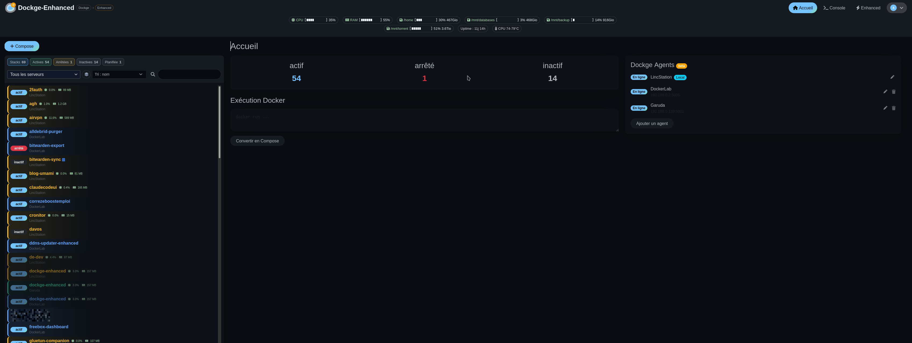</a>
      <sub>Panel principal y Agentes de Dockge</sub>
    </td>
    <td align="center" width="33%">
      <a href="screens/01-stack-overview.png">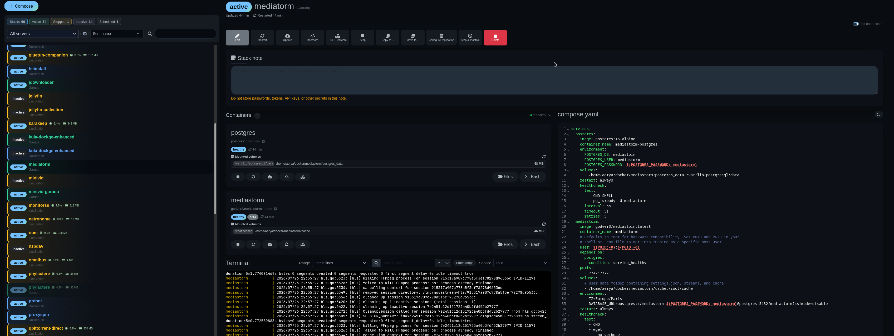</a>
      <sub>Vista general de stack, acciones, contenedores y registros</sub>
    </td>
    <td align="center" width="33%">
      <a href="screens/19-configuration-editor.png">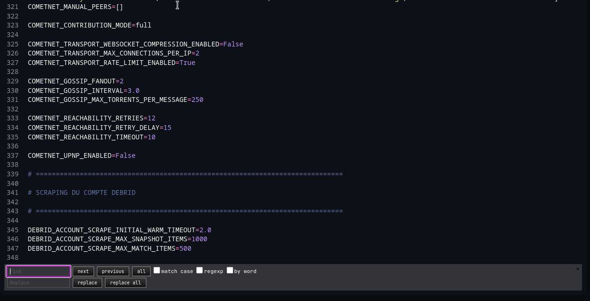</a>
      <sub>Editor de configuración con búsqueda y reemplazo</sub>
    </td>
  </tr>
  <tr>
    <td align="center" width="33%">
      <a href="screens/02-image-monitoring.png">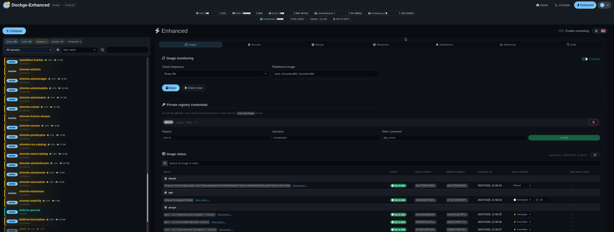</a>
      <sub>Monitoreo de imágenes y credenciales de registro</sub>
    </td>
    <td align="center" width="33%">
      <a href="screens/06-docker-images.png">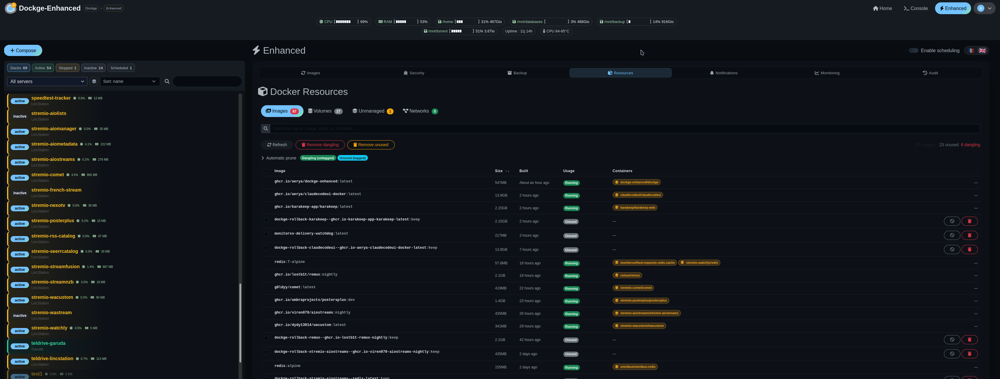</a>
      <sub>Inventario y limpieza de imágenes Docker</sub>
    </td>
    <td align="center" width="33%">
      <a href="screens/07-docker-networks.png">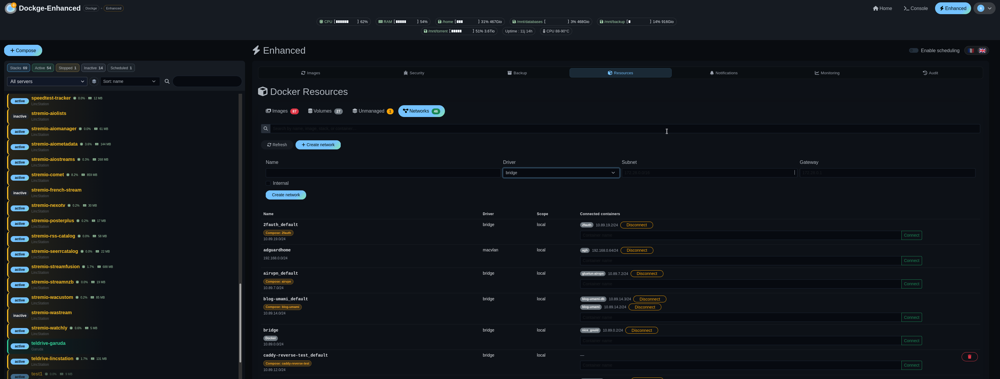</a>
      <sub>Inventario y protecciones de redes Docker</sub>
    </td>
  </tr>
  <tr>
    <td align="center" width="33%">
      <a href="screens/14-volume-file-browser.png">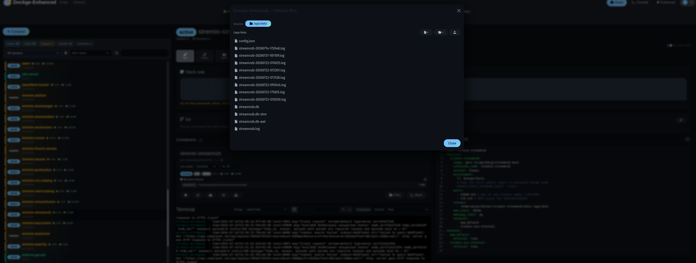</a>
      <sub>Explorador de archivos de volúmenes Docker</sub>
    </td>
    <td align="center" width="33%">
      <a href="screens/03-backup-configuration.png">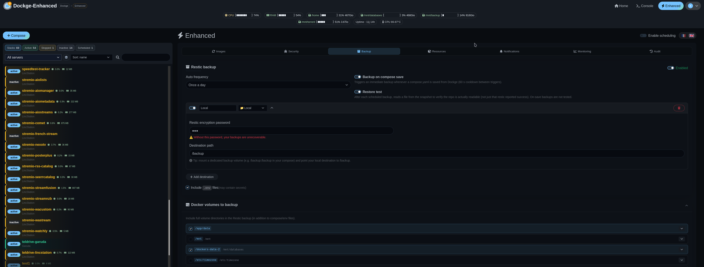</a>
      <sub>Destinos Restic y copia de seguridad de volúmenes</sub>
    </td>
    <td align="center" width="33%">
      <a href="screens/04-backup-stack-consistency.png">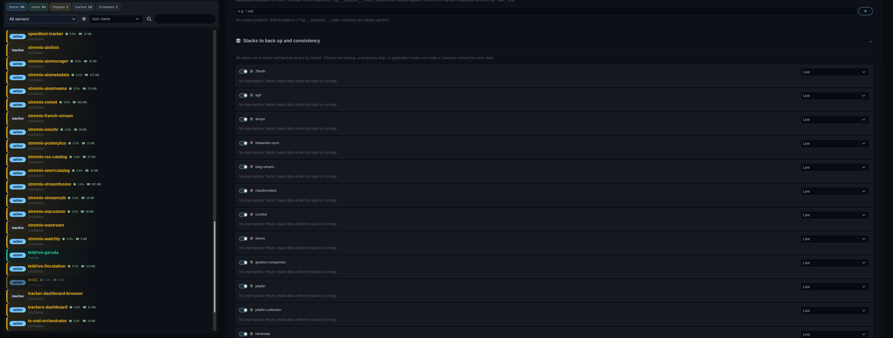</a>
      <sub>Estrategia de consistencia de copias de seguridad por stack</sub>
    </td>
  </tr>
  <tr>
    <td align="center" width="33%">
      <a href="screens/05-backup-history.png">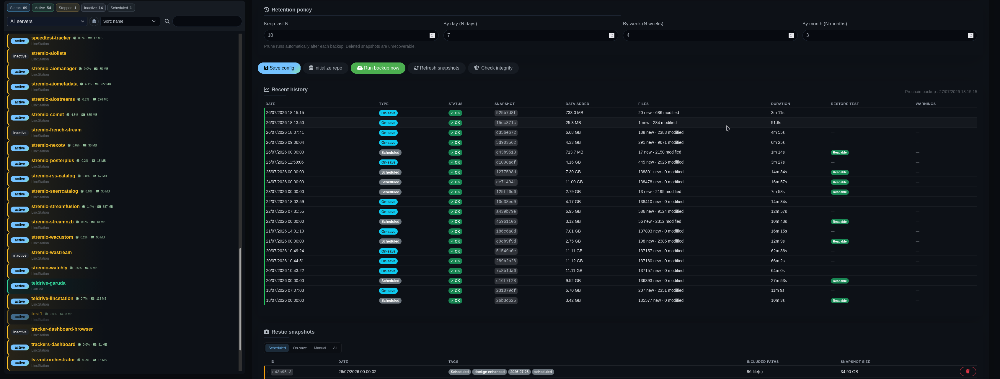</a>
      <sub>Historial de copias de seguridad, retención y pruebas de restauración</sub>
    </td>
    <td align="center" width="33%">
      <a href="screens/15-stack-replication.png">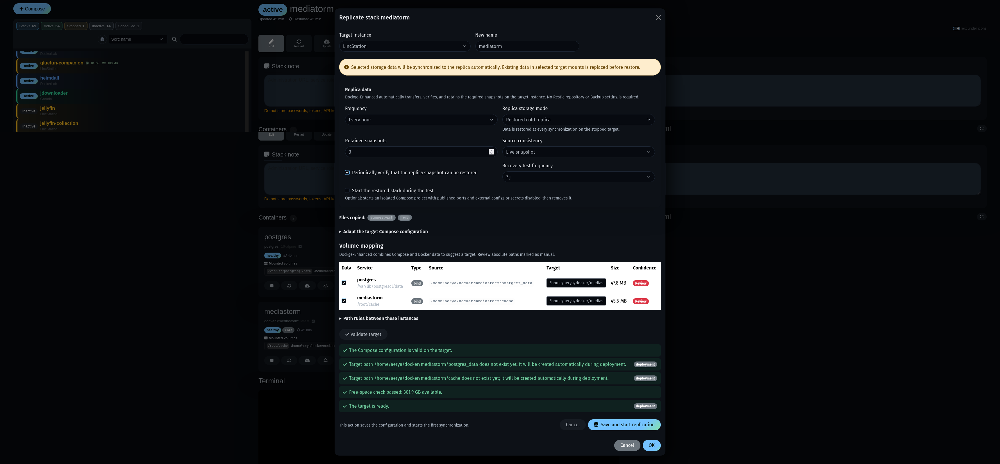</a>
      <sub>Replicación programada de stacks y pruebas de recuperación</sub>
    </td>
    <td align="center" width="33%">
      <a href="screens/16-stack-copy.png">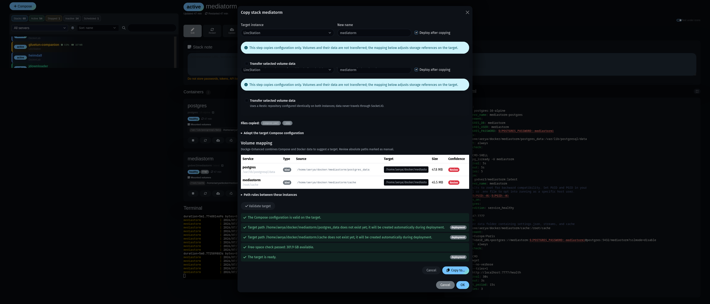</a>
      <sub>Copia de stacks entre instancias y mapeo de volúmenes</sub>
    </td>
  </tr>
  <tr>
    <td align="center" width="33%">
      <a href="screens/17-monitoring-full-page.png">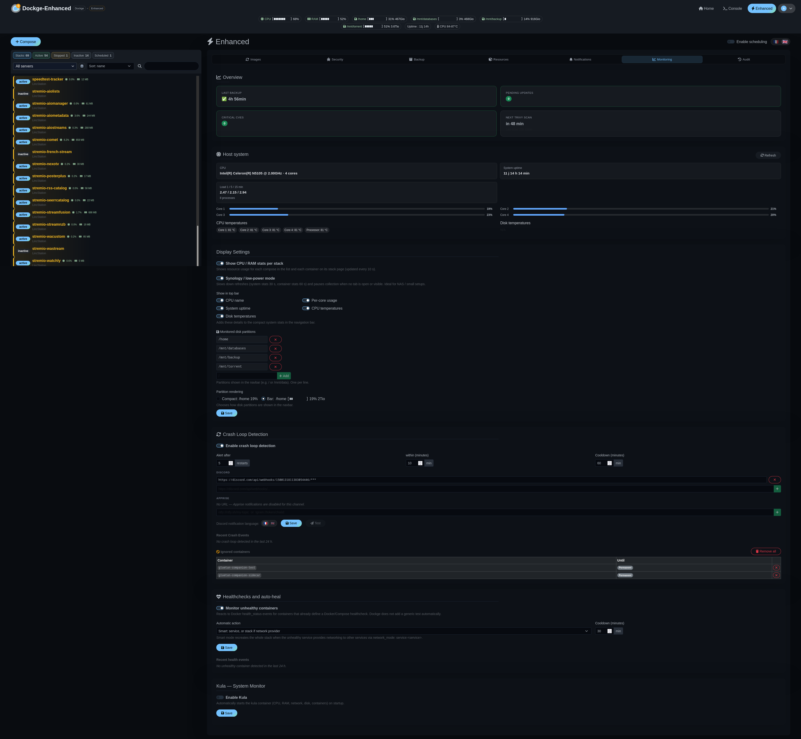</a>
      <sub>Monitoreo, detección de bucles de fallo y auto-reparación</sub>
    </td>
    <td align="center" width="33%">
      <a href="screens/08-notifications.png">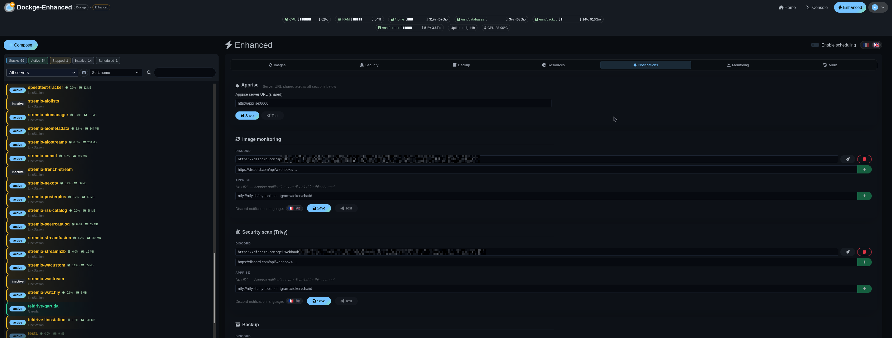</a>
      <sub>Canales de notificación y configuración de idioma</sub>
    </td>
    <td align="center" width="33%">
      <a href="screens/09-audit-log.png">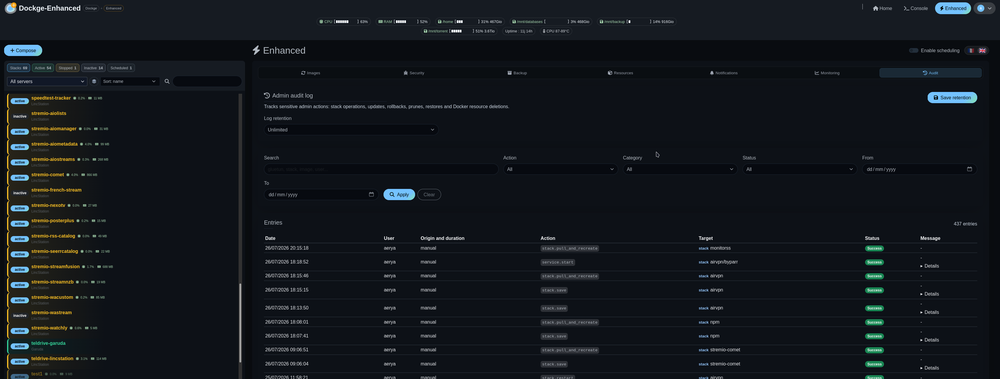</a>
      <sub>Historial de auditoría centralizado</sub>
    </td>
  </tr>
  <tr>
    <td align="center" width="33%">
      <a href="screens/10-security-settings.png">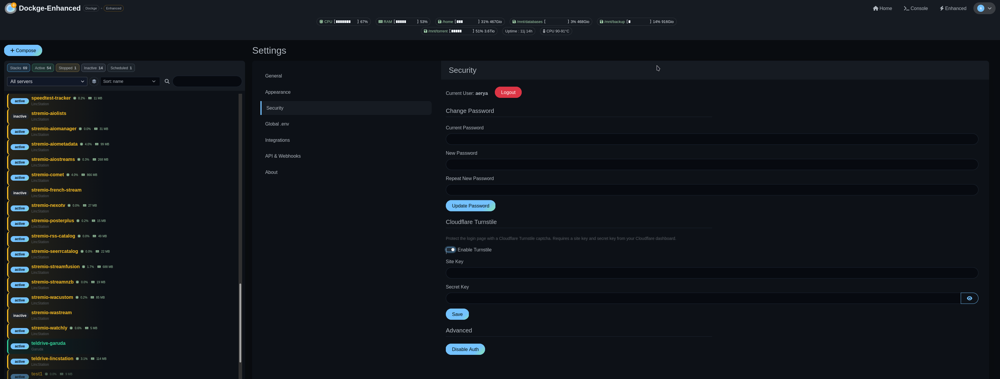</a>
      <sub>Configuración de autenticación y seguridad</sub>
    </td>
    <td align="center" width="33%">
      <a href="screens/11-plugnpin-integration.png">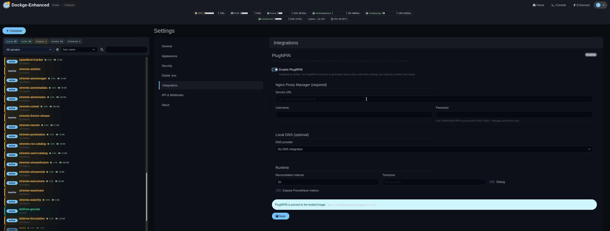</a>
      <sub>Integración opcional PlugNPiN</sub>
    </td>
    <td align="center" width="33%">
      <a href="screens/12-api-and-webhooks.png">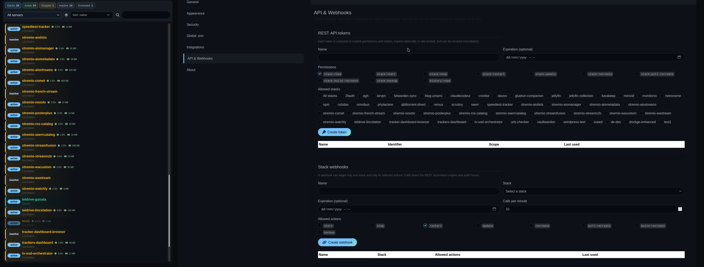</a>
      <sub>Tokens API acotados y webhooks de stack</sub>
    </td>
  </tr>
  <tr>
    <td align="center" width="33%">
      <a href="screens/13-trivy-security-scan.png">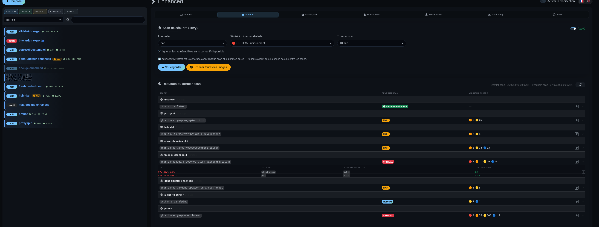</a>
      <sub>Resultados del escaneo de vulnerabilidades Trivy</sub>
    </td>
    <td align="center" width="33%">
      <a href="screens/EnhancedUpdate.png">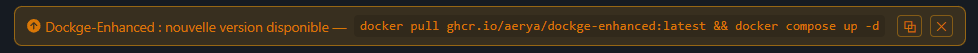</a>
      <sub>Auto-actualización en la aplicación</sub>
    </td>
    <td align="center" width="33%">
      <a href="screens/DiscordUpdates.png">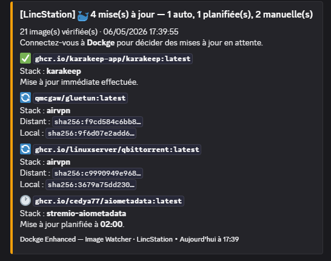</a>
      <sub>Discord — alertas de actualización de imágenes</sub>
    </td>
  </tr>
  <tr>
    <td align="center" width="33%">
      <a href="screens/DiscordTrivy.png">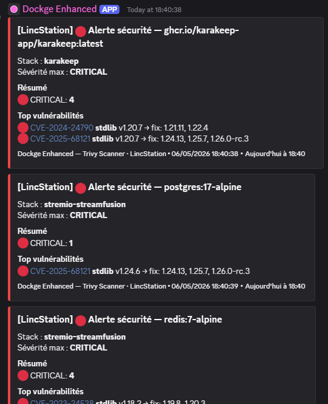</a>
      <sub>Discord — alertas de seguridad Trivy</sub>
    </td>
    <td align="center" width="33%">
      <a href="screens/DiscordBackup.png">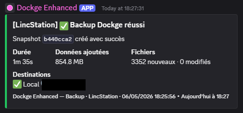</a>
      <sub>Discord — notificaciones de copia de seguridad</sub>
    </td>
    <td align="center" width="33%">
      <a href="screens/DiscordEnhancedUpdate.png">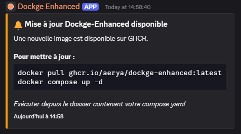</a>
      <sub>Discord — alertas de actualización de Dockge Enhanced</sub>
    </td>
  </tr>
</table>

---

## Instalación

```yaml
# compose.yaml
services:
  dockge:
    image: ghcr.io/aerya/dockge-enhanced:latest
    container_name: dockge-enhanced
    restart: unless-stopped
    ports:
      - 5001:5001
    volumes:
      - /var/run/docker.sock:/var/run/docker.sock
      - ../../data:/app/data
      - ../../opt/stacks:/opt/stacks
      - ../../backup/dockge:/backup          # opcional — volumen local dedicado para copias de seguridad
      - ../../docker:/dockers-data           # opcional — datos adicionales para copiar de seguridad
    environment:
      - DOCKGE_STACKS_DIR=/opt/stacks
      - DOCKGE_DATA_DIR=/app/data
#      - DOCKER_API_VERSION=x.xx             # opcional — para dispositivos NAS con API de Docker más antigua
      - TZ=Europe/Paris                      # zona horaria (afecta actualizaciones programadas)
```

```bash
docker compose up -d
```

Abre **http://localhost:5001**, crea tu cuenta de administrador y luego haz clic en **Monitoreo** en la barra de navegación.

> El volumen `/backup:/backup` es opcional pero recomendado si usas **local** como destino de copia de seguridad Restic — establece la ruta del destino en `/backup` para que tus instantáneas caigan en un directorio de anfitrión dedicado fuera del contenedor.

> **¿Copiando de seguridad múltiples directorios de datos?** Agrega tantos volúmenes como necesites (por ejemplo `../../media:/media-data`), luego registra cada ruta de contenedor en la pestaña Copias de seguridad bajo **Rutas adicionales** — Restic los incluirá todos en cada ejecución de copia de seguridad.

> **¿Monitoreando una partición de disco diferente a `/`?** Las estadísticas de disco se leen desde dentro del contenedor con `df`. Si quieres rastrear una ruta de anfitrión como `/mnt/data`, montala de solo lectura y agrégalas en la pestaña **Monitoreo** bajo *Particiones de disco monitoreadas*:
> ```yaml
>       - /mnt/data:/mnt/data:ro
> ```

### Integración opcional PlugNPiN

Abre **Configuración → Integraciones** para configurar [PlugNPiN](https://github.com/DeepSpace2/PlugNPiN). La integración permanece totalmente inactiva hasta que se selecciona **Habilitar PlugNPiN** y se guarda el formulario. Habilitarlo crea el stack gestionado `plugnpin-dockge-enhanced`; deshabilitarlo ejecuta Compose down y elimina el directorio de stack generado.

Las credenciales de Nginx Proxy Manager son requeridas por PlugNPiN. Pi-hole, AdGuard Home, métricas y registro de depuración permanecen opcionalmente individuales. Las contraseñas se escriben a través de stdin en el volumen Docker dedicado `dockge_enhanced_plugnpin_secrets` y nunca se devuelven al navegador ni se incluyen en el archivo Compose generado.

Para publicar un servicio, edita su stack y usa **Publicación PlugNPiN (opcional)** debajo del editor Compose. El asistente genera y puede aplicar las etiquetas requeridas `plugNPiN.ip` y `plugNPiN.url` más opciones NPM seleccionadas. Las etiquetas y comentarios en formato de mapeo existentes se conservan. Para etiquetas en formato de lista, Dockge ofrece deliberadamente salida de solo copia en lugar de reescribir la estructura existente.

> Deshabilitar el controlador detiene sus contenedores pero no puede garantizar la eliminación inmediata de entradas que creó mientras los contenedores de aplicación etiquetados aún se están ejecutando. Elimina las etiquetas o detén las aplicaciones afectadas mientras PlugNPiN se está ejecutando si esas entradas deben eliminarse primero.

> PlugNPiN `1.0.0` está actualmente publicado upstream solo para `amd64`. Dockge mantiene la integración deshabilitada con un mensaje claro en arquitecturas no compatibles; el resto de Dockge Enhanced permanece multi-arquitectura.

---

## Variables de entorno

| Variable | Predeterminado | Descripción |
|---|---|---|
| `DOCKGE_STACKS_DIR` | `/opt/stacks` | Directorio que contiene los stacks Docker Compose |
| `DOCKGE_DATA_DIR` | `/opt/dockge/data` | Directorio de datos de Dockge (establece en `/app/data`) |
| `DOCKGE_PUBLIC_URL` | *(ninguna)* | URL pública usada en enlaces de notificaciones Discord (por ejemplo `https://dockge.example.com`) |
| `DOCKER_API_VERSION` | *(ninguna)* | Fija la versión de la API de Docker negociada por el cliente — útil en ciertos sistemas NAS (por ejemplo Synology DSM 7.x) |
| `TZ` | `UTC` | Zona horaria del contenedor — **importante** para que las actualizaciones automáticas programadas se disparen en la hora local correcta (por ejemplo `Europe/Paris`) |
| `DOCKGE_PORT` | `5001` | Puerto de la interfaz web |
| `DOCKGE_SSL_KEY` / `DOCKGE_SSL_CERT` | — | Habilita HTTPS |
| `DOCKGE_AUTH_MODE` | *(no establecido)* | Modo de autenticación: `local`, `disabled`, o `trusted-proxy`. Cuando no está establecido, se conserva el comportamiento histórico y la configuración `disableAuth` |
| `DOCKGE_AUTH_PROXY_HEADER` | `x-forwarded-user` | Encabezado que contiene la identidad validada por proxy en modo `trusted-proxy` |
| `DOCKGE_AUTH_PROXY_TRUSTED_NETWORKS` | *(requerido en modo proxy)* | Direcciones o CIDRs separados por comas permitidos para proporcionar el encabezado de identidad |
| `DOCKGE_BOOTSTRAP_USERNAME` | *(ninguna)* | Nombre del primer administrador, creado solo cuando la base de datos no contiene usuarios |
| `DOCKGE_BOOTSTRAP_PASSWORD_FILE` | *(ninguna)* | Archivo secreto que contiene la contraseña; recomendado para bootstrap automatizado |
| `DOCKGE_BOOTSTRAP_PASSWORD` | *(ninguna)* | Alternativa de contraseña directa, menos segura porque es visible en el entorno del contenedor |
| `DOCKGE_TRANSFER_RSYNC_PROFILES` | `[]` | Array JSON de perfiles SSH/rsync locales (`label`, `host`, `port`, `user`, `path`, `keyPath`, opcional `bandwidthKbps`). Configura la misma identidad de destino en ambas instancias; las rutas de clave nunca salen de su instancia |

> ⚠️ Siempre establece `DOCKGE_DATA_DIR=/app/data` para coincidir con el montaje del volumen, de lo contrario la configuración no persistirá después de un reinicio.

> ℹ️ `DOCKGE_PUBLIC_URL` es opcional. Si no está configurado, las notificaciones Discord se envían sin enlace. Funciona con proxies inversos y dominios HTTPS.

> Los perfiles SSH/rsync requieren que la clave privada y un archivo `known_hosts` poblado estén montados de solo lectura en cada instancia Dockge participante. `StrictHostKeyChecking=yes` siempre se aplica; las contraseñas y comandos remotos arbitrarios no se aceptan desde la WebUI.

### Autenticación y configuración inicial

**Las instalaciones existentes no requieren cambios.** Sin las variables anteriores, las cuentas, la página de inicio de sesión, 2FA y la configuración **Deshabilitar autenticación** funcionan exactamente como antes. En el primer inicio de una nueva instalación, abre `/setup` y crea el administrador normalmente. Una vez inicializado, el servidor rechaza todo intento de configuración posterior incluso si la URL SPA permanece conocida.

Para un bootstrap sin interacción, es preferible montar un secreto y establecer solo estas variables opcionales:

```yaml
services:
  dockge:
    environment:
      - DOCKGE_BOOTSTRAP_USERNAME=admin
      - DOCKGE_BOOTSTRAP_PASSWORD_FILE=/run/secrets/dockge_admin_password
    secrets:
      - dockge_admin_password

secrets:
  dockge_admin_password:
    file: ./secrets/dockge_admin_password
```

El bootstrap se ignora tan pronto como existe un usuario, por lo que nunca cambia una cuenta o contraseña existente.

Para delegar el acceso a [OAuth2 Proxy](https://oauth2-proxy.github.io/oauth2-proxy/configuration/overview/) o Traefik ForwardAuth:

```yaml
environment:
  - DOCKGE_AUTH_MODE=trusted-proxy
  - DOCKGE_AUTH_PROXY_HEADER=x-forwarded-user
  - DOCKGE_AUTH_PROXY_TRUSTED_NETWORKS=172.20.0.0/24
```

Reemplaza el CIDR de ejemplo con la red exacta del proxy y configúralo para pasar el encabezado seleccionado. El puerto Dockge no debe ser directamente accesible: solo los proxies declarados pueden proporcionar una identidad. Cada usuario autorizado por el proxy recibe derechos de administrador porque Dockge Enhanced actualmente no proporciona roles separados. Nunca exempts `/setup`, `/socket.io`, o `/api/*` de la autenticación; el proxy debe reenviar WebSockets y proteger todo el host.

---

## Actualizaciones automáticas

Este fork rastrea automáticamente los lanzamientos upstream de Dockge a través de GitHub Actions:
- **Diario** — verifica un nuevo lanzamiento estable
- **Si se encuentra** — fusiona cambios upstream y abre un PR
- **Al fusionar** — reconstruye y publica imágenes Docker (`amd64` + `arm64`) a GHCR
- **En conflictos de autenticación** — mantiene temporalmente la versión Enhanced en la rama de sincronización y lista explícitamente archivos que requieren comparación antes de fusionar

---

## Apps móviles / clientes de terceros

Dockge-Enhanced es gratuito y de código abierto.

Actualmente no hay una app oficial de iOS o Android mantenida por este proyecto.

Pueden existir clientes de terceros, pero son independientes de Dockge-Enhanced a menos que se listen explícitamente aquí.

---

## Atribución

Si tu app, servicio, artículo o integración usa funcionalidades, endpoints API, capturas de pantalla, documentación o marca Dockge-Enhanced, por favor acredita el proyecto y enlaza a este repositorio.

Los clientes de terceros comerciales están permitidos por la licencia, pero no deben implicar afiliación oficial sin permiso.

---

## Créditos

- [**Dockge**](https://github.com/louislam/dockge) por louislam — el proyecto original (licencia MIT)
- [**Trivy**](https://github.com/aquasecurity/trivy) — escáner de vulnerabilidades
- [**Restic**](https://restic.net/) — herramienta de copia de seguridad encriptada
- [**Apprise**](https://github.com/caronc/apprise-api) — gateway de notificación multiplataforma
- [**Kula**](https://github.com/c0m4r/kula) por c0m4r — monitor de sistema ligero (AGPLv3)
- [**Dozzle**](https://github.com/amir20/dozzle) por Amir Rajan — visor de registros Docker en tiempo real (licencia MIT)
- [**PlugNPiN**](https://github.com/DeepSpace2/PlugNPiN) por DeepSpace2 — automatización opcional de DNS y Nginx Proxy Manager (GPLv3)

---

## Licencia

MIT — ver [LICENSE](LICENSE).
