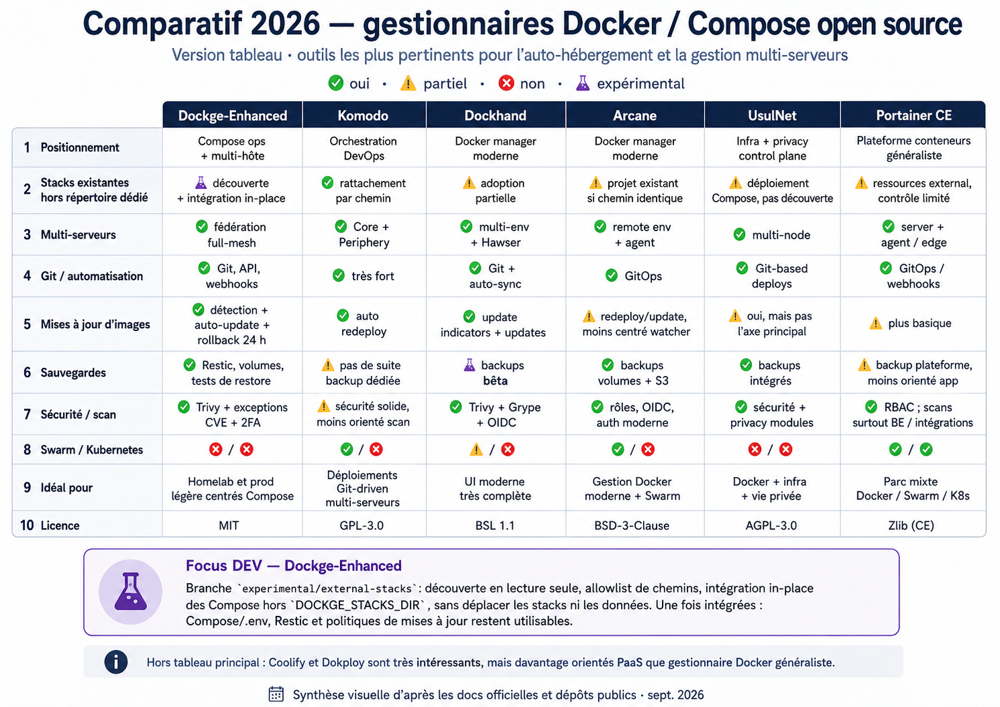

<p align="center">
  
</p>

# Dockge Enhanced
> [!WARNING]
> ## Correctif critique de l’auto-mise à jour de Dockge-Enhanced
>
> Plusieurs builds publiés entre **le 31 août 2026 et le 2 septembre 2026** ont comporté des défauts dans le mécanisme d’auto-mise à jour de Dockge-Enhanced.
>
> Dans certaines conditions, le sidecar pouvait arrêter le conteneur Dockge-Enhanced, échouer à recréer la nouvelle version et, sur certains builds, échouer également à restaurer automatiquement l’ancienne.
>
> Le mécanisme a depuis été corrigé et renforcé. À partir du build **`0fc2564` / version 1.5.4**, l’auto-mise à jour :
>
> - télécharge systématiquement le dernier `dockge-enhanced-updater:latest` avant chaque mise à jour ;
> - télécharge explicitement l’image Dockge-Enhanced cible ;
> - effectue un backup Restic obligatoire avant remplacement ;
> - vérifie le nouveau conteneur avant de valider la mise à jour ;
> - conserve un mécanisme de rollback et un snapshot de récupération.
>
> **Si votre installation utilise un build antérieur à `0fc2564` / version 1.5.4, effectuez une dernière mise à jour manuelle avant d’activer ou réactiver les mises à jour automatiques :**
>
> ```bash
> docker pull ghcr.io/aerya/dockge-enhanced:latest
> docker compose up -d
> ```
>
> Une fois cette mise à jour effectuée, vous pouvez activer **Automatique via sidecar protégé**. Les mises à jour suivantes seront alors prises en charge automatiquement par Dockge-Enhanced.
>
> **Les stacks gérées par Dockge-Enhanced et leurs données persistantes ne sont pas concernées par ce problème.**
>
> Toutes mes excuses aux utilisateurs concernés. Une fonction conçue précisément pour rendre les mises à jour plus sûres ne doit évidemment pas pouvoir laisser Dockge-Enhanced hors ligne. Merci à ceux qui utilisent, testent et signalent les problèmes : vos retours ont permis d’identifier puis de corriger rapidement ces défauts.

---

Un fork de [Dockge](https://github.com/louislam/dockge) axé sur les fonctionnalités, qui transforme son expérience simple de gestion Docker Compose en une plateforme Docker plus complète — avec fédération multi-serveurs, migration et réplication de stacks, sauvegardes Restic, mises à jour des images et de Dockge-Enhanced avec rollback, scan de sécurité, supervision, automatisation, notifications et gestion des ressources Docker, le tout depuis l'interface web.

<p align="center">
  🇫🇷 Français ·
  🇬🇧 <a href="https://github.com/Aerya/Dockge-Enhanced/blob/main/README.md">English</a> ·
  🇪🇸 <a href="https://github.com/Aerya/Dockge-Enhanced/blob/main/README.es-ES.md">Español</a> ·
  🇨🇳 <a href="https://github.com/Aerya/Dockge-Enhanced/blob/main/README.zh-CN.md">简体中文</a> ·
  <a href="https://upandclear.org/2026/08/30/dockge-enhanced-quelques-mois-plus-tard-le-petit-fork-a-bien-grandi/">Article de présentation</a>
</p>

<p align="center">
  
  
  
  
  
  
</p>

<p align="center">
  <strong>Tu l'utilises ? Tu l'aimes ?</strong>
  <a href="https://github.com/Aerya/Dockge-Enhanced"><strong>⭐ Mets une étoile !</strong></a>
  — ça prend deux secondes.
</p>

---

<p align="center">
  
</p>

## Fonctionnalités

### Ce qui distingue Dockge Enhanced

| Domaine | Dockge Enhanced ajoute |
| --- | --- |
| **Multi-serveurs** | Fédération en maillage complet entre instances Dockge-Enhanced, administration depuis n'importe quel serveur lié, sélection et regroupement des serveurs, état des mises à jour distantes, copie/migration transactionnelle des stacks, transferts reprenables et réplication froide planifiée |
| **Gestion des stacks** | Stacks épinglées, indicateurs compacts d'état et de ressources, navigation repliable/redimensionnable, espace Logs/Compose flexible, copie du YAML brut, actions et planification par stack et conteneur, Build + Recreate, notes, outils Git, prérequis de démarrage hôte et protections pour les namespaces réseau VPN partagés |
| **Sauvegarde & reprise** | Sauvegardes Restic multi-destination des bind mounts et volumes, cohérence par stack, restauration sélective, vérification des dépôts, contrôle et diff des snapshots, ainsi que les mécanismes de récupération utilisés par les mises à jour protégées |
| **Mises à jour** | Détection des mises à jour d'images, mises à jour manuelles ou automatiques des conteneurs avec rollback, badges distants, pauses globales/par image et auto-mise à jour protégée de Dockge-Enhanced avec backup obligatoire, contrôles d'intégrité et récupération automatique |
| **Migration & réplication** | Transferts transactionnels entre instances, migration du Compose et des données persistantes, jobs reprenables, finalisation explicite des déplacements, répliques froides planifiées, snapshots de récupération et workflows de reprise |
| **Automatisation & audit** | API REST limitée par permissions, webhooks par stack, exemples Home Assistant, opérations planifiées et historique centralisé avec origine, statut et durée |
| **Ressources Docker** | Gestion des images, volumes, réseaux et conteneurs hors Dockge, opérations groupées, auto-prune et protections autour des actions destructives |
| **Sécurité** | Scan de vulnérabilités Trivy, exceptions CVE, workflows de mise à jour protégés, 2FA, trusted proxy et Cloudflare Turnstile |
| **Supervision** | Statistiques système, stacks et conteneurs, barre d'état système configurable, cartes de santé du tableau de bord, détection des crash loops, auto-heal des healthchecks, logs responsives/plein écran, Kula optionnel et Dozzle géré |
| **Intégrations** | PlugNPiN et assistant de labels par service pour Nginx Proxy Manager, Pi-hole et AdGuard Home |
| **Notifications & accès** | Notifications Discord et Apprise localisées en EN/FR/ES/zh-CN, prise en compte du multi-instance, 2FA, trusted proxy, Turnstile et clients mobiles tiers |

## Dernières nouveautés

Les évolutions majeures récentes restent visibles directement dans le README afin de comprendre rapidement ce qui vient d'arriver dans Dockge-Enhanced.

### 🆕 Septembre 2026

**Stacks externes (Beta)**

Enhanced peut détecter des projets Docker Compose existants, les adopter **sans déplacer leur Compose/.env ni leurs données**, puis les gérer depuis l’interface normale des stacks. Si un chemin source n’est pas encore accessible dans Enhanced, une autorisation protégée en un clic adapte automatiquement le Compose d’Enhanced. Les stacks adoptées portent le badge **Externe** ; la suppression des fichiers source demande une confirmation supplémentaire explicite. Le scanner fait également correspondre le répertoire de stacks d’Enhanced avec son bind côté hôte : les stacks déjà gérées par l’instance sont donc exclues même lorsque les labels Docker Compose contiennent leurs chemins hôte.

**Comptage anonyme des installations**

Afin de connaître approximativement le nombre d’installations de Dockge-Enhanced réellement actives sans exploiter de service d’analytics séparé, Enhanced télécharge au maximum une fois par mois un minuscule fichier technique placé dans une release GitHub dédiée. Le `download_count` public de GitHub pour cet asset mensuel est le seul agrégat utilisé pour le comptage.

Aucun identifiant d’installation n’est généré ni transmis pour ce comptage. La requête ne contient aucun hostname, nom d’instance, stack, conteneur, image Docker, configuration, chemin, compte GitHub, e-mail, architecture ou identifiant de build. Comme pour tout téléchargement d’asset GitHub, la connexion elle-même est traitée par GitHub ; Dockge-Enhanced ne reçoit ni ne stocke l’adresse IP des installations.

Le mois déjà compté est mémorisé uniquement dans le répertoire de données local afin qu’une même installation ne télécharge l’asset qu’une fois par mois. Le comptage est activé par défaut et peut être désactivé avec `DOCKGE_USAGE_COUNT=false`. Une recréation ou suppression du répertoire de données peut faire recompter la même installation pendant le mois en cours : le chiffre reste donc volontairement approximatif.

Le mécanisme est entièrement public : [code côté Enhanced](./backend/anonymous-install-count.ts), [workflow GitHub qui crée les assets mensuels](./.github/workflows/usage-count-asset.yml) et [compteurs mensuels agrégés](https://github.com/Aerya/Dockge-Enhanced/releases/tag/usage-count).

**Recherche globale multi-instance V2 (`Ctrl+K`)**

La palette globale accepte désormais les **correspondances floues** pour tolérer de petites fautes de frappe et des opérateurs assistés comme `type:`, `stack:`, `image:`, `port:`, `instance:` ainsi que des filtres opérationnels `is:update`, `is:stopped`, `is:vulnerable`, `is:critical` et `is:backup-failed`. Des boutons d’aide sont affichés directement dans la palette : il n’est pas nécessaire de mémoriser cette syntaxe. Un résultat Compose ou `.env` ouvre la bonne stack et positionne directement CodeMirror sur la ligne trouvée. Les recherches récentes et les recherches épinglées sont conservées localement dans le navigateur.

La recherche dans la configuration des **snapshots Restic récents** s’active explicitement depuis la palette ; elle est volontairement bornée à 5 snapshots récents et 80 fichiers Compose/.env par instance afin de protéger les dépôts distants. La recherche dans les **valeurs `.env`** est elle aussi optionnelle : la valeur sert uniquement à détecter une correspondance, n’est jamais renvoyée ni affichée et, lorsque ce mode sensible est actif, la requête n’est enregistrée ni dans l’historique ni dans les favoris. Les instances liées utilisent le protocole V2 lorsqu’il est disponible, avec repli sur la V1 pour les recherches simples vers une instance encore ancienne.


**Protection de l’auto-mise à jour pendant l’édition d’un Compose/.env**

Lorsqu’un compose, son override ou son `.env` contient des modifications non enregistrées dans la WebUI, l’instance Dockge-Enhanced propriétaire bloque temporairement son auto-mise à jour — y compris si l’édition a été ouverte depuis une autre WebUI liée. L’éditeur maintient un lease court par heartbeat afin qu’une session navigateur abandonnée expire automatiquement. Si une mise à jour devient prête pendant l’édition, un popup permet **d’enregistrer puis mettre à jour**, de **reporter de 30 minutes**, de **reporter d’1 heure** ou de **continuer à travailler**. Le backend revérifie aussi les bloqueurs juste avant la préparation puis le lancement du sidecar afin qu’une édition commencée pendant le backup/la vérification ne puisse pas être interrompue par le redémarrage.


**Vue synthétique des instances liées sur l’accueil**

Le panneau des agents déjà présent sur l’accueil devient également une vue compacte de l’infrastructure. Chaque instance Dockge-Enhanced liée affiche le nombre et l’état de ses stacks, l’utilisation CPU/RAM de l’hôte, son uptime et le nombre de stacks épinglées, tout en conservant les actions existantes de renommage, réauthentification, suppression et ajout d’agent. Un clic sur le résumé d’une instance filtre la liste des stacks à gauche sur ce serveur ; un second clic rétablit la vue de tous les serveurs.


**Stats CPU/RAM par stack entre instances liées**

L’option **Afficher les stats CPU / RAM par stack** appartient désormais à chaque instance Dockge-Enhanced. Lorsqu’elle est activée sur un serveur, celui-ci collecte ses propres statistiques Docker et les expose via le canal existant des instances liées. Toute WebUI liée qui affiche ce serveur montre les mêmes badges CPU/RAM pour ses stacks et leurs conteneurs. Masquer le serveur masque ses statistiques ; désactiver l’option sur l’instance propriétaire arrête leur collecte et leur exposition pour cette instance.


**Stacks épinglées persistantes entre instances liées**

Les stacks épinglées appartiennent désormais à l’instance Dockge-Enhanced qui les héberge, et non plus au `localStorage` d’un navigateur. Épingler une stack de Garuda, DockerLab ou LincStation enregistre la préférence sur le serveur correspondant. Toute WebUI liée qui affiche ce serveur retrouve la même stack épinglée ; masquer ce serveur masque ses épingles sans les supprimer. Les épingles survivent ainsi aux déconnexions/reconnexions, aux changements de navigateur et aux mises à jour de Dockge-Enhanced. Les anciennes épingles locales sont migrées automatiquement lorsque leurs instances propriétaires sont joignables.


**Rétention dédiée des backups de self-update**

Les snapshots Restic obligatoires créés avant une auto-mise à jour protégée de Dockge-Enhanced utilisent désormais une politique de rétention dédiée. Une fois le nouveau snapshot **créé et vérifié**, Dockge-Enhanced conserve les **2 derniers snapshots self-update de cette installation** et supprime les générations plus anciennes avant de lancer le sidecar. Un tag stable propre à l’installation évite de nettoyer les snapshots d’une autre instance Dockge-Enhanced partageant le même dépôt Restic. La rétention normale (`keepLast`, quotidienne, hebdomadaire, mensuelle) reste inchangée. Si ce nettoyage dédié échoue, le backup vérifié est conservé et la mise à jour peut continuer ; l’erreur est journalisée et une auto-mise à jour ultérieure retentera le nettoyage.


**Rapprochement des noms de projets Docker Compose**

Les stacks gérées dont le dossier contient des points ou des majuscules sont désormais rapprochées de Docker Compose à partir du chemin réel `ConfigFiles`, au lieu de dépendre uniquement du nom de projet normalisé par Docker. Cela évite les doublons « gérée/arrêtée » et « externe/en cours » pour une même stack.

**Prise en charge de la syntaxe longue des ports Compose**

Les cartes des conteneurs prennent désormais en charge les syntaxes courte et longue des ports Compose. Les définitions utilisant `published`, `target`, `protocol`, `mode` ou `host_ip` ne provoquent plus l'erreur `split is not a function` et ne font plus disparaître la carte du conteneur. Les valeurs IPv6 de `host_ip` sont également correctement formatées dans les liens générés.

**Préservation des permissions tmpfs dans l'éditeur Compose**

L'éditeur visuel Compose conserve désormais les valeurs octales avec zéro initial telles que `tmpfs.mode: 01777` lorsqu'il régénère le YAML. Modifier un autre champ ne réécrit donc plus silencieusement cette permission en `1777`.

**Protection renforcée contre le path traversal des stacks**

Les noms de stacks fournis aux opérations backend sont désormais validés avant toute résolution de chemin, y compris dans les chemins de code qui ignorent volontairement la découverte filesystem. Un nom forgé tel que `../outside` ne peut plus sortir du répertoire des stacks gérées pour accéder aux fichiers Compose ou `.env` d'une autre application.

**Auto-mise à jour protégée de Dockge-Enhanced**

Dockge-Enhanced peut désormais se mettre à jour via un sidecar volontairement restreint. Chaque mise à jour exige un backup Restic et une vérification d'intégrité du dépôt avant remplacement du conteneur. La nouvelle version doit ensuite passer les contrôles de disponibilité ; sinon l'image précédente immuable est restaurée automatiquement.

**État des mises à jour sur les serveurs distants**

Les informations de mise à jour des images sont récupérées séparément depuis chaque instance Dockge-Enhanced connectée. Les stacks distantes affichent donc leurs propres badges de mise à jour sans mélanger les serveurs ou les stacks portant le même nom.

**Identification claire des builds et progression des mises à jour**

L'onglet Mises à jour identifie désormais les builds installés et disponibles grâce aux métadonnées OCI : date de build, commit Git et digest immuable. Les différentes étapes, la progression Restic, le temps écoulé et l'estimation restante sont affichés de manière cohérente.


**Annonces distantes**

Dockge-Enhanced peut afficher une **annonce opérationnelle en texte uniquement publiée depuis ce dépôt GitHub**, indépendamment du mécanisme de mise à jour de l'image Docker. Ce canal de secours a été ajouté à la suite de l'incident d'auto-mise à jour de fin août / début septembre 2026 : si un futur build présente un problème important, une version installée concernée pourra recevoir un avertissement sans devoir attendre que ce même mécanisme de mise à jour fonctionne.

Les annonces proviennent de [`remote-announcements.json`](remote-announcements.json). Elles sont facultatives, récupérées uniquement en HTTPS, validées par un schéma strict, limitées en taille et en nombre, et peuvent être ciblées par version de l'application, révision Git ou date de build OCI. Elles **ne peuvent exécuter aucune commande, injecter du HTML ni déclencher une mise à jour**. Les liens sont limités au dépôt GitHub de Dockge-Enhanced. Si GitHub est indisponible ou si le document est invalide, aucune annonce n'est affichée.

Fermer une annonce ne la masque que pour la session du navigateur. **Ne plus afficher** mémorise son identifiant dans les données persistantes de Dockge-Enhanced ; une nouvelle annonce utilise un nouvel identifiant.

**Compatibilité entre instances liées**

Les opérations **Copier**, **Déplacer** et **Répliquer** négocient un **protocole de transfert** indépendant du SHA du build. Des builds différents restent autorisés lorsque leur protocole est compatible. En cas d’incompatibilité, aucun transfert ne démarre. Une instance distante assez récente pour connaître ce mécanisme peut être mise à jour depuis la WebUI via le self-update normal (backup Restic, sidecar, healthcheck et rollback), puis Dockge-Enhanced attend jusqu’à **2 heures** sa reconnexion avant de reprendre. Une version trop ancienne pour répondre au handshake exige une mise à jour manuelle. La réplication permanente passe en **En attente de compatibilité** et retente environ toutes les 10 minutes sans modifier les données.

**Identification permanente de l’instance locale**

Le **nom de l’instance locale** défini dans Dockge Agents est affiché en permanence dans le header desktop/mobile et dans le titre de l’onglet (`NomInstance · Dockge-Enhanced`). Si aucun nom n’est défini, l’hôte (`IP:port` ou domaine) est utilisé comme repère. Aucun réglage supplémentaire n’est nécessaire.

**Journal de nouveautés non lues**

La popup de nouveautés conserve désormais chaque entrée de release individuellement. Si plusieurs mises à jour automatiques sont installées sans que la WebUI soit ouverte, **toutes les nouveautés accumulées** sont présentées à la prochaine ouverture. Ouvrir ou recharger la page ne marque rien comme lu : les entrées affichées ne sont acquittées que lorsque l’utilisateur ferme explicitement la popup. Le stockage repose sur les IDs des releases et ne dépend plus de leur position dans la liste. L’ancien marqueur `releaseNewsSeen` est migré automatiquement sans réafficher tout l’historique aux utilisateurs existants.

### Août 2026

**Migration transactionnelle et réplication des stacks**

Les stacks peuvent être copiées ou déplacées entre instances Dockge-Enhanced avec leur configuration Compose et leurs données persistantes. Les transferts sont reprenables, validés côté cible et protégés par des mécanismes de rollback.

**Prérequis hôte et récupération automatique**

Une stack peut exiger qu'un montage hôte ou un service `systemd` soit disponible avant son démarrage. Dockge-Enhanced peut également surveiller ces dépendances et gérer proprement leur disparition puis leur retour.

**Interface responsive et supervision enrichie**

La navigation des stacks, l'espace Logs/Compose, les indicateurs de ressources, les cartes de santé, les thèmes et l'affichage mobile ont été largement remaniés.

➡️ **[Consulter le changelog complet](CHANGELOG.fr.md)**

---

## Catalogue des fonctionnalités

### Multi-serveurs & fédération
- Fédération en maillage complet entre instances Dockge-Enhanced
- Administration depuis n'importe quelle instance liée
- Sélection et regroupement des serveurs
- État distant des stacks et des mises à jour d'images
- Jetons de fédération dédiés
- Récupération d'une liaison de fédération cassée
- Gestion multi-instance unifiée

### Gestion des stacks
- Création, édition, démarrage, arrêt et recréation des stacks Compose
- Stacks épinglées
- Tri par date de création ou dernière mise à jour
- Notes par stack
- Outils Git
- Build + Recreate
- Actions par service et par conteneur
- Opérations planifiées
- Prérequis liés aux montages hôte et services `systemd`
- Protections pour les services partageant le namespace réseau d'un VPN
- Colonne des stacks repliable et redimensionnable
- Indicateurs compacts d'état, CPU et RAM

### Migration & réplication
- Copie ou déplacement de stacks entre instances
- Transfert de la configuration Compose
- Transfert des bind mounts et volumes nommés
- Jobs reprenables
- Vérification SHA-256
- Déploiement transactionnel et rollback
- Copie d'images Docker locales si nécessaire
- Transfert sécurisé des accès aux registries privés
- Détection des conflits `container_name`
- Réplication froide planifiée
- Snapshots et mécanismes de récupération

### Sauvegarde & restauration
- Sauvegardes Restic
- Plusieurs destinations de backup
- Sauvegardes cohérentes par stack
- Bind mounts et volumes
- Restauration sélective
- Vérification d'intégrité des dépôts
- Tests et comparaison des snapshots
- Historique des sauvegardes
- Intégration aux workflows de récupération et de mise à jour

### Mises à jour
- Surveillance des mises à jour d'images Docker
- Détection des mises à jour distantes
- Mises à jour manuelles et automatiques
- Rollback vers l'image précédente
- Planification
- Pause globale et par image
- Auto-mise à jour protégée de Dockge-Enhanced
- Backup Restic et contrôle d'intégrité obligatoires
- Vérification de disponibilité et récupération automatique

### Sécurité
- Validation centralisée des noms de stacks pour bloquer tout path traversal hors du répertoire géré
- Scan Trivy
- Exceptions CVE
- 2FA
- Cloudflare Turnstile
- Trusted proxy
- Sidecar restreint et plan d'update signé
- Protections autour des opérations destructives
- Transfert chiffré des identifiants de registries privés

### Supervision
- Statistiques système, stacks et conteneurs
- Barre d'état système configurable
- Cartes de santé
- Détection des crash loops
- Auto-heal des healthchecks
- Logs live et plein écran
- Pause de l'autoscroll et gestion des longues lignes
- Intégrations Kula et Dozzle

### Ressources Docker
- Images, volumes, réseaux et conteneurs non gérés
- Actions groupées
- Auto-prune
- Protections contre les suppressions à risque

### Automatisation & audit
- API REST limitée par permissions et stacks
- Webhooks par stack
- Exemples Home Assistant
- Opérations planifiées
- Historique centralisé avec origine, statut et durée

### Intégrations
- PlugNPiN
- Assistants de labels Nginx Proxy Manager, Pi-hole et AdGuard Home
- Dozzle
- Kula

### Notifications & accès
- Discord et Apprise
- Notifications localisées en EN / FR / ES / zh-CN
- 2FA, trusted proxy et Cloudflare Turnstile
- Clients mobiles tiers

---

---

## Déroulement d’une mise à jour automatique de Dockge-Enhanced

Dockge-Enhanced gère automatiquement le workflow complet : backup Restic obligatoire, vérification d’intégrité, remplacement contrôlé du conteneur, healthcheck puis confirmation finale. Les notifications Discord/Apprise permettent aussi de suivre l’opération sans rester devant la WebUI.

Avant de démarrer une auto-mise à jour, Enhanced vérifie aussi qu’aucune opération sensible n’est en cours : backup ou restauration Restic, copie/déplacement/transfert de données ou réplication de stack, vérification/mise à jour d’images Docker, scan Trivy et intégration protégée d’une stack externe. Si une opération bloque la mise à jour, celle-ci passe en attente, la raison est visible dans la WebUI et envoyée via Discord/Apprise, puis le watcher la retente automatiquement.

<table>
<tr>
<td align="center" width="50%"><a href="screens/AutoUpdate-ResticVerification.png"></a><br/><sub><strong>1. Vérification Restic</strong> — contrôle du backup avant remplacement.</sub></td>
<td align="center" width="50%"><a href="screens/AutoUpdate-Healthcheck.png"></a><br/><sub><strong>2. Healthcheck</strong> — validation du nouveau conteneur.</sub></td>
</tr>
<tr>
<td align="center" width="50%"><a href="screens/AutoUpdate-Completed.png"></a><br/><sub><strong>3. Mise à jour terminée</strong> — build installé et état final.</sub></td>
<td align="center" width="50%"><a href="screens/AutoUpdate-Notifications.png"></a><br/><sub><strong>4. Notifications</strong> — disponibilité, changements et confirmation finale.</sub></td>
</tr>
</table>

## Captures d'écran

<table>
  <tr>
    <td align="center" width="33%">
      <a href="screens/1.png"></a>
      <sub>Tableau de bord multi-instance et état global</sub>
    </td>
    <td align="center" width="33%">
      <a href="screens/2.png"></a>
      <sub>Vue d’une stack, Compose, conteneurs et logs</sub>
    </td>
    <td align="center" width="33%">
      <a href="screens/3.png"></a>
      <sub>Gestion détaillée d’une stack et de ses actions</sub>
    </td>
  </tr>
  <tr>
    <td align="center" width="33%">
      <a href="screens/4.png"></a>
      <sub>Assistant de copie/migration — sélection des données</sub>
    </td>
    <td align="center" width="33%">
      <a href="screens/5.png"></a>
      <sub>Assistant de copie/migration — préparation du transfert</sub>
    </td>
    <td align="center" width="33%">
      <a href="screens/6.png"></a>
      <sub>Assistant de copie/migration — mapping et validation des volumes</sub>
    </td>
  </tr>
  <tr>
    <td align="center" width="33%">
      <a href="screens/7.png"></a>
      <sub>Vue stack avec outils d’exploitation avancés</sub>
    </td>
    <td align="center" width="33%">
      <a href="screens/8.png"></a>
      <sub>Surveillance des mises à jour d’images</sub>
    </td>
    <td align="center" width="33%">
      <a href="screens/9.png"></a>
      <sub>État détaillé des images surveillées</sub>
    </td>
  </tr>
  <tr>
    <td align="center" width="33%">
      <a href="screens/10.png"></a>
      <sub>Planification du démarrage et de l’arrêt des stacks</sub>
    </td>
    <td align="center" width="33%">
      <a href="screens/11.png"></a>
      <sub>Analyse de sécurité et résultats Trivy</sub>
    </td>
    <td align="center" width="33%">
      <a href="screens/12.png"></a>
      <sub>Configuration des sauvegardes Restic</sub>
    </td>
  </tr>
  <tr>
    <td align="center" width="33%">
      <a href="screens/13.png"></a>
      <sub>Volumes inclus, exclusions et cohérence des sauvegardes</sub>
    </td>
    <td align="center" width="33%">
      <a href="screens/14.png"></a>
      <sub>Gestion des ressources Docker</sub>
    </td>
    <td align="center" width="33%">
      <a href="screens/15.png"></a>
      <sub>Supervision, monitoring et état des conteneurs</sub>
    </td>
  </tr>
  <tr>
    <td align="center" width="33%">
      <a href="screens/16.png"></a>
      <sub>Interface responsive / affichage mobile</sub>
    </td>
    <td align="center" width="33%">
      <a href="screens/17.png"></a>
      <sub>Historique et journal d’audit</sub>
    </td>
    <td align="center" width="33%">
      <a href="screens/18.png"></a>
      <sub>Paramètres de sécurité et d’authentification</sub>
    </td>
  </tr>
  <tr>
    <td align="center" width="33%">
      <a href="screens/19.png"></a>
      <sub>Intégrations facultatives</sub>
    </td>
    <td align="center" width="33%">
      <a href="screens/20.png"></a>
      <sub>Automatisation, API et webhooks</sub>
    </td>
    <td align="center" width="33%">
      <a href="screens/21.png"></a>
      <sub>À propos et informations de version</sub>
    </td>
  </tr>
  <tr>
    <td align="center" width="33%">
      <a href="screens/EnhancedUpdate.png"></a>
      <sub>Mise à jour intégrée de Dockge Enhanced</sub>
    </td>
    <td align="center" width="33%">
      <a href="screens/DiscordUpdates.png"></a>
      <sub>Discord — alertes de mises à jour d’images</sub>
    </td>
    <td align="center" width="33%">
      <a href="screens/DiscordTrivy.png"></a>
      <sub>Discord — alertes de sécurité Trivy</sub>
    </td>
  </tr>
  <tr>
    <td align="center" width="33%">
      <a href="screens/DiscordBackup.png"></a>
      <sub>Discord — notifications de sauvegarde</sub>
    </td>
    <td align="center" width="33%">
      <a href="screens/DiscordEnhancedUpdate.png"></a>
      <sub>Discord — alertes de mise à jour Dockge Enhanced</sub>
    </td>
  </tr>
</table>
---

## Installation

```yaml
# compose.yaml
services:
  dockge:
    image: ghcr.io/aerya/dockge-enhanced:latest
    container_name: dockge-enhanced
    restart: unless-stopped
    ports:
      - 5001:5001
    volumes:
      - /var/run/docker.sock:/var/run/docker.sock
      - ../../data:/app/data
      - ../../opt/stacks:/opt/stacks
      - ../../backup/dockge:/backup          # optionnel — volume dédié au backup local
      - ../../docker:/dockers-data           # optionnel — données supplémentaires à sauvegarder
    environment:
      - DOCKGE_STACKS_DIR=/opt/stacks
      - DOCKGE_DATA_DIR=/app/data
#      - DOCKER_API_VERSION=x.xx             # optionnel — pour les NAS avec une API Docker ancienne
      - TZ=Europe/Paris                      # fuseau horaire (affecte les MàJ planifiées)
```

```bash
docker compose up -d
```

Ouvre **http://localhost:5001**, crée ton compte admin, puis clique sur **Surveillance** dans la barre de navigation.

> Le volume `/backup:/backup` est optionnel mais recommandé si tu utilises **local** comme destination Restic — pointe la destination sur `/backup` pour que les snapshots atterrissent dans un répertoire dédié sur l'hôte, hors du container.

> **Tu veux sauvegarder plusieurs répertoires de données ?** Ajoute autant de volumes que nécessaire (ex : `../../media:/media-data`), puis enregistre chaque chemin dans l'onglet Backup sous **Chemins supplémentaires** — Restic les inclura tous à chaque exécution.

> **Tu veux surveiller une partition autre que `/` ?** Les stats disque sont lues depuis l'intérieur du container via `df`. Pour surveiller un chemin hôte comme `/mnt/data`, monte-le en lecture seule et ajoute-le dans l'onglet **Monitoring** sous *Partitions disque surveillées* :
> ```yaml
>       - /mnt/data:/mnt/data:ro
> ```

### Intégration PlugNPiN facultative

Ouvre **Paramètres → Intégrations** pour configurer [PlugNPiN](https://github.com/DeepSpace2/PlugNPiN). L’intégration reste totalement inactive tant que **Activer PlugNPiN** n’est pas sélectionné et sauvegardé. Son activation crée la stack gérée `plugnpin-dockge-enhanced` ; sa désactivation exécute Compose down puis retire le dossier généré.

Les identifiants Nginx Proxy Manager sont obligatoires pour PlugNPiN. Pi-hole, AdGuard Home, les métriques et les logs debug restent facultatifs et indépendants. Les mots de passe sont écrits via l’entrée standard dans le volume Docker dédié `dockge_enhanced_plugnpin_secrets` ; ils ne sont jamais renvoyés au navigateur ni inclus dans le Compose généré.

Pour publier un service, édite sa stack puis utilise **Publication PlugNPiN (facultative)** sous l’éditeur Compose. L’assistant génère et peut appliquer les labels obligatoires `plugNPiN.ip` et `plugNPiN.url`, ainsi que les options NPM sélectionnées. Les commentaires et labels existants sous forme de mapping sont préservés. Pour les labels sous forme de liste, Dockge fournit volontairement uniquement le YAML à copier au lieu de réécrire la structure existante.

> La désactivation du contrôleur arrête ses conteneurs, mais ne peut pas garantir la suppression immédiate des entrées qu’il a créées lorsque les conteneurs applicatifs étiquetés fonctionnent encore. Retire les labels ou arrête les applications concernées pendant que PlugNPiN fonctionne si ces entrées doivent d’abord être supprimées.

> PlugNPiN `1.0.0` est actuellement publié en amont uniquement pour `amd64`. Dockge maintient l’intégration désactivée avec un message explicite sur les architectures non prises en charge ; le reste de Dockge Enhanced demeure multi-architecture.

---

## Variables d'environnement

| Variable | Défaut | Description |
|---|---|---|
| `DOCKGE_STACKS_DIR` | `/opt/stacks` | Dossier contenant les stacks Docker Compose |
| `DOCKGE_DATA_DIR` | `/opt/dockge/data` | Dossier de données Dockge (à définir sur `/app/data`) |
| `DOCKGE_PUBLIC_URL` | *(aucun)* | URL publique utilisée dans les liens des notifications Discord (ex : `https://dockge.mondomaine.fr`) |
| `DOCKER_API_VERSION` | *(aucun)* | Fixe la version d'API Docker négociée par le client — utile sur certains NAS (ex : Synology DSM 7.x) |
| `TZ` | `UTC` | Fuseau horaire du container — **important** pour que les MàJ planifiées se déclenchent à la bonne heure locale (ex : `Europe/Paris`) |
| `DOCKGE_PORT` | `5001` | Port de la WebUI |
| `DOCKGE_SSL_KEY` / `DOCKGE_SSL_CERT` | — | Activer HTTPS |
| `DOCKGE_AUTH_MODE` | *(non défini)* | Mode d’authentification : `local`, `disabled` ou `trusted-proxy`. Non défini, le comportement historique et le réglage `disableAuth` sont conservés |
| `DOCKGE_AUTH_PROXY_HEADER` | `x-forwarded-user` | Header contenant l’identité validée par le proxy en mode `trusted-proxy` |
| `DOCKGE_AUTH_PROXY_TRUSTED_NETWORKS` | *(requis en mode proxy)* | Adresses ou CIDR autorisés à fournir le header d’identité, séparés par des virgules |
| `DOCKGE_BOOTSTRAP_USERNAME` | *(aucun)* | Nom du premier administrateur à créer uniquement si la base ne contient encore aucun utilisateur |
| `DOCKGE_BOOTSTRAP_PASSWORD_FILE` | *(aucun)* | Fichier secret contenant son mot de passe ; recommandé pour un bootstrap automatisé |
| `DOCKGE_BOOTSTRAP_PASSWORD` | *(aucun)* | Alternative directe au fichier secret, moins sûre car visible dans l’environnement du conteneur |
| `DOCKGE_TRANSFER_RSYNC_PROFILES` | `[]` | Tableau JSON de profils SSH/rsync locaux (`label`, `host`, `port`, `user`, `path`, `keyPath`, `bandwidthKbps` optionnel). Configurer la même identité de destination sur les deux instances ; les chemins de clés ne quittent jamais leur instance |

> ⚠️ Toujours définir `DOCKGE_DATA_DIR=/app/data` pour correspondre au montage de volume, sinon les paramètres ne seront pas persistés après un redémarrage.

> ℹ️ `DOCKGE_PUBLIC_URL` est optionnel. Si absent, les notifications Discord sont envoyées sans lien. Compatible avec les reverse proxies et les domaines HTTPS.

> Les profils SSH/rsync exigent que la clé privée et un fichier `known_hosts` déjà rempli soient montés en lecture seule dans chaque instance Dockge participante. `StrictHostKeyChecking=yes` reste toujours imposé ; aucun mot de passe ni commande distante arbitraire ne peut être fourni depuis la WebUI.

### Authentification et premier setup

**Installation existante : rien à changer.** Sans les variables ci-dessus, les comptes, la page de connexion, la 2FA et le réglage **Désactiver l’authentification** fonctionnent comme avant. Au premier démarrage d’une installation neuve, ouvre simplement `/setup` et crée l’administrateur. Une fois l’installation terminée, le serveur refuse toute nouvelle tentative de setup, même si l’URL SPA reste connue.

Pour un bootstrap non interactif, monte de préférence un secret puis renseigne uniquement ces variables optionnelles :

```yaml
services:
  dockge:
    environment:
      - DOCKGE_BOOTSTRAP_USERNAME=admin
      - DOCKGE_BOOTSTRAP_PASSWORD_FILE=/run/secrets/dockge_admin_password
    secrets:
      - dockge_admin_password

secrets:
  dockge_admin_password:
    file: ./secrets/dockge_admin_password
```

Le bootstrap est ignoré dès qu’un utilisateur existe : il ne modifie ni mot de passe ni compte sur une installation déjà initialisée.

Pour déléguer l’accès à [OAuth2 Proxy](https://oauth2-proxy.github.io/oauth2-proxy/configuration/overview/) ou à Traefik ForwardAuth :

```yaml
environment:
  - DOCKGE_AUTH_MODE=trusted-proxy
  - DOCKGE_AUTH_PROXY_HEADER=x-forwarded-user
  - DOCKGE_AUTH_PROXY_TRUSTED_NETWORKS=172.20.0.0/24
```

Remplace le CIDR d’exemple par le réseau exact de ton proxy et configure celui-ci pour transmettre le header choisi. Le port Dockge ne doit pas être accessible directement : seuls les proxies déclarés peuvent fournir une identité. Tous les utilisateurs autorisés par le proxy disposent des droits administrateur dans Dockge Enhanced, qui ne propose pas encore de rôles distincts. Ne place jamais `/setup`, `/socket.io` ou `/api/*` dans une règle sans authentification ; le proxy doit transmettre les WebSockets et protéger tout le host.

---

## Mises à jour automatiques

Ce fork suit les releases stables de Dockge automatiquement via GitHub Actions :
- **Chaque jour** — vérifie si une nouvelle version est disponible
- **Si oui** — merge les changements upstream et crée une PR
- **Au merge** — rebuild et publie les images Docker (`amd64` + `arm64`) sur GHCR
- **En cas de conflit d’authentification** — conserve temporairement la version Enhanced dans la branche de synchronisation et signale explicitement les fichiers à comparer avant le merge

---

## Applications mobiles / clients tiers

Dockge-Enhanced est libre et open-source.

Il n'existe pas d'application iOS ou Android officielle maintenue par ce projet.

Des clients tiers peuvent exister, mais ils sont indépendants de Dockge-Enhanced sauf mention explicite ici.

---

## Attribution

Si votre application, service, article ou intégration utilise des fonctionnalités, endpoints API, captures d'écran, documentation ou la marque de Dockge-Enhanced, merci de créditer le projet et de lier vers ce dépôt.

Les clients tiers commerciaux sont autorisés par la licence, mais ne doivent pas laisser entendre une affiliation officielle sans autorisation.

---

## Crédits

- [**Dockge**](https://github.com/louislam/dockge) par louislam — le projet d'origine (licence MIT)
- [**Trivy**](https://github.com/aquasecurity/trivy) — scanner de vulnérabilités
- [**Restic**](https://restic.net/) — outil de backup chiffré
- [**Apprise**](https://github.com/caronc/apprise-api) — passerelle de notifications multi-plateformes
- [**Kula**](https://github.com/c0m4r/kula) par c0m4r — monitoring système léger (AGPLv3)
- [**Dozzle**](https://github.com/amir20/dozzle) par Amir Rajan — visualisation en temps réel des logs Docker (licence MIT)
- [**PlugNPiN**](https://github.com/DeepSpace2/PlugNPiN) par DeepSpace2 — automatisation optionnelle du DNS et de Nginx Proxy Manager (GPLv3)
- [**crossly/Dockge-Enhanced**](https://github.com/crossly/Dockge-Enhanced) — source d’améliorations importantes de l’UI/UX, des thèmes, de l’internationalisation et de l’architecture frontend adaptées dans ce projet

---

## Licence

MIT — voir [LICENSE](LICENSE).
