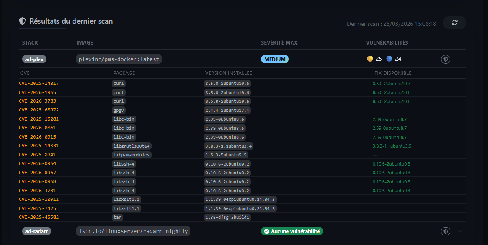
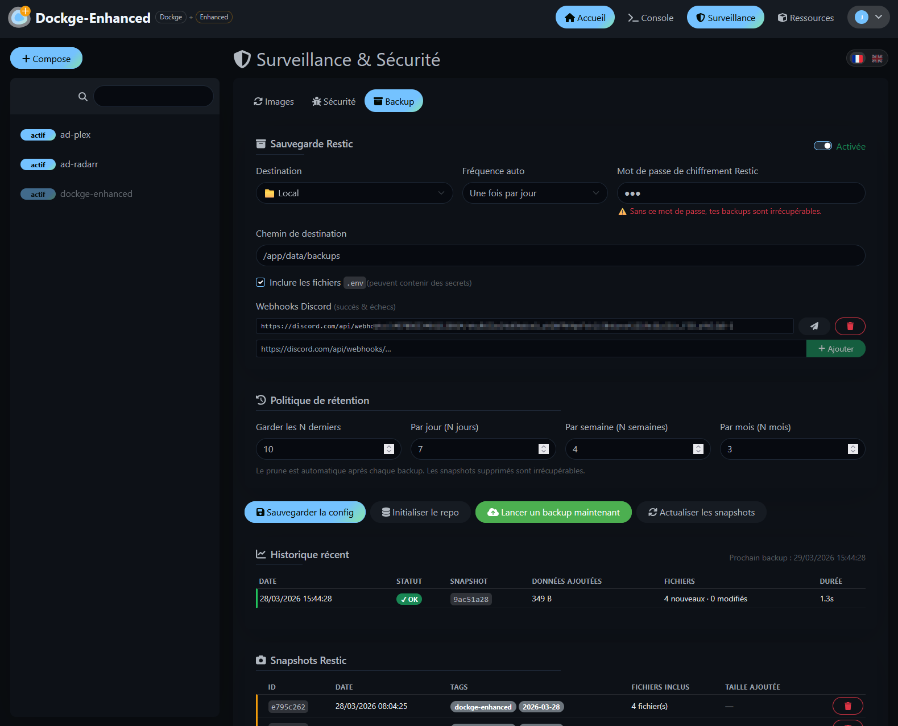

<p align="center">
  
</p>

# Dockge Enhanced

> 💡 **Use it? Like it? [⭐ Star it!](https://github.com/Aerya/dockge-enhanced/stargazers)** — it only takes a second.

🇫🇷 [Version française](README.fr.md)

> 📖 **[Gérer ses conteneurs Docker autrement : le fork Dockge Enhanced](https://upandclear.org/2026/03/28/gerer-ses-conteneurs-docker-autrement-le-fork-dockge-enhanced-surveillance-dimages-scan-cve-backup-automatique-gestion-des-ressources/)** — article de présentation (en français)

A fork of [**Dockge**](https://github.com/louislam/dockge) by louislam — adds image monitoring, security scanning, automatic backups and Docker resource management, all controllable from the web UI.

---

## ✨ Added features

**🔄 Image Watcher** — Automatically checks for image updates by comparing local and remote digests (no pull required). Supports Docker Hub, ghcr.io, and private registries. Configurable frequency (1h → 24h). Click **View project →** next to any image to search for it instantly.

**🛡️ Trivy Scanner** — Scans running container images for known vulnerabilities (CVE) via [Trivy](https://trivy.dev/). `aquasec/trivy:latest` is automatically pulled before each scan and removed afterwards — always up-to-date, zero disk footprint between scans. Configurable severity threshold and scan timeout. Results visible in the UI with a per-image manual scan button. CVE deduplication ensures each vulnerability appears only once per image. Alerts sent to Discord with retry/backoff on rate limits.

**☁️ Restic Backup** — Automatic backup of all stack `compose.yaml` and `.env` files with [Restic](https://restic.net/). **Multiple destinations in parallel** — add as many as you want (e.g. local + SFTP) and all are backed up on every run. 4 destination types: local, SFTP/NAS, S3/Backblaze B2, REST Server. SFTP supports both **SSH key** and **password** authentication (`sshpass` is bundled in the container). Configurable retention policy. The next scheduled backup time is shown in the UI. Click any snapshot to expand it and see each file with two status indicators: **vs previous snapshot** (New / Modified / Unchanged) and **vs current disk** (Disk OK / Modified since / Missing). Each snapshot displays the amount of data added. Select individual files and restore them in one click.

**📢 Discord Notifications** — Rich embeds for image updates, security alerts, and backup results. Supports multiple webhooks per feature. Set `DOCKGE_PUBLIC_URL` to include a clickable link in notifications. Automatic retry with exponential backoff on rate limits (HTTP 429) and server errors.

**🗂️ Docker Resources** — List and delete Docker images, volumes, and unmanaged containers directly from the UI (`/resources`). The **Unmanaged** tab lists containers running outside Dockge (e.g. started by another tool) — stop and delete them from the UI. Highlights images/volumes linked to stopped Dockge stacks, with double confirmation before any destructive action. The MàJ badge on stacks is automatically cleared once images are up to date.

**🌐 FR/EN interface** — The `/watcher` and `/resources` pages have a 🇫🇷/🇬🇧 toggle to switch languages independently of the global app setting.

**📱 Mobile navigation** — Full bottom navigation bar on mobile with all sections: Home, Console, Surveillance, Resources, Settings.

---

## 📸 Screenshots

<table>
  <tr>
    <td align="center" width="33%">
      <a href="screens/enhanced3.png"></a>
      <sub>Main interface</sub>
    </td>
    <td align="center" width="33%">
      <a href="screens/enhanced4.png"></a>
      <sub>Image Watcher — update monitoring</sub>
    </td>
    <td align="center" width="33%">
      <a href="screens/enhanced5.png"></a>
      <sub>Trivy Scanner — configuration</sub>
    </td>
  </tr>
  <tr>
    <td align="center" width="33%">
      <a href="screens/enhanced6.png"></a>
      <sub>Trivy Scanner — CVE results</sub>
    </td>
    <td align="center" width="33%">
      <a href="screens/enhanced8.png"></a>
      <sub>Restic Backup — configuration</sub>
    </td>
    <td align="center" width="33%">
      <a href="screens/enhanced9.png"></a>
      <sub>Restic Backup — snapshot detail & restore</sub>
    </td>
  </tr>
  <tr>
    <td align="center" width="33%">
      <a href="screens/enhanced11.png"></a>
      <sub>Docker Resources</sub>
    </td>
    <td align="center" width="33%">
      <a href="screens/enhanced7.png"></a>
      <sub>Discord — Trivy security alerts</sub>
    </td>
    <td align="center" width="33%">
      <a href="screens/enhanced10.png"></a>
      <sub>Discord — backup notification</sub>
    </td>
  </tr>
  <tr>
    <td align="center" width="33%">
      <a href="screens/enhanced1.png"></a>
      <sub>In-app update banner</sub>
    </td>
    <td align="center" width="33%">
      <a href="screens/enhanced2.png"></a>
      <sub>Discord — Dockge Enhanced update alert</sub>
    </td>
    <td></td>
  </tr>
</table>

---

## 🚀 Installation

```yaml
# compose.yaml
services:
  dockge:
    image: ghcr.io/aerya/dockge-enhanced:latest
    container_name: dockge-enhanced
    restart: unless-stopped
    ports:
      - 5001:5001
    volumes:
      - /var/run/docker.sock:/var/run/docker.sock
      - ./data:/app/data
      - /opt/stacks:/opt/stacks
    environment:
      - DOCKGE_STACKS_DIR=/opt/stacks
      - DOCKGE_DATA_DIR=/app/data
      - DOCKGE_PUBLIC_URL=http://192.168.1.100:5001   # your machine's IP or domain
```

```bash
docker compose up -d
```

Open **http://localhost:5001**, create your admin account, then click **Monitoring** in the navigation bar.

---

## ⚙️ Environment variables

| Variable | Default | Description |
|---|---|---|
| `DOCKGE_STACKS_DIR` | `/opt/stacks` | Directory containing Docker Compose stacks |
| `DOCKGE_DATA_DIR` | `/opt/dockge/data` | Dockge data directory (set to `/app/data`) |
| `DOCKGE_PUBLIC_URL` | *(none)* | Public URL used in Discord notification links (e.g. `https://dockge.example.com`) |
| `DOCKGE_PORT` | `5001` | Web UI port |
| `DOCKGE_SSL_KEY` / `DOCKGE_SSL_CERT` | — | Enable HTTPS |

> ⚠️ Always set `DOCKGE_DATA_DIR=/app/data` to match the volume mount, otherwise settings won't persist after a restart.

> ℹ️ `DOCKGE_PUBLIC_URL` is optional. If not set, Discord notifications are sent without a link. Works with reverse proxies and HTTPS domains.

---

## 🔄 Auto-updates

This fork tracks upstream Dockge releases automatically via GitHub Actions:
- **Daily** — checks for a new stable release
- **If found** — merges upstream changes and opens a PR
- **On merge** — rebuilds and publishes Docker images (`amd64` + `arm64`) to GHCR

---

## 🙏 Credits

- [**Dockge**](https://github.com/louislam/dockge) by louislam — the original project (MIT licence)
- [**Trivy**](https://github.com/aquasecurity/trivy) — vulnerability scanner
- [**Restic**](https://restic.net/) — encrypted backup tool
