<p align="center">
  
</p>

# Dockge Enhanced

> 💡 **Use it? Like it? [⭐ Star it!](https://github.com/Aerya/dockge-enhanced/stargazers)** — it only takes a second.

🇫🇷 [Version française](README.fr.md)

> 📖 **[Gérer ses conteneurs Docker autrement : le fork Dockge Enhanced](https://upandclear.org/2026/03/28/gerer-ses-conteneurs-docker-autrement-le-fork-dockge-enhanced-surveillance-dimages-scan-cve-backup-automatique-gestion-des-ressources/)** — presentation article (in French)

A plugin for [**Dockge**](https://github.com/louislam/dockge) by louislam — adds image monitoring, security scanning, automatic backups and Docker resource management, all controllable from the web UI.

---

## 🆕 Recent changes

- **Per-service logs on Compose pages** - The stack terminal now includes a `Service` selector. Keep `All` for the existing combined stream, or pick one service to follow only its logs with `docker compose logs -f --tail 100 <service>`, directly from the compose edit/run page.
- **Rollback keeps Docker Compose project names stable** - Image rollback and auto-update now run `docker compose` from the stack directory instead of using only an absolute compose file path. This prevents Compose from deriving a wrong project name and recreating containers with unexpected prefixes before their names.
- **ARM64 / Podman digest comparison fix** - Image checks now compare remote digests against all local `RepoDigests`, including the platform-specific manifest digest and the multi-arch index digest, while avoiding false positives when Docker or Podman only exposes a local image ID/non-registry digest. The self-update banner uses the same safer logic, and `DOCKGE_DOCKER_SOCKET` can point it at a custom rootless/Podman socket.

---

## ✨ Added features

### Added feature highlights

**Per-service stack logs** — On each compose page, the terminal header now has a `Service` selector. `All` keeps the grouped stack logs, while selecting a service starts a dedicated filtered stream for that service, so you can launch, inspect, stop, edit and relaunch a compose without leaving the page.

**Auto-update history** — A timestamped log of every automatic image update is now recorded and viewable directly in the Image Watcher tab. Each entry shows the date, stack, image name, old → new digest (truncated), update mode (Immediate / Scheduled), and success or failure status. History persists across restarts (stored in `update-history.json`) and can be cleared with one click. Failed updates are also recorded with their error message.

**Kula system monitor integration** — A new **Kula** section in the Monitoring tab lets you enable [kula](https://github.com/c0m4r/kula), a lightweight Go-based server monitor (CPU, RAM, network, disk I/O, containers). When enabled, Dockge Enhanced automatically pulls and starts the `c0m4r/kula:latest` container on startup. Configure the port (default 27960), network mode (`bridge` with `-p port:27960`, or `host` with `--network host`), and an optional custom URL for reverse-proxy setups. When running, a **Kula** link appears in the top navbar alongside the CPU/RAM/disk stats, and a direct link is shown in the Monitoring tab. The container restarts automatically with Docker (`--restart unless-stopped`). Kula is optional and completely independent from Dockge — it can be stopped or disabled at any time.

**Live backup progress** — When you click **Run backup now**, a pulsing blue banner appears below the buttons showing each destination currently running and the elapsed time (e.g. `Local (2m 34s)`). It updates every second and disappears automatically when the backup finishes. The container logs also now show timestamped lines: `▶ "Local" démarré…` at start and `✓ "Local" terminé en 23m 41s` at end — useful to confirm a long backup is still running.

**Restic lock auto-unlock** — A stale restic lock (exit code 11) would previously block both the backup and the `forget --prune` step entirely. Dockge Enhanced now runs `restic unlock --remove-all` automatically before each operation (backup start and forget/prune). Using `--remove-all` is required when the lock was created by a different container (e.g. after a Docker image rebuild changes the container ID) — plain `unlock` only removes locks from the same host.

**SFTP backup fix** — SFTP backups using password authentication were failing with `parse error on line 1: bare " in non-quoted-field`. Restic uses Go's CSV parser to read the `-o sftp.command=` option value, and shell-quoted arguments (e.g. `"/tmp/file"`) caused parse errors. Fixed by passing raw values without shell quotes inside `sftp.command` and `sftp.args` — restic splits the value by space itself to build its argv.

**Restore test fix on large snapshots** — On repositories with 1M+ files (including volume data), `restic ls` would exceed the output buffer and mark the restore test as failed. Fixed by scoping the `ls` command to the stacks directory only (`restic ls <id> /opt/stacks`), reducing output from ~200 MB to a few KB.

**Custom restic exclude patterns** — A new **Exclude patterns** section in the Backup tab lets you add glob patterns passed directly to `restic --exclude` (e.g. `*.wal`, `*.tmp`). Built-in patterns (`*.log`, `__pycache__`, `node_modules`) are always applied. Additionally, restic exit code 3 ("at least one source file could not be read") is now treated as a **success with warnings** rather than an error — the snapshot is still created and files that disappeared mid-backup (e.g. database WAL files) are listed in the Warnings column instead of marking the whole backup as failed. The backup timeout is set to **2 hours** to safely handle large repositories.

**Backup error details in the UI** — When a backup entry shows ✗ Error in the history table, clicking the badge now expands an inline detail panel directly below the row — no need to check logs or notifications. The full error message is displayed in a formatted block. If multiple destinations were involved, each failing destination is listed separately with its label and error.

**Monitoring tab** — A new **Monitoring** tab in the Enhanced menu (`/watcher`) provides a unified health overview: 4 summary cards (last backup age/status, pending image updates, critical CVEs, next Trivy scan), **crash loop detection** (alerts when a container restarts N times in X minutes via Docker events, with cooldown and Discord/Apprise notifications), and **display settings** (stack stats toggle and monitored disk partition, moved from Settings → General).

**Instance name in notifications** — All Discord and Apprise notifications (image updates, Trivy security alerts, backups) now include the instance name configured in **Settings → General → Primary hostname**. When set, the name appears as `[my-server]` prefix in the notification title (Apprise) and in the Discord footer alongside the timestamp. Useful when running multiple Dockge-Enhanced instances and receiving notifications in the same channel.

**Snapshot-to-snapshot diff** — The file preview modal now has a third tab **Diff vs prev snapshot** alongside Preview and Diff vs disk. It shows a line-by-line LCS diff between the file as it was in the **previous snapshot** and its content in the **current snapshot** — the exact lines added or removed between two backups. The tab is auto-selected when you open a file with a *Modified* badge. Disabled for new files (no previous version). Uses the same colour-coded diff engine as the existing disk diff.

**Restore test after each backup** — After every scheduled backup, Dockge Enhanced automatically reads one file from the freshly created snapshot to verify the repo is truly readable — not just that restic reported success. It finds the first `compose.yaml` in the snapshot, decrypts and reads it in memory (no temp files on disk), and records the result as ✅ Readable or ❌ Failed directly in the backup history table. A 🔍 icon also appears next to each destination in Discord/Apprise notifications. On-save backups are skipped (speed). The feature can be toggled off in the Backup tab.

**Exclude a stack from backup** — A new **Stacks to back up** section appears in the Backup tab, listing every stack detected in your compose directory. Each stack has an on/off toggle — turn it off to exclude that stack from all backups (compose.yaml and .env). Excluded stacks are shown with a grey badge. The section header shows how many stacks are excluded when collapsed. Applies to both scheduled backups and on-save triggers.

**Ignore a specific CVE** — In the CVE detail panel, each vulnerability row has a **⊘** button. Clicking it marks that CVE ID as globally ignored: it disappears from the detail panel and is excluded from all Discord/Apprise notifications. A dedicated **Ignored CVEs** section appears in the Trivy settings tab, listing every ignored CVE ID with a **✕** button to resume tracking individually. Ignored CVEs persist across restarts and re-scans.

**Backup on compose save** — Every time you save or deploy a stack from Dockge, a Restic snapshot is created automatically — no waiting for the next scheduled run. This covers the `compose.yaml` **and** the `.env` of all your stacks (Restic is incremental, so only the changed file adds new data). A 60 s cooldown prevents back-to-back snapshots when you save several times in a row. Important: on-save snapshots are tagged `on-save` and **intentionally skip the pruning step** (`restic forget`). This means your retention rules (`keepLast`, `keepDaily`, `keepWeekly`, …) are only applied by the scheduled cron backup — so a burst of saves during the day can never silently delete your older daily or weekly snapshots. A toggle in the Backup tab lets you disable the feature if you don't need it.

**Skip a specific release** — In the image status table, when an update is available, a new **Skip this version** button appears. Clicking it marks that exact digest as ignored: no more notifications, no auto-update, the image shows "Version skipped". A **Resume** button clears the skip so the next check picks it up again. This lets you skip a broken release without disabling watching for the image entirely.

**Restic integrity check** — A new **Check integrity** button in the Backup tab runs `restic check` on every enabled destination independently. Results (✅ OK / ❌ Failed) are displayed inline with the full output from restic, without interfering with scheduled backups.

**Snapshot volume browser** — The snapshot viewer now lists backed-up **volume data files** alongside compose/env files. Each file shows its project name (first path segment inside the volume), its relative path within the volume, and the same two status indicators as compose files: **vs previous snapshot** (New / Modified / Unchanged) and **vs current disk** (OK / Modified / Missing). Select any combination of compose, env and volume files and restore them all in one click.

**Rollback image protection** — The rollback image is now tagged `dockge-rollback-<key>:keep` immediately after each auto-update, preventing `docker image prune` (or any other tool) from removing it before the 24 h window expires. The protection tag is cleaned up automatically on rollback or expiry.

**Backup staleness badge** — A visible `⚠️ Backup overdue` badge appears on the backup section heading when the last successful backup is more than twice the configured interval old. A Discord/Apprise notification is also sent once per interval (FR/EN).

**Next Trivy scan date** — The Trivy status heading now shows both the last scan date and the **next scheduled scan** date alongside it.

**Restore by stack** — Each stack accordion in the snapshot viewer has a one-click **Restore stack** button that restores all files from that stack (compose, env and volumes) without having to select them individually.

**Snapshot file preview & diff** — For text files (compose.yaml, .env), an eye button opens a modal with two tabs: **Preview** (raw snapshot content) and **Diff vs disk** (line-by-line LCS diff showing exactly what a restore would change — lines in red will disappear, lines in green will be added).

**Image Watcher** — Automatically checks for image updates by comparing local and remote digests (no pull required). Supports Docker Hub, ghcr.io, private registries and images using `network_mode: host`, external networks or YAML anchors. Configurable frequency (1h → 24h). **Per-image auto-update**: choose *Immediate* to update on detection, *Scheduled* to apply the update at a specific time of day (e.g. `02:00` for off-peak hours — uses the container's `TZ` timezone), or *Ignore* to skip update checking entirely for that image. A ⏳ indicator shows images waiting for their slot. **Rollback**: after each auto-update a 24 h window is open — a countdown timer and Rollback button appear in the table; the old image is automatically purged on expiry. Notifications distinguish ✅ auto-updated, 🕐 scheduled, and 🔄 manual action required — per image. Click **View project →** next to any image to search for it instantly.

**Trivy Scanner** — Scans running container images for known vulnerabilities (CVE) via [Trivy](https://trivy.dev/). `aquasec/trivy:latest` is automatically pulled before each scan and removed afterwards — always up-to-date, zero disk footprint between scans. Configurable severity threshold and scan timeout. Results visible in the UI with a per-image manual scan button. CVE deduplication ensures each vulnerability appears only once per image. Alerts sent to Discord/Apprise with retry/backoff on rate limits.

**Restic Backup** — Automatic backup of all stack `compose.yaml` and `.env` files with [Restic](https://restic.net/). **Multiple destinations in parallel** — add as many as you want (e.g. local + SFTP) and all are backed up on every run. 4 destination types: local, SFTP/NAS, S3/Backblaze B2, REST Server. SFTP supports both **SSH key** and **password** authentication (any port, `sshpass` is bundled). Configurable retention policy. **Volume backup**: optionally include `/app/data` (Dockge data) and/or any number of **custom volume paths** (e.g. `/dockers-data`) — sizes are calculated and displayed on demand. The next scheduled backup time is displayed in the UI. **Snapshot browser**: click any snapshot to expand it and browse compose/env files *and* volume data files side by side. Volume files show their project name and relative path inside the volume. Every file has two status indicators: **vs previous snapshot** (New / Modified / Unchanged) and **vs current disk** (OK / Modified / Missing). Select any mix of files and restore them in one click.

**Discord Notifications** — Rich embeds for image updates, security alerts, and backup results. Supports multiple webhooks per feature. Set `DOCKGE_PUBLIC_URL` to include a clickable link in notifications. Automatic retry with exponential backoff on rate limits (HTTP 429) and server errors.

**Apprise Notifications** — Send alerts to 60+ services (Telegram, ntfy, Slack, Gotify, Pushover, Matrix…) via an [Apprise](https://github.com/caronc/apprise-api) container. Configured once in `/watcher` (collapsible section) and applies to all alert types. Pass notification URLs directly (stateless mode) or let Apprise use its pre-configured services. Works alongside Discord.

**Docker Resources** — List and delete Docker images, volumes, and unmanaged containers directly from the UI (`/resources`). The **Unmanaged** tab lists containers running outside Dockge — stop and delete them from the UI. Two image purge modes: **Dangling** (`docker image prune`) for untagged images only, and **Unused** (`docker image prune -a`) for all images not used by any active container. Highlights images/volumes linked to stopped Dockge stacks, with double confirmation before any destructive action. The update badge on stacks is automatically cleared once images are up to date. **Multi-select checkboxes** let you bulk-delete multiple images in one click.

**System & Stack Stats** — CPU, RAM and disk usage displayed in the top navbar (refreshed every 5 s), with pastel colour indicators (green → yellow → red). Per-stack CPU% and RAM consumption are shown next to each compose name in the sidebar (refreshed every 10 s, powered by a single `docker stats --no-stream` call). Both can be enabled/disabled from the **Monitoring** tab. The monitored disk partition is configurable there as well.

**Monitoring** — A dedicated **Monitoring** tab (6th tab in the Enhanced `/watcher` menu) aggregates everything in one view: **Overview cards** (last backup age, pending image updates, critical CVEs, next Trivy scan), **Crash loop detection** (streams Docker events in real time — alerts when a container restarts N times in X minutes, with cooldown), and display settings (stack stats toggle, disk partition).

**FR/EN interface** — The `/watcher` and `/resources` pages have a 🇫🇷/🇬🇧 toggle to switch languages independently of the global app setting.

**Mobile navigation** — Full bottom navigation bar on mobile with all sections: Home, Console, Surveillance, Resources, Settings.

---

## 📸 Screenshots

<table>
  <tr>
    <td align="center" width="33%">
      <a href="screens/LandingPage.png">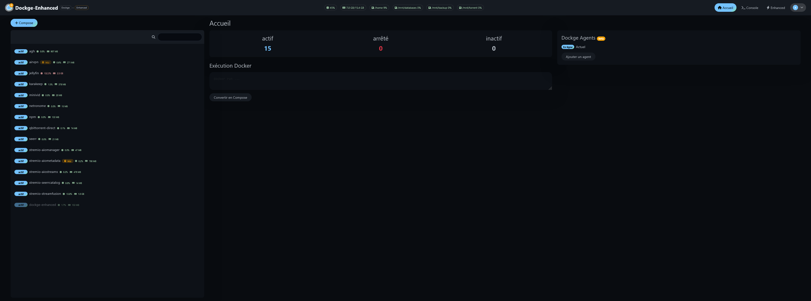</a>
      <sub>Landing page — vue d’ensemble de Dockge Enhanced</sub>
    </td>
    <td align="center" width="33%">
      <a href="screens/Images.png">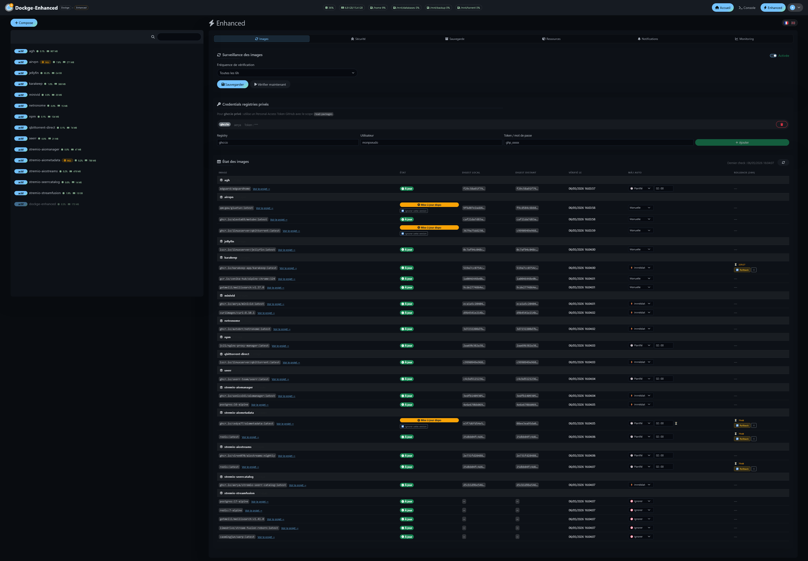</a>
      <sub>Gestion des images Docker</sub>
    </td>
    <td align="center" width="33%">
      <a href="screens/Sécurité.png">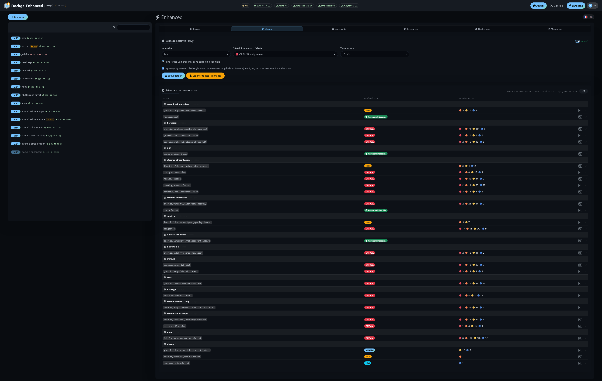</a>
      <sub>Trivy Scanner — sécurité & vulnérabilités</sub>
    </td>
  </tr>

  <tr>
    <td align="center" width="33%">
      <a href="screens/Sauvegarde.png">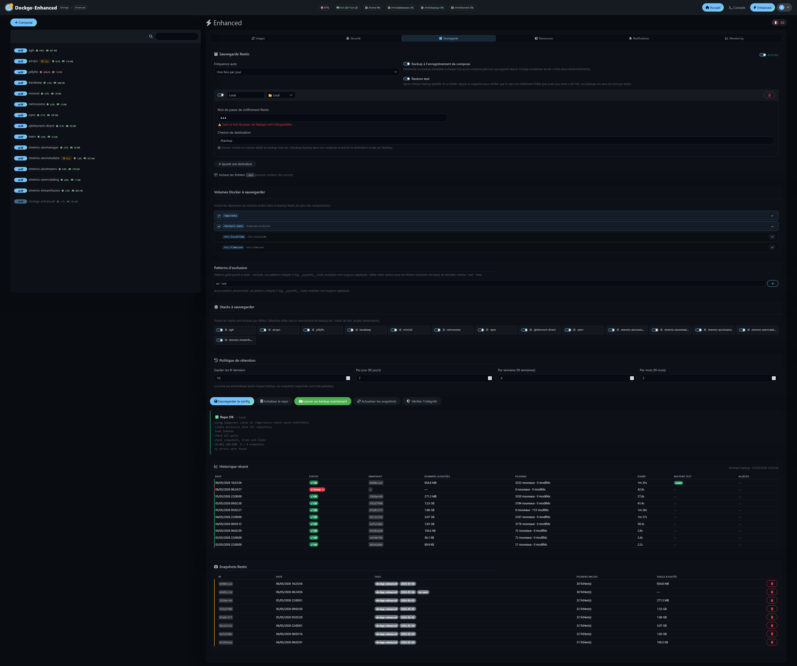</a>
      <sub>Backup Restic — sauvegardes & snapshots</sub>
    </td>
    <td align="center" width="33%">
      <a href="screens/Ressources.png">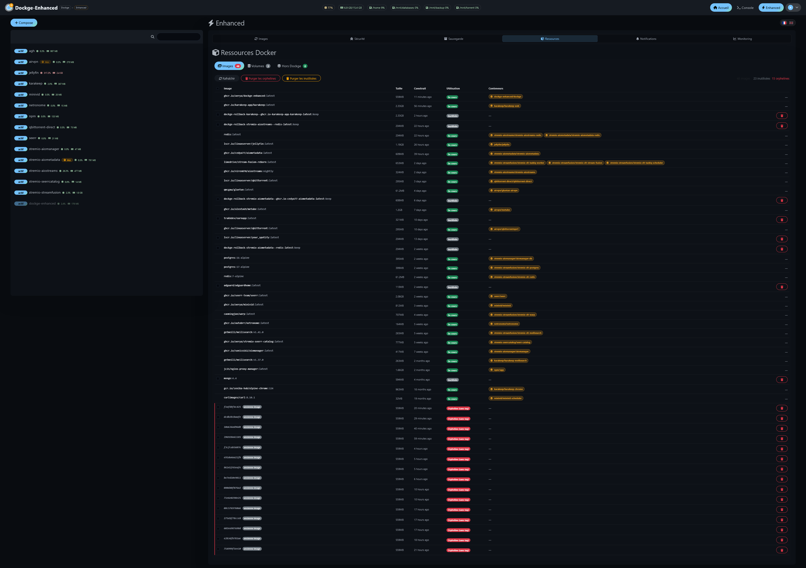</a>
      <sub>Ressources Docker — CPU, RAM & stockage</sub>
    </td>
    <td align="center" width="33%">
      <a href="screens/Notifications.png">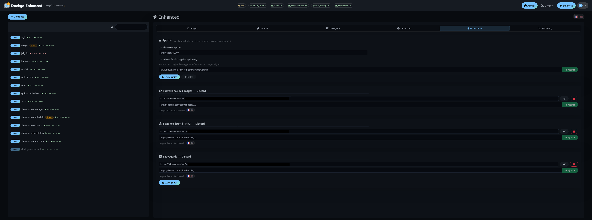</a>
      <sub>Centre de notifications</sub>
    </td>
  </tr>

  <tr>
    <td align="center" width="33%">
      <a href="screens/Monitoring.png">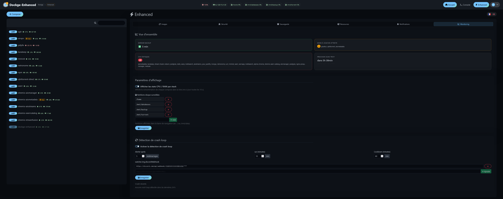</a>
      <sub>Monitoring temps réel des stacks</sub>
    </td>
    <td align="center" width="33%">
      <a href="screens/EnhancedUpdate.png">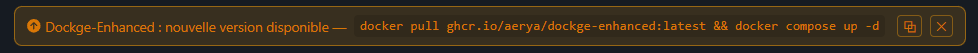</a>
      <sub>Mise à jour in-app de Dockge Enhanced</sub>
    </td>
    <td align="center" width="33%">
      <a href="screens/DiscordUpdates.png">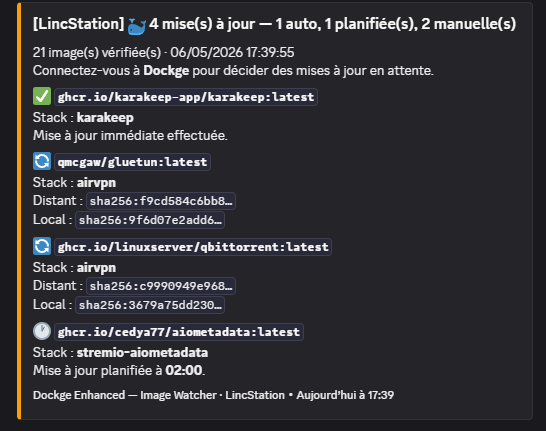</a>
      <sub>Discord — alertes de mises à jour Docker</sub>
    </td>
  </tr>

  <tr>
    <td align="center" width="33%">
      <a href="screens/DiscordTrivy.png">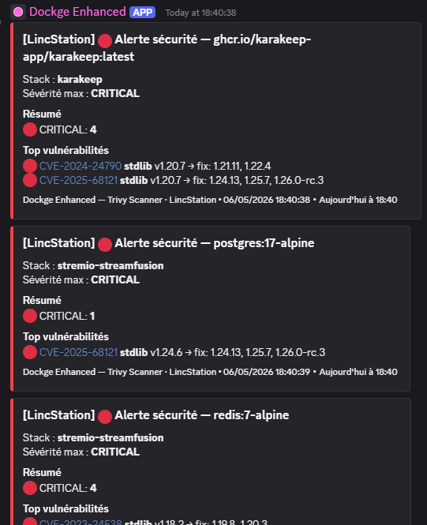</a>
      <sub>Discord — alertes sécurité Trivy</sub>
    </td>
    <td align="center" width="33%">
      <a href="screens/DiscordBackup.png">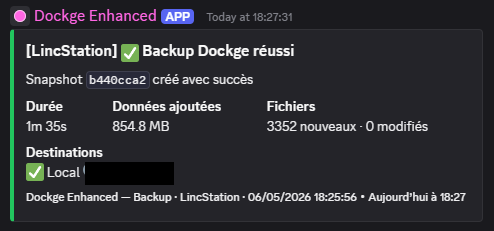</a>
      <sub>Discord — notifications de sauvegarde</sub>
    </td>
    <td align="center" width="33%">
      <a href="screens/DiscordEnhancedUpdate.png">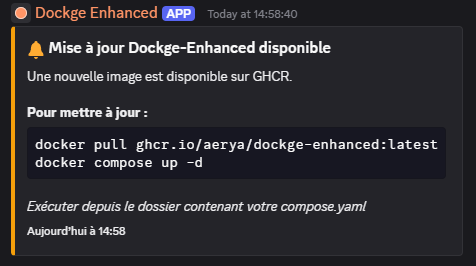</a>
      <sub>Discord — alertes de mise à jour Dockge Enhanced</sub>
    </td>
  </tr>
</table>

---

## 🚀 Installation

```yaml
# compose.yaml
services:
  dockge:
    image: ghcr.io/aerya/dockge-enhanced:latest
    container_name: dockge-enhanced
    restart: unless-stopped
    ports:
      - 5001:5001
    volumes:
      - /var/run/docker.sock:/var/run/docker.sock
      - ../../data:/app/data
      - ../../opt/stacks:/opt/stacks
      - ../../backup/dockge:/backup          # optional — dedicated local backup volume
      - ../../docker:/dockers-data           # optional — Dockers data to backup
    environment:
      - DOCKGE_STACKS_DIR=/opt/stacks
      - DOCKGE_DATA_DIR=/app/data
#      - DOCKER_API_VERSION=x.xx                       # optional — for some NAS devices where Docker does not support a recent API version
      - TZ=Europe/Paris                               # timezone (affects scheduled updates)
```

> 💾 The `/backup:/backup` volume is optional but recommended if you use **local** as a Restic backup destination — set the destination path to `/backup` so your snapshots land on a dedicated host directory outside the container.

> 📂 **Backing up multiple data directories?** Add as many volumes as you need (e.g. `../../media:/media-data`), then register each container path in the Backup tab under **Additional paths** — Restic will include them all in every backup run.

```bash
docker compose up -d
```

Open **http://localhost:5001**, create your admin account, then click **Monitoring** in the navigation bar.

---

## ⚙️ Environment variables

| Variable | Default | Description |
|---|---|---|
| `DOCKGE_STACKS_DIR` | `/opt/stacks` | Directory containing Docker Compose stacks |
| `DOCKGE_DATA_DIR` | `/opt/dockge/data` | Dockge data directory (set to `/app/data`) |
| `DOCKGE_PUBLIC_URL` | *(none)* | Public URL used in Discord notification links (e.g. `https://dockge.example.com`) |
| `DOCKER_API_VERSION` | *(none)* | Fixes the Docker API version negotiated by the client — useful on certain NAS systems, for example with DSM 7.x on Synology DS220+ |
| `TZ` | `UTC` | Container timezone — **important** for scheduled auto-updates to fire at the right local time (e.g. `Europe/Paris`) |
| `DOCKGE_PORT` | `5001` | Web UI port |
| `DOCKGE_SSL_KEY` / `DOCKGE_SSL_CERT` | — | Enable HTTPS |

> ⚠️ Always set `DOCKGE_DATA_DIR=/app/data` to match the volume mount, otherwise settings won't persist after a restart.

> ℹ️ `DOCKGE_PUBLIC_URL` is optional. If not set, Discord notifications are sent without a link. Works with reverse proxies and HTTPS domains.

---

## 🔄 Auto-updates

This fork tracks upstream Dockge releases automatically via GitHub Actions:
- **Daily** — checks for a new stable release
- **If found** — merges upstream changes and opens a PR
- **On merge** — rebuilds and publishes Docker images (`amd64` + `arm64`) to GHCR

---

## 🙏 Credits

- [**Dockge**](https://github.com/louislam/dockge) by louislam — the original project (MIT licence)
- [**Trivy**](https://github.com/aquasecurity/trivy) — vulnerability scanner
- [**Restic**](https://restic.net/) — encrypted backup tool
- [**Apprise**](https://github.com/caronc/apprise-api) — multi-platform notification gateway
- [**Kula**](https://github.com/c0m4r/kula) by c0m4r — lightweight system monitor (AGPLv3)
