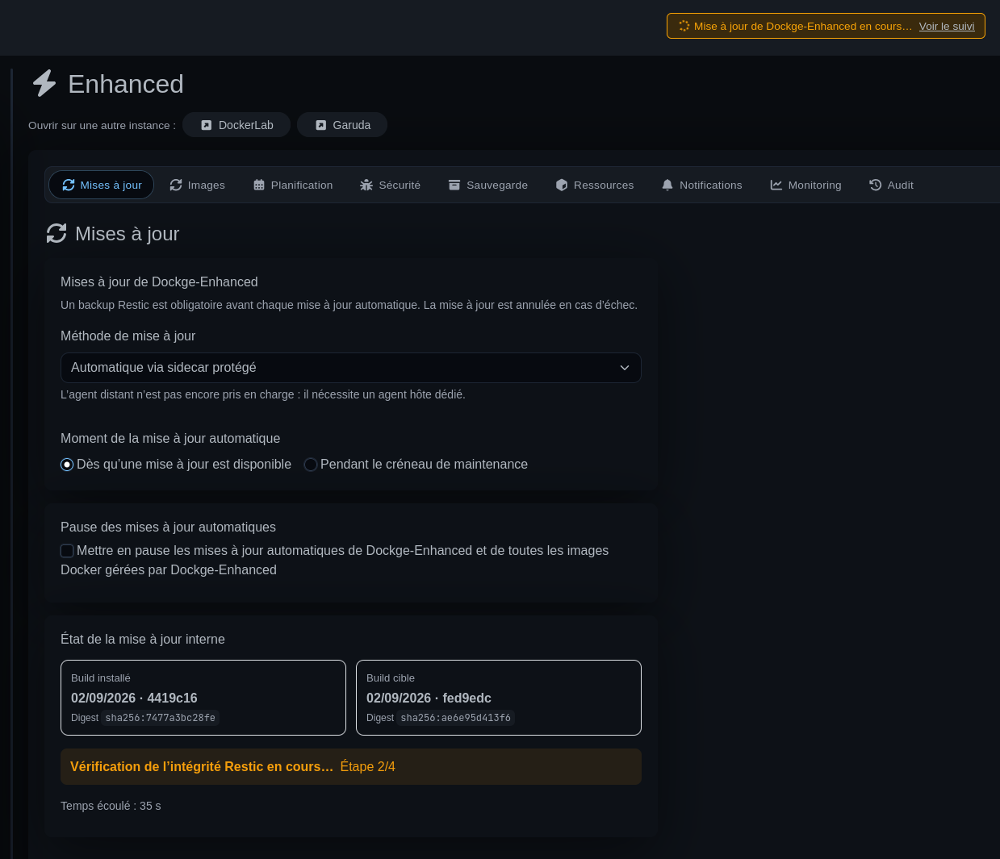
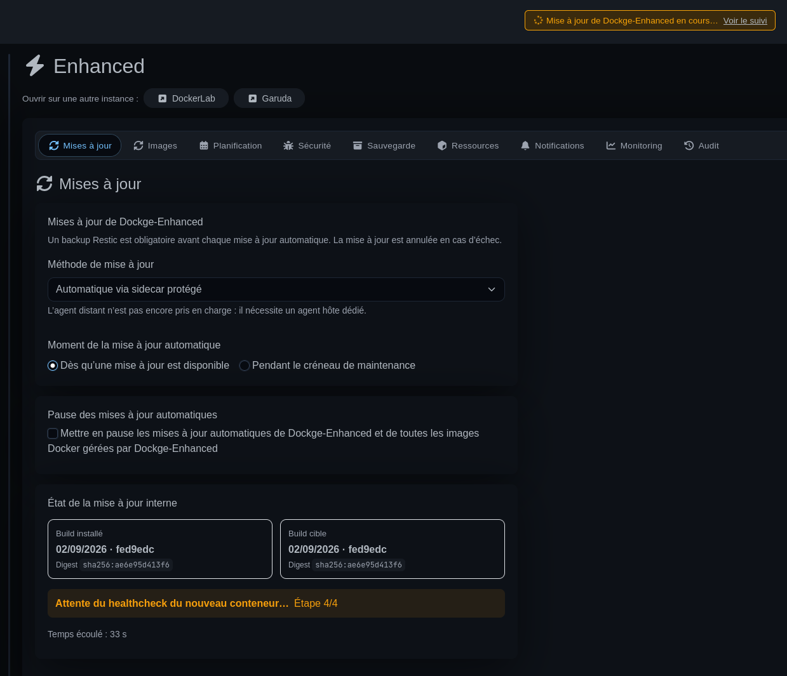
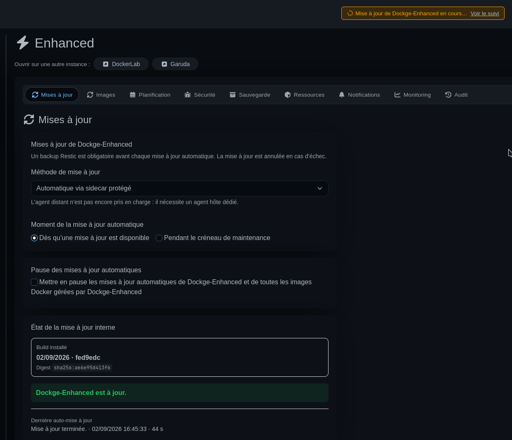
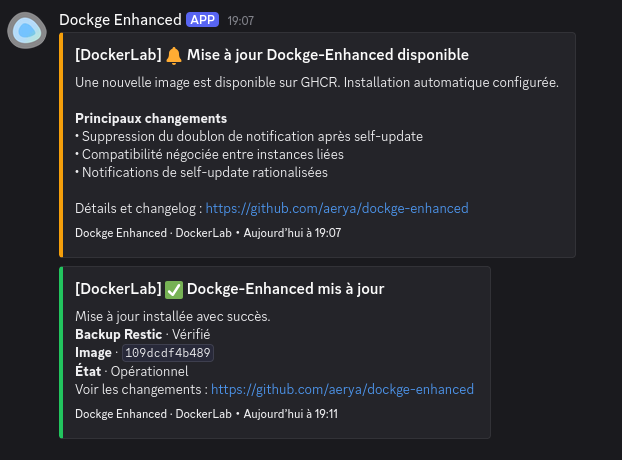

<p align="center">
  
</p>

# Dockge Enhanced
[Dockge](https://github.com/louislam/dockge) 的功能增强分支，在保留简洁 Docker Compose 管理体验的基础上，将其扩展为更完整的 Docker 管理平台 —— 提供多服务器联邦、Stack 迁移与复制、Restic 备份、镜像与 Dockge-Enhanced 自更新及回滚、安全扫描、监控、自动化、通知和 Docker 资源管理，并全部集成于 Web UI。

<p align="center">
  🇨🇳 简体中文 ·
  🇬🇧 <a href="https://github.com/Aerya/Dockge-Enhanced/blob/main/README.md">English</a> ·
  🇫🇷 <a href="https://github.com/Aerya/Dockge-Enhanced/blob/main/README.fr.md">Français</a> ·
  🇪🇸 <a href="https://github.com/Aerya/Dockge-Enhanced/blob/main/README.es-ES.md">Español</a>
</p>

<p align="center">
  
  
  
  
  
</p>

<p align="center">
  <strong>正在使用？觉得不错？</strong>
  <a href="https://github.com/Aerya/Dockge-Enhanced"><strong>⭐ 给项目一个 Star！</strong></a>
</p>

---

## 功能

## 最新动态

<details>
<summary>查看最新变化</summary>

本节汇总近期最重要的变化，方便快速了解 Dockge-Enhanced 最近新增了什么。

### 🆕 2026 年 10 月

**旧版 Dockge-Enhanced 镜像按各自年龄清理**

通过 digest 拉取后留下的旧 `ghcr.io/aerya/dockge-enhanced:<none>` 镜像现在会独立计算清理年龄。新的成功自更新不会再把所有旧 Enhanced 镜像的 48 小时等待时间重新归零；每个旧镜像都按自身创建时间判断，同时继续保护当前正在使用的镜像和恢复快照。如果统一 Docker 清理配置了更长的宽限期，则仍以更长的时间为准。

**统一 Docker 清理与精确补跑**

“Docker 资源”的镜像页、清理预览和清理任务现在共用同一个 Image ID 清单。手动与自动清理使用相同宽限期，同一物理镜像的多个标签只计一次；清理过程中已经消失的镜像不会再造成失败。已停止容器的镜像以及回滚/恢复资源继续受到保护。镜像、网络、卷和构建缓存可独立选择，结果按类别写入历史；系统每 15 分钟检查精确到期时间，并在休眠或重启后只补跑一次。启用统一清理时，旧的镜像自动清理设置会暂停但不会被删除。

**可选的主机 CPU/RAM 历史**

Monitoring 可在没有浏览器打开时每 5 分钟记录一次轻量级主机 CPU/RAM 样本。响应式 SVG 图表支持 24 小时、7 天、1 个月和自定义范围；所选显示周期可以保存，并在下次打开时恢复。长时间范围会在服务端聚合，停机时间以空档显示。记录功能默认关闭；明确启用后，即使在低功耗模式下也会继续。

**按服务排除状态与镜像更新**

可视化 Compose 编辑器可添加 `dockge.status.ignore: "true"`，使可选服务在部署后不再影响应用栈整体状态，同时仍显示该服务自身状态。还可添加 `dockge.imageupdates.check: "false"`，将服务排除在 ImageWatcher 检测以及自动或批量镜像更新之外；仍可明确手动更新该服务。现有服务标签及其 YAML 语法会被保留。功能灵感来自 [hamphh/dockge](https://github.com/hamphh/dockge)。

**更稳定的关联实例连接**

添加或修改关联实例时，浏览器会话刷新不再断开联邦连接。同步网状网络及重启后，两个实例仍保持在线。

**更新所有可用的 Docker 镜像**

更新页面通过现有的 Compose 更新与回滚流程逐个处理检测到的镜像，显示进度并在首次失败时停止。Dockge-Enhanced 自身更新仍单独进行。

**密码管理器**

创建账户时，用户名和新密码字段现在可由浏览器密码管理器正确识别。

**Stack 操作与 Compose 创建**

暂停／恢复 Stack 不会删除容器卷。Stack 暂停期间自动镜像更新会等待恢复；Restic 备份或还原运行时禁止暂停／恢复，Enhanced 自身及使用停止服务或钩子备份策略的 Stack 不能暂停。常规设置新增仅适用于新 Stack 的默认 Compose 模板。Stack 的 README.md 改由操作按钮打开，容器操作图标提供说明提示。现有的 `tmpfs` 八进制模式保护和 Compose 变量高亮保持不变。

**更清晰的 Stack 操作**

Stack 按钮现在说明实际执行的命令。帮助面板展示所选 Stack 的 Docker Compose 命令，包括项目和 Compose 文件参数，并提供 Docker 官方文档链接。原“停止并置于非活动状态”按钮改为“移除 Stack 容器”：确认后执行 `docker compose down`，删除容器和 Compose 网络，但不会删除命名卷、绑定挂载数据、Compose 文件或镜像。匿名卷可能不会在下一次 `up` 时重新挂载。

**Stack 显示名称**

现在可以在 Stack 页面设置 Web UI 显示名称。技术名称、Compose 项目、备份选择和恢复路径均不改变；技术名称仍显示在别名旁边。

**实际容器视图**

每个 Compose 服务现在会分别列出实际容器，包括副本。打开容器后可查看状态、健康检查、镜像、端口、资源使用和最近的日志，也可仅对该容器执行启动、停止或重启；服务级操作保持不变。此功能受到 [Lorwell/dockge](https://github.com/Lorwell/dockge) 启发。

**可选的主机文件管理器**

启用后，“文件”页面可浏览指定的主机目录、编辑小型 UTF-8 文件、传输文件并查看文件日志，也支持关联的 Enhanced 实例。它与各 Stack 的卷浏览器不同，不能访问授权根目录之外的路径。

仅将需要开放的目录挂载到 Enhanced，并把 `DOCKGE_FILE_MANAGER_ROOT` 设为**容器内路径**。例如在 `volumes:` 下添加 `- /srv/shared:/managed-files`，在 `environment:` 下添加 `DOCKGE_FILE_MANAGER_ROOT: /managed-files`。未配置时此功能保持关闭；**不要挂载 `/` 或范围过大的主机目录**。关闭身份验证时也会拒绝文件操作。可选的 `DOCKGE_FILE_MANAGER_MAX_FILE_SIZE` 限制传输大小（默认 100 MiB），在线文本编辑限制为 1 MiB。每个关联实例都需要单独配置挂载和路径。

**容器终端中的复制与粘贴**

右键现在会打开终端的原生复制/粘贴菜单。在本地 HTTP 地址上也可使用键盘快捷键粘贴，无需依赖浏览器剪贴板 API。

**受管理 Stack 的 README.md**

现在可以在 Stack 页面查看和编辑与 Compose 文件同目录的 Markdown `README.md`。它与简短的 Stack 备注相互独立，并会在复制或迁移到其他 Dockge-Enhanced 实例时一同传输。此功能不会修改外部 Stack。

### 🆕 2026 年 9 月

**更可靠的自动镜像清理**

即使上次清理在计划时间后几秒钟才结束，自动清理也不会跳过下一个计划时段。任何容器（包括已停止的容器）使用的镜像以及回滚镜像都会保留。成功自更新至少 48 小时后，按 digest 拉取的旧版 Dockge-Enhanced 镜像可在下一次清理中删除，同时保留当前镜像和恢复镜像。最近一次清理中的 Docker 错误会显示在“Docker 资源”页面。

**避免夜间刷屏的联邦可用性告警**

断路器可用性通知现在按一次连续离线事件管理：只要关联实例持续离线，每个 Dockge 实例最多发送一次告警；只有对端重新成功认证并恢复在线后，告警才会重新启用。每个远程实例还可以在本机标记为 **间歇性机器 — 不可用时不发送告警**。该模式适用于经常关机或休眠的台式机、笔记本等节点；自动重连、退避和断路器保护仍会继续工作。由于这是本地偏好，需要在每台常开且不希望收到该告警的 Dockge 实例上标记相应的间歇性节点。


**进程级共享联邦传输**

联邦现在由每个 Dockge-Enhanced 进程共享一套出站传输，而不是每个 WebUI socket 各自建立连接。服务器开始监听后会从 SQLite 加载关联实例并自动连接。打开多个 WebUI 不会再成倍创建远程 socket，关闭最后一个浏览器也不会断开关联实例；约 5 分钟后的断路器重试即使在没有 WebUI 打开时也会继续。凭据变更、mesh 修复或删除 peer 会立即重新同步共享传输。


**联邦重连风暴防护**

联邦 socket 现在使用轻量认证路径，不再执行 WebUI 的 Stack/代理初始化。Socket.IO 重连被明确限制，并使用指数退避、随机抖动和 5 分钟断路器。过量入站联邦握手会在认证前被拒绝，同时限制并发入站联邦 socket 数量。如果重连保护触发或检测到 SQLite/Knex 争用，现有 Discord/Apprise 配置会在不查询 SQLite 的情况下发送限频告警。


**网络命名空间安全的定向更新**

定向镜像更新、服务重新创建和镜像回滚现在会在替换容器前解析完整的 Compose 模型。当其他服务通过 `network_mode: service:<service>` 或 `network_mode: container:<container_name>` 共享其网络命名空间时，所有直接和间接消费者都会与提供者一起在一次定向 Compose 操作中强制重新创建。无关服务不会受到影响，VPN、Gluetun 和 sidecar Stack 也不会再保留已删除容器的旧网络命名空间。

**外部 Stack（Beta）**

Enhanced 现在可以检测现有 Docker Compose 项目，并在**不移动 Compose/.env 或数据**的情况下将其接管，之后可从常规 Stack 界面管理。如果源路径尚未对 Enhanced 可见，可通过受保护的一键授权自动更新 Enhanced 自身的 Compose。已接管的 Stack 会显示 **外部** 标记；删除源文件需要额外的明确确认。 扫描器还会将 Enhanced 的 Stack 目录与主机侧 bind 挂载进行对应，因此即使 Docker Compose 标签记录的是主机路径，已经由当前实例管理的 Stack 也会被排除。

选择永久删除源目录时，Enhanced 现在会通过受保护的 helper 从自身 Compose 中移除源 bind 和授权条目，仅重新创建自身容器，然后删除主机目录。这样可避免删除仍作为 Enhanced 挂载点的目录时出现 `EBUSY` 错误。

一个明确支持的场景是 [Gluetun-Companion](https://github.com/Aerya/Gluetun-Companion)：它可以通过 bind 挂载的 `/compose` 路径重新创建已经由 Enhanced 管理的 Gluetun Stack。Enhanced 现在会把这种 Compose 路径别名映射回原生 Stack，不再错误地将其作为外部 Stack 提供接管。

**匿名安装计数**

为了在不运行独立分析服务的情况下大致了解真正活跃的 Dockge-Enhanced 安装数量，Enhanced 每月最多下载一次托管在专用 GitHub Release 中的极小技术文件。计数仅使用 GitHub 为该月 asset 提供的公开 `download_count` 聚合值。

此计数不会生成或发送任何安装标识符。请求中不包含 hostname、实例名称、Stack、容器、Docker 镜像、配置、路径、GitHub 账户、电子邮件、架构或 build 标识。与任何 GitHub asset 下载一样，连接本身由 GitHub 处理；Dockge-Enhanced 不会接收或存储安装实例的 IP 地址。

已计数的月份只保存在本地数据目录中，以确保同一安装每月最多下载一次该 asset。计数默认启用，可通过 `DOCKGE_USAGE_COUNT=false` 禁用。重新创建或删除数据目录可能使同一安装在当月再次被计数，因此该数字有意保持为近似值。

整个机制完全公开：[Enhanced 端代码](./backend/anonymous-install-count.ts)、[创建每月 asset 的 GitHub workflow](./.github/workflows/usage-count-asset.yml)以及[每月聚合计数](https://github.com/Aerya/Dockge-Enhanced/releases/tag/usage-count)。

仓库所有者可以添加名为 `USAGE_COUNT_DISCORD_WEBHOOK` 的 Actions Secret，以便每周一接收当月暂定计数，并在每月第一天接收上个月的最终计数。也可以手动运行 workflow，立即发送当前计数。Webhook 值由 GitHub 加密，绝不会提交到仓库。

**多实例全局搜索 V2（`Ctrl+K`）**

全局搜索现在支持用于小型输入错误的**模糊匹配**，以及 `type:`、`stack:`、`image:`、`port:`、`instance:` 和 `is:update`、`is:stopped`、`is:vulnerable`、`is:critical`、`is:backup-failed` 等辅助筛选。面板会直接显示可点击的操作符提示，无需记忆语法。Compose 和 `.env` 结果会打开对应 Stack，并让 CodeMirror 直接定位到匹配行。最近搜索和固定搜索只保存在当前浏览器中。

用户可显式启用对**最近 Restic 快照**中的历史配置搜索；为保护远程仓库，每个实例最多检查最近 5 个快照和 80 个 Compose/.env 文件。对 **`.env` 值**的搜索同样必须显式开启：值只参与匹配，绝不会返回或显示；启用该敏感模式后，查询也不会保存到最近搜索或收藏中。关联实例优先使用 V2 协议，旧实例的简单搜索仍可回退到 V1。


**编辑 Compose/.env 时保护自动更新**

当 WebUI 中的 compose、override 或 `.env` 存在尚未保存的更改时，所属 Dockge-Enhanced 实例会暂时阻止自身自动更新，即使该编辑来自另一台关联 WebUI。编辑器通过短时 heartbeat lease 保持状态，遗留浏览器会话会自动过期。如果更新在存在未保存内容时准备就绪，用户可在对话框中选择**保存并更新**、**推迟 30 分钟**、**推迟 1 小时**或**继续编辑**。后端还会在准备和启动 updater sidecar 前再次检查阻塞状态，避免在备份或校验期间开始的新编辑被重启中断。


**首页关联实例概览**

首页现有的代理面板现在也作为紧凑的基础设施概览。每个关联的 Dockge-Enhanced 实例都会显示其堆栈总数和状态、主机 CPU/RAM 使用率、运行时间以及固定堆栈数量，同时保留重命名、重新认证、删除和添加代理等现有操作。点击某个实例摘要会将左侧堆栈列表筛选到该服务器，再次点击则恢复所有服务器视图。


**关联实例之间的堆栈 CPU/RAM 统计**

**显示每个堆栈的 CPU / 内存统计** 选项现在归属于各个 Dockge-Enhanced 实例。某服务器启用该选项后，会在本机采集 Docker 统计，并通过现有的关联实例通道提供数据。任何显示该服务器的关联 WebUI 都会为其堆栈和容器显示相同的 CPU/RAM 指标。隐藏服务器会隐藏其统计；在所属实例上关闭该选项则会停止该实例的采集和数据提供。


**关联实例之间持久化的固定堆栈**

固定堆栈现在归属于实际托管它的 Dockge-Enhanced 实例，而不是某个浏览器的 `localStorage`。在 Garuda、DockerLab 或 LincStation 上固定堆栈时，偏好会保存到对应服务器。任何显示该服务器的关联 WebUI 都会看到相同的固定堆栈；隐藏服务器只会隐藏其固定项，不会删除它们。因此固定状态可跨退出/重新登录、更换浏览器和 Dockge-Enhanced 更新保留。旧的浏览器本地固定状态会在所属实例可访问时自动迁移。


**self-update 备份独立保留策略**

Dockge-Enhanced 在受保护的自动更新前创建的强制 Restic 快照现在使用独立保留策略。新快照**创建并验证成功后**，系统会为当前安装保留**最近 2 个 self-update 快照**，并在启动 updater sidecar 前删除更旧的版本。稳定的安装专属标签可避免在多个 Dockge-Enhanced 实例共享同一 Restic 仓库时误删其他实例的快照。普通备份的保留策略（`keepLast`、每日、每周、每月）保持不变。如果独立清理失败，已验证的备份仍会保留，更新可以继续；错误会写入日志，并在后续自动更新时再次尝试清理。


**Docker Compose 项目名称匹配改进**

当受管理 Stack 的目录名包含点号或大写字母时，现在会根据实际的 `ConfigFiles` 路径与 Docker Compose 进行匹配，而不再仅依赖 Docker 规范化后的项目名称。这样可避免同一个 Stack 同时出现“受管理/已停止”和“外部/运行中”的重复条目。

**支持 Compose 长格式端口语法**

容器卡片现在同时支持 Compose 的短格式和长格式端口定义。使用 `published`、`target`、`protocol`、`mode` 或 `host_ip` 的配置不再触发 `split is not a function`，也不会再导致容器卡片消失。IPv6 `host_ip` 也会在生成的链接中正确格式化。

**Compose YAML 修复与格式化**

Stack 编辑器现在为 `compose.yaml` 提供 **修复 / 格式化 YAML** 操作。有效文档会统一为 **2 个空格**缩进；若 YAML 因常见的 Compose 缩进错误而无效，Dockge-Enhanced 会尝试重新对齐服务键与列表（`services`、服务选项、`environment`、`ports`、`volumes`、`healthcheck.test` 等），验证修复结果后再格式化。注释以及带前导零的 `tmpfs.mode` 权限值会被保留。若无法安全修复，则保持原内容不变并显示错误。

**Compose 编辑器保留 tmpfs 权限模式**

可视化 Compose 编辑器在重新生成 YAML 时会保留 `tmpfs.mode: 01777` 这类带前导零的八进制权限值。修改其他字段时不会再静默地将该权限重写为 `1777`。

**加强 Stack 路径遍历防护**

后端操作现在会在解析任何路径之前验证传入的 Stack 名称，包括主动跳过文件系统发现的代码路径。类似 `../outside` 的恶意名称无法再逃离受管理的 Stack 目录，从而访问其他应用的 Compose 或 `.env` 文件。

**受保护的 Dockge-Enhanced 自动更新**

Dockge-Enhanced 现在可以通过受严格限制的 sidecar 自动更新。替换容器前必须完成 Restic 备份和仓库完整性检查，新版本必须通过可用性检查，否则自动恢复之前的镜像。

**远程服务器镜像更新状态**

镜像更新信息分别从每个已连接实例获取，因此远程 Stack 可以显示自己的更新标记。

**清晰的 build 标识与更新进度**

“更新”页面通过 OCI 元数据识别 build，并统一显示更新阶段、Restic 进度和已用时间。


**远程公告**

Dockge-Enhanced 现在可以显示**从此 GitHub 仓库发布的纯文本运维公告**，并且该通道独立于 Docker 镜像更新机制。这个安全通道是在 2026 年 8 月底至 9 月初的自动更新事故之后加入的：如果未来某个构建出现严重问题，受影响的已安装版本可以收到警告，而不必等待同一个更新机制先恢复正常。

公告来自 [`remote-announcements.json`](remote-announcements.json)。公告是可选的，仅通过 HTTPS 获取，经过严格结构校验，并限制大小和数量；还可以按应用版本、Git 修订或 OCI 构建日期定向发布。公告**不能执行命令、注入 HTML 或触发更新**。可点击链接仅允许指向 Dockge-Enhanced 的 GitHub 仓库。如果 GitHub 不可用或公告文档无效，Dockge-Enhanced 只会不显示公告，不影响其他功能。

关闭公告只会在当前浏览器会话中隐藏它。选择**不再显示**会把公告 ID 保存到 Dockge-Enhanced 的持久化数据目录；发布新的公告时使用新的 ID。

**关联实例兼容性**

**复制**、**移动**和**副本**会协商一个独立于构建 SHA 的**传输协议**。只要协议兼容，不同构建仍可继续。协议不兼容时不会开始任何传输。足够新的远程实例可以通过 WebUI 使用正常自更新流程（Restic 备份、Sidecar、健康检查和失败回滚）进行更新，Dockge-Enhanced 最多等待 **2 小时**让它重新连接后再继续。过旧、无法响应握手的版本需要手动更新。持久副本会进入**等待兼容**状态，大约每 10 分钟重试一次，期间不会修改数据。

**永久显示本地实例标识**

Dockge Agents 中配置的**本地实例名称**现在会始终显示在桌面/移动端顶部栏和浏览器标签标题中（`实例名称 · Dockge-Enhanced`）。若未设置名称，则使用主机地址（`IP:端口` 或域名）作为后备标识，无需新增设置。

**未读更新日志**

更新说明弹窗现在会单独跟踪每个 release 条目。如果在未打开 WebUI 的情况下连续安装了多次自动更新，下次访问时会显示**所有累积的更新内容**。仅打开或刷新页面不会将内容标记为已读；只有用户明确关闭弹窗时，当前显示的条目才会被确认。已读状态基于 release ID，不再依赖条目在列表中的位置。旧的 `releaseNewsSeen` 标记会自动迁移，同时避免向现有用户重新显示全部历史记录。

### 2026 年 8 月

**事务式 Stack 迁移与复制**

Stack 可连同 Compose 配置和持久化数据在实例之间复制或移动，支持恢复、验证和 rollback。

**主机前置条件与自动恢复**

Stack 可以要求主机挂载点或 `systemd` 服务可用后再启动。

**响应式界面与增强监控**

Stack 导航、Logs/Compose、资源指标、健康卡片、主题和移动端显示均得到改进。

➡️ **[查看完整更新日志](CHANGELOG.zh-CN.md)**

</details>

---

## 功能目录

<details>
<summary>查看全部功能</summary>

### 多服务器与联邦
- 全网状联邦
- 从任意已连接实例管理
- 服务器选择与分组
- 远程 Stack 与更新状态
- 专用联邦 Token 与连接恢复
- 修改关联实例时刷新浏览器而不中断联邦连接
- 已连接实例概览、可达性状态和 WebUI 直达入口
- 跨 Stack、Compose/.env 文件、Docker 资源和近期 Restic Snapshot 的全局多实例搜索
- 不同 Dockge-Enhanced 版本之间的能力协商

### Stack 管理
- 可按服务忽略其对应用栈整体状态的影响，同时保留服务自身状态
- 可选的 Web UI 显示名称，不改变 Compose 或 Restic 标识
- 实际容器与副本的详情及单容器启动、停止、重启操作，与 Compose 服务级操作分离
- 可选的受限主机文件管理器：与 Stack 卷浏览器分离，支持分块传输与文件日志查看
- 创建、编辑、启动、停止和重新创建 Compose Stack
- 服务端持久化并在关联 WebUI 间共享的固定 Stack 与排序
- 无需移动文件或数据即可发现并接管外部 Compose Stack
- 通过受保护的一键授权开放外部 Stack 路径
- 可选完整删除已接管的外部 Stack，包括源目录和 Enhanced 访问挂载
- 基于标签永久清理损坏的外部 Stack，并在删除容器、卷、网络、镜像和 Compose 源文件前锁定资源清单并要求强化确认
- 备注和 Git 工具
- 受管理 Stack 的 Markdown `README.md` 查看与编辑，复制或迁移时一同传输
- Build + Recreate
- 服务/容器级操作和计划任务
- 自动重新创建通过 `service:` 或 `container:` 直接或间接共享 VPN/网络命名空间的服务
- 可折叠/调整大小的侧栏与资源指标
- Compose 编辑器支持端口长语法并保留 `tmpfs` 权限模式

### 迁移与复制
- 实例间复制或移动
- Compose、bind mount 与卷传输
- 可恢复任务和 SHA-256 校验
- 事务式部署与 rollback
- 本地镜像和私有 Registry 凭据传输
- `container_name` 冲突检测
- 计划冷复制

### 备份与恢复
- Restic 多目标备份
- Bind mount 与卷
- 选择性恢复
- 仓库与 Snapshot 检查
- 历史记录与恢复流程集成

### 更新
- 使用 `dockge.imageupdates.check: "false"` 按服务排除 ImageWatcher 检查及自动/批量更新
- 镜像更新监控与远程检测
- 手动和自动更新
- 可用镜像的顺序批量更新，显示进度并在首次失败时停止
- Rollback、计划与暂停
- Dockge-Enhanced 受保护自动更新
- 持久化的 8 阶段真实自更新流程，显示每步耗时、可用时的 Restic 文件/字节/吞吐量，以及主机实时 CPU/RAM 与 1 分钟负载
- 支持自定义 Compose `hostname:` 的可靠当前容器识别，并在无法验证更新时显示降级状态
- 强制 Restic 备份、完整性和可用性检查
- 失败时自动恢复
- Compose 或 `.env` 存在未保存修改时阻止自更新
- 更新时校准 Compose 项目名称并使用 Stack 的准确上下文

### 安全
- 集中验证 Stack 名称，阻止路径遍历逃离受管理的 Stack 目录
- Trivy 与 CVE 例外
- 2FA、Turnstile、trusted proxy
- 受限制 sidecar 与签名计划
- Docker 破坏性操作保护
- 私有 Registry 凭据加密传输

### 监控
- 系统、Stack 和容器统计
- 可选的 5 分钟 CPU/RAM 历史，支持 24 小时、7 天、1 个月和自定义范围、服务端降采样以及可见的停机空档
- 状态栏与健康卡片
- Crash loop 与 healthcheck 自动修复
- 实时/全屏日志，支持**自上次重启以来**的时间范围，并可一键复制最近 **50 / 100 / 150** 行或全部已加载日志
- Kula 与 Dozzle
- 本地及已连接实例的每 Stack CPU/RAM 统计

### Docker 资源
- 镜像、卷、网络和未管理容器
- 镜像、网络、卷和构建缓存的统一手动/自动清理；手动与自动模式使用相同宽限期，镜像按唯一 Image ID 计数，并显示每个类别的结果及最近 30 次历史
- 每 15 分钟检查精确的 `lastRun + interval` 到期时间，休眠或重启后只补跑一次
- 基于完整 Image ID 对运行中和已停止容器进行分类；同一镜像的多个标签只计数一次
- 高风险删除保护

### 自动化与审计
- REST API
- 每 Stack Webhook
- Home Assistant 示例
- 计划操作
- 集中历史记录

### 集成
- PlugNPiN
- Nginx Proxy Manager
- Pi-hole
- AdGuard Home
- Dozzle 与 Kula

### 通知与访问
- Discord 与 Apprise
- EN / FR / ES / zh-CN
- 远程运维公告
- 持久化的未读版本新闻记录
- 通过 GitHub Actions Discord Webhook 可选发送每周和每月匿名安装计数报告
- 2FA、trusted proxy、Turnstile
- 第三方移动客户端

</details>

---

## Dockge-Enhanced 自动更新流程

<details>
<summary>查看受保护的更新流程</summary>

Dockge-Enhanced 会自动处理完整流程：强制 Restic 备份、完整性验证、受控替换容器、健康检查和最终确认。Discord/Apprise 通知也可以在无需一直打开 WebUI 的情况下跟踪操作。

在 **更新** 页面为 Dockge-Enhanced 自动更新配置维护时段后，该时段也会成为所有镜像自动更新的全局窗口。窗口之外检测到的镜像更新会排队等待下一个允许时段；手动执行的 **立即更新** 不受此窗口限制。

自动自更新开始前，Enhanced 还会确认没有敏感操作正在执行：Restic 备份或恢复、堆栈复制/移动/数据传输或复制同步、Docker 镜像检查/更新、Trivy 扫描以及受保护的外部堆栈集成。如果存在阻塞操作，更新会进入等待状态，WebUI 和 Discord/Apprise 会显示具体原因，随后 watcher 会自动重试。

<table>
<tr>
<td align="center" width="50%"><a href="screens/AutoUpdate-ResticVerification.png"></a><br/><sub><strong>1. Restic 验证</strong> — 替换容器前检查备份。</sub></td>
<td align="center" width="50%"><a href="screens/AutoUpdate-Healthcheck.png"></a><br/><sub><strong>2. 健康检查</strong> — 验证新容器。</sub></td>
</tr>
<tr>
<td align="center" width="50%"><a href="screens/AutoUpdate-Completed.png"></a><br/><sub><strong>3. 更新完成</strong> — 已安装构建版本和最终状态。</sub></td>
<td align="center" width="50%"><a href="screens/AutoUpdate-Notifications.png"></a><br/><sub><strong>4. 通知</strong> — 更新可用、主要变更和最终确认。</sub></td>
</tr>
</table>

</details>

## 截图

<details>
<summary>查看截图</summary>

项目截图位于 [`screens/`](screens/) 目录。主 README 中展示了界面、更新、备份、Trivy、Discord 通知和多实例功能的最新截图。

</details>

---

## 安装

```yaml
# compose.yaml
services:
  dockge:
    image: ghcr.io/aerya/dockge-enhanced:latest
    container_name: dockge-enhanced
    restart: unless-stopped
    ports:
      - 5001:5001
    volumes:
      - /var/run/docker.sock:/var/run/docker.sock
      - ../../data:/app/data
      - ../../opt/stacks:/opt/stacks
      - ../../backup/dockge:/backup          # 可选：独立本地备份目录
      - ../../docker:/dockers-data           # 可选：额外需要备份的数据
    environment:
      - DOCKGE_STACKS_DIR=/opt/stacks
      - DOCKGE_DATA_DIR=/app/data
#      - DOCKER_API_VERSION=x.xx             # 可选：旧版 Docker API 的 NAS
      - TZ=Europe/Paris                      # 时区，会影响计划任务
```

启动：

```bash
docker compose up -d
```

打开 **http://localhost:5001**，创建管理员账号，然后即可使用 Dockge Enhanced。

> `/backup:/backup` 不是必需的，但如果使用 Restic 的本地目标，建议挂载一个独立主机目录并把备份目标设为 `/backup`。

> 如果要备份多个数据目录，可以添加多个 volume，然后在 **Backup** 页面中的 **Additional paths** 注册对应的容器路径。

> 如果要监控 `/` 之外的主机磁盘分区，请把目标路径只读挂载到容器，并在 **Monitoring** 页面中加入该路径。

### 与 Dockge 并行测试 Dockge-Enhanced

Dockge 和 Dockge-Enhanced 可以运行在同一台 Docker 主机上，但不能直接同时使用默认 Compose 配置，因为两者都会发布端口 `5001`。

如需并行测试：

- 从单独的 Compose 目录安装 Dockge-Enhanced；
- 使用另一个主机端口，例如 `5002:5001`；
- 使用独立的 `/app/data` 目录；
- 建议使用独立的 stacks 目录，并只放置专用于测试的 stack。

示例：

```yaml
ports:
  - 5002:5001
volumes:
  - ./enhanced-data:/app/data
  - /opt/dockge-enhanced-test-stacks:/opt/stacks
environment:
  - DOCKGE_STACKS_DIR=/opt/stacks
  - DOCKGE_DATA_DIR=/app/data
```

随后可通过 **http://localhost:5002** 打开 Dockge-Enhanced，同时原有 Dockge 仍可通过端口 `5001` 访问。

两个应用可以访问同一个 stacks 目录，但绝不能**同时**编辑、部署、更新或以其他方式操作同一个 stack。使用独立的 stacks 目录进行测试更安全。

### 从 Dockge 迁移到 Dockge-Enhanced

Dockge-Enhanced 与 Dockge 基于相同的基础，因此迁移很简单：

1. 停止 Dockge。
2. 备份 Dockge 的 Compose 文件、数据目录和 stacks 目录。
3. 在现有 Dockge Compose 文件中，将镜像替换为：

   ```yaml
   image: ghcr.io/aerya/dockge-enhanced:latest
   ```

4. 保留现有的 `/app/data` 和 stacks volume 映射。
5. 拉取镜像并重新启动 Compose 项目：

   ```bash
   docker compose pull
   docker compose up -d
   ```

Dockge-Enhanced 将使用您现有的账号、设置和 stacks 启动。

请保留迁移前创建的备份。如果决定返回 Dockge，请先停止 Dockge-Enhanced，恢复该备份，然后再启动原始 Dockge 镜像。

### 可选 PlugNPiN 集成

<details>
<summary>查看配置说明</summary>

在 **Settings → Integrations** 中配置 [PlugNPiN](https://github.com/DeepSpace2/PlugNPiN)。只有明确启用并保存后，Dockge Enhanced 才会创建受管的 `plugnpin-dockge-enhanced` Stack。

Nginx Proxy Manager 凭据是必需的；Pi-hole、AdGuard Home、metrics 和 debug 日志均可单独选择。密码通过 stdin 写入专用 Docker volume，不会返回浏览器，也不会写入生成的 Compose 文件。

</details>

---

## 环境变量

| 变量 | 默认值 | 说明 |
|---|---|---|
| `DOCKGE_STACKS_DIR` | `/opt/stacks` | Docker Compose Stack 所在目录 |
| `DOCKGE_DATA_DIR` | `/opt/dockge/data` | Dockge 数据目录；推荐与 volume 对应设置为 `/app/data` |
| `DOCKGE_PUBLIC_URL` | 无 | Discord 通知中使用的公网 URL，例如 `https://dockge.example.com` |
| `DOCKER_API_VERSION` | 无 | 固定 Docker Client 协商的 API 版本，适合部分 NAS |
| `TZ` | `UTC` | 容器时区；计划自动更新依赖此值 |
| `DOCKGE_PORT` | `5001` | Web UI 端口 |
| `DOCKGE_SSL_KEY` / `DOCKGE_SSL_CERT` | — | 启用 HTTPS |
| `DOCKGE_AUTH_MODE` | 未设置 | `local`、`disabled` 或 `trusted-proxy` |
| `DOCKGE_AUTH_PROXY_HEADER` | `x-forwarded-user` | trusted-proxy 模式下包含已验证身份的 Header |
| `DOCKGE_AUTH_PROXY_TRUSTED_NETWORKS` | 必填（代理模式） | 允许提供身份 Header 的地址/CIDR |
| `DOCKGE_BOOTSTRAP_USERNAME` | 无 | 数据库没有用户时创建的首个管理员名称 |
| `DOCKGE_BOOTSTRAP_PASSWORD_FILE` | 无 | 管理员密码 Secret 文件；自动部署时推荐 |
| `DOCKGE_BOOTSTRAP_PASSWORD` | 无 | 直接密码方式；由于会暴露在容器环境中，安全性较低 |
| `DOCKGE_TRANSFER_RSYNC_PROFILES` | `[]` | 本地 SSH/rsync 传输配置 JSON |

> ⚠️ 如果 volume 使用 `/app/data`，请始终设置 `DOCKGE_DATA_DIR=/app/data`，否则重启后设置可能无法持久化。

### 身份验证与初始化

现有安装无需修改。没有额外环境变量时，账号、登录页、2FA 和“禁用身份验证”功能与之前保持一致。

自动初始化管理员时，推荐使用 Secret：

```yaml
services:
  dockge:
    environment:
      - DOCKGE_BOOTSTRAP_USERNAME=admin
      - DOCKGE_BOOTSTRAP_PASSWORD_FILE=/run/secrets/dockge_admin_password
    secrets:
      - dockge_admin_password

secrets:
  dockge_admin_password:
    file: ./secrets/dockge_admin_password
```

可信代理示例：

```yaml
environment:
  - DOCKGE_AUTH_MODE=trusted-proxy
  - DOCKGE_AUTH_PROXY_HEADER=x-forwarded-user
  - DOCKGE_AUTH_PROXY_TRUSTED_NETWORKS=172.20.0.0/24
```

请把示例 CIDR 替换为代理的真实网络。Dockge 端口不应直接暴露；只有声明的可信代理可以提供用户身份。

---

## 自动更新

该分支通过 GitHub Actions 跟踪上游 Dockge：

- **每天**检查新的稳定版本；
- 检测到上游更新时同步变更并创建 PR；
- PR 合并后重新构建并发布 `amd64` + `arm64` Docker 镜像到 GHCR；
- 发生认证相关冲突时，Enhanced 版本会被保留在同步分支中，并明确列出需要人工比较的文件。

Dockge-Enhanced 自身的应用内自更新是独立功能，可在 **Updates** 页面配置。自动模式要求 Restic 备份与验证通过，并在健康检查失败时回滚。

应用内配置的维护时段是全局时段：启用后，它同时限制 Dockge-Enhanced 自更新和所有镜像自动更新。允许日期和时间之外检测到的镜像会保持排队状态，而手动 **立即更新** 始终立即执行。

---

## 移动应用 / 第三方客户端

Dockge-Enhanced 是免费且开源的。

本项目当前没有官方维护的 iOS 或 Android 应用。第三方客户端可能存在，但除非在此项目中明确列出，否则均独立于 Dockge-Enhanced。

---

## 署名

如果你的应用、服务、文章或集成使用 Dockge-Enhanced 的功能、API、截图、文档或品牌，请注明本项目并链接到本仓库。

MIT 许可证允许商业第三方客户端，但未经许可不得暗示其与 Dockge-Enhanced 存在官方关联。

---

## 致谢

- [**Dockge**](https://github.com/louislam/dockge) by louislam — 原始项目（MIT）
- [**Lorwell/dockge**](https://github.com/Lorwell/dockge) by Lorwell — 为 Enhanced 适配的受限主机文件管理器和实际容器视图提供灵感（MIT）
- [**hamphh/dockge**](https://github.com/hamphh/dockge) by hamphh — 按服务排除整体状态和镜像更新功能的灵感及兼容标签来源
- [**Trivy**](https://github.com/aquasecurity/trivy) — 漏洞扫描
- [**Restic**](https://restic.net/) — 加密备份
- [**Apprise**](https://github.com/caronc/apprise-api) — 多平台通知网关
- [**Kula**](https://github.com/c0m4r/kula) by c0m4r — 轻量系统监控
- [**Dozzle**](https://github.com/amir20/dozzle) by Amir Rajan — Docker 实时日志查看器
- [**PlugNPiN**](https://github.com/DeepSpace2/PlugNPiN) by DeepSpace2 — 可选 DNS / Nginx Proxy Manager 自动化
- [**crossly/Dockge-Enhanced**](https://github.com/crossly/Dockge-Enhanced) — 已整合的重要 UI/UX、主题、国际化和前端架构改进来源

---

## 许可证

MIT — 参见 [LICENSE](LICENSE)。

**日常 Stack 操作**

在启动、部署或重建前，如果绝对 bind mount 明确指向目录，Enhanced 现在会自动准备缺失的主机目录。这对 Synology NAS 尤其有用，因为 Docker 会拒绝尚不存在的 bind 源。疑似文件的 bind 源不会被自动创建为目录。镜像的 **立即** 自动更新模式在保存后会立刻执行针对该镜像的检查。Stack 重启成功后，Enhanced 还会重新读取真实状态并隐藏已经过期的 Compose 进度输出。

CPU/RAM 历史仍会保留真实采样空档，但图表更紧凑，采用 PowerWatch 风格的轻量网格和柔和填充。
